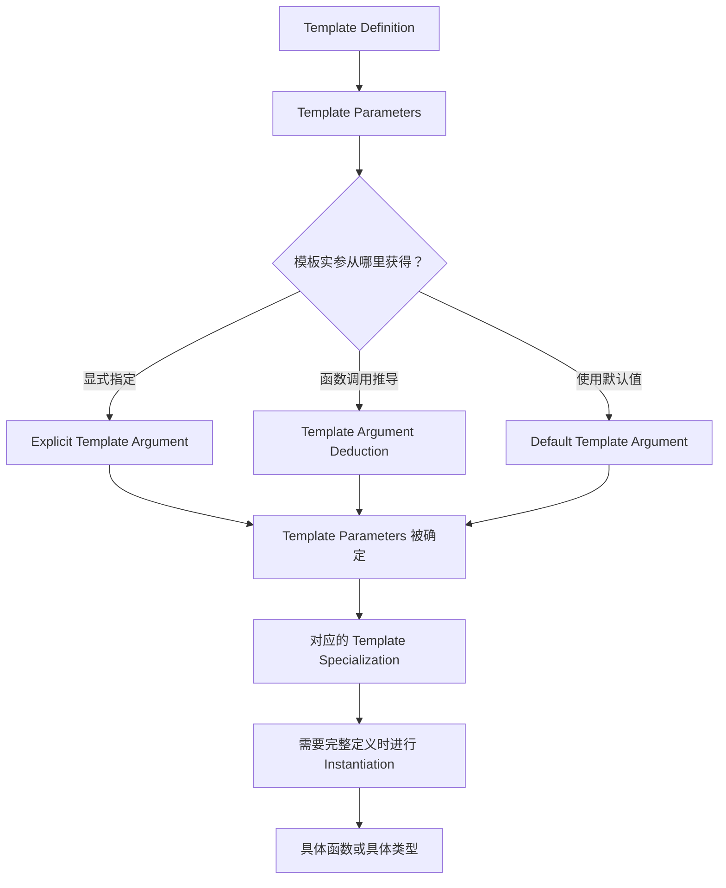

## Template 是什么

Template 的核心作用是：**把类型或编译期值参数化，用一份定义描述一组相关的函数或类型。**

例如，一个只能处理 `int` 的函数可以写成：

```cpp
int max_value(int a, int b) {
    return a < b ? b : a;
}
```

如果还需要处理 `double`，可以再写一个几乎相同的函数。两者的逻辑相同，区别只是参与运算的类型。

Function Template 可以把类型抽取为模板参数：

```cpp
template<typename T>
T max_value(T a, T b) {
    return a < b ? b : a;
}
```

这里定义的不是某一个普通函数，而是一个 **Function Template**。它描述了一族具有相同结构的函数。

当程序调用：

```cpp
max_value(1, 2);
```

编译器可以从函数实参中推导出 `T = int`，从而确定对应的具体函数 `max_value<int>`。

Class Template 的思想类似：

```cpp
template<typename T>
class Box {
public:
    T value;
};
```

`Box` 是 Class Template，而 `Box<int>`、`Box<double>` 是使用具体 Template Argument 得到的具体类型。

因此首先需要建立一个核心区别：

| 写法               | 含义                               |
| ---------------- | -------------------------------- |
| `max_value`      | Function Template                |
| `max_value<int>` | `T = int` 对应的具体函数 specialization |
| `Box`            | Class Template                   |
| `Box<int>`       | `T = int` 对应的具体类型                |

模板首先提供参数化定义。当 Template Parameter 被具体 Template Argument 确定后，编译器才有足够信息形成对应的具体实体。

## Template Parameter 与 Template Argument

Template 中最容易混淆的两个概念是 Template Parameter 和 Template Argument。

观察下面的定义：

```cpp
template<typename T>
class Box {
public:
    T value;
};
```

这里的 `T` 是 **Template Parameter**，表示模板定义中的一个未知类型。

使用模板时：

```cpp
Box<int> a;
Box<double> b;
```

`int` 和 `double` 是 **Template Argument**，它们分别用来确定模板参数 `T`。

可以把这种关系类比为普通函数中的 parameter 与 argument：

```cpp
void f(int x) {
}

f(10);
```

这里 `x` 是函数 parameter，`10` 是调用时传入的 argument。模板中的关系类似，只不过 Template Parameter 和 Template Argument 主要参与编译期的模板生成过程。

模板参数最终可以通过不同方式获得对应实参：

- 程序员显式指定 Template Argument。
- Function Template 通过 Template Argument Deduction 推导。
- 在允许的情况下使用 Default Template Argument。

无论通过哪种方式，核心目标都是确定模板中需要的 Template Parameter。

## Type Template Parameter 与 Non-type Template Parameter

Template Parameter 可以表示类型，也可以表示编译期值。

### Type Template Parameter

最常见的是 **Type Template Parameter**：模板中的某些位置需要一个类型，但定义模板时暂时不确定具体是哪种类型。

例如：

```cpp
template<typename T>
T square(T value) {
    return value * value;
}
```

这里的 `T` 是一个 Type Template Parameter。

也可以写成：

```cpp
template<class T>
T square(T value) {
    return value * value;
}
```

对于这里的 Type Template Parameter，`typename` 和 `class` 表达相同的含义。

显式调用：

```cpp
square<int>(5);
```

这里 Template Argument 是 `int`，因此 `T = int`。

为了理解编译器得到的具体函数，可以在概念上把它看成类似：

```cpp
int square(int value) {
    return value * value;
}
```

这段代码只是帮助理解模板参数确定后的结果，并不表示编译器必须生成完全对应的源代码形式。

### Non-type Template Parameter

Template Parameter 也可以表示某个编译期值，这类参数称为 **Non-type Template Parameter**。

例如固定长度数组：

```cpp
#include <cstddef>

template<typename T, std::size_t N>
class Array {
public:
    T data[N];
};
```

这里有两个 Template Parameter：

- `T` 是 Type Template Parameter，表示元素类型。
- `N` 是 Non-type Template Parameter，表示数组长度。

使用：

```cpp
Array<int, 10> a;
Array<double, 20> b;
```

对于 `Array<int, 10>`，有 `T = int`、`N = 10`；对于 `Array<double, 20>`，有 `T = double`、`N = 20`。

两类参数的核心区别如下：

| 参数类型 | 表示什么 | 典型实参 |
| --- | --- | --- |
| Type Template Parameter | 类型 | `int`、`double`、`std::string` |
| Non-type Template Parameter | 编译期值 | `10`、`32` |

Non-type Template Argument 必须满足对应模板参数的编译期要求。例如：

```cpp
constexpr std::size_t size = 10;

Array<int, size> a;
```

这里 `size` 是常量表达式，可以作为模板实参。

普通运行时变量则不能直接作为这里的模板实参：

```cpp
std::size_t size = 10;

// Array<int, size> a;  // error
```

还需要注意，`Array<int, 10>` 和 `Array<int, 20>` 是两个不同的类型。Type Template Argument 和 Non-type Template Argument 都会参与确定具体模板 specialization 的身份。

## Function Template 与 Template Argument Deduction

Function Template 使用一个参数化定义描述一族函数。

例如：

```cpp
template<typename T>
T max_value(T a, T b) {
    return a < b ? b : a;
}
```

可以显式指定 Template Argument：

```cpp
int result = max_value<int>(1, 2);
```

这里程序员直接指定 `T = int`。

更常见的写法是省略模板实参：

```cpp
int result = max_value(1, 2);
```

此时编译器会进行 **Template Argument Deduction**。

两个函数参数都是 `T`，实际传入的两个实参都是 `int`，因此可以推导出 `T = int`，最终对应 `max_value<int>`。

### Deduction 必须得到一致的结果

考虑：

```cpp
max_value(1, 2.5);
```

第一个实参会令 `T` 被推导为 `int`，第二个实参会令 `T` 被推导为 `double`。

同一个 Template Parameter 得到了不一致的推导结果，因此 deduction 失败。

编译器不会在这个 deduction 过程中简单地先寻找一个共同类型，再把两个参数都转换过去。

但可以显式指定 Template Argument：

```cpp
max_value<double>(1, 2.5);
```

此时 `T = double` 已经由程序员确定，不再需要通过两个实参推导 `T`。函数参数类型确定后，普通函数调用规则可以把整数 `1` 转换为 `double`。

因此需要区分：

- `max_value(1, 2.5)`：需要 deduction，但无法为 `T` 得到一致结果。
- `max_value<double>(1, 2.5)`：`T` 已显式确定，之后处理普通函数参数转换。

### 显式 Template Argument 与 Deduction 可以组合

如果 Function Template 有多个 Template Parameter，可以只显式指定其中一部分，让剩余参数继续通过 deduction 获得。

```cpp
template<typename Result, typename T>
Result convert(T value) {
    return static_cast<Result>(value);
}

double value = convert<double>(10);
```

这里 `Result = double` 来自显式 Template Argument，而 `T = int` 从实参 `10` 推导得到。

因此显式指定与 deduction 并不是互斥机制。

### 返回类型通常不能帮助普通函数模板推导

考虑：

```cpp
template<typename T>
T make_value() {
    return T{};
}
```

下面的调用不能仅根据左侧的 `int` 推导 `T`：

```cpp
// int x = make_value();  // error
```

因为调用中没有能够提供 `T` 推导信息的函数实参。

需要显式指定：

```cpp
int x = make_value<int>();
```

因此理解普通 Function Template Argument Deduction 时，可以先建立一个实用模型：

<mark>编译器主要根据函数参数与调用实参之间的关系推导模板参数，而不是根据调用者希望得到的返回类型反向推导。</mark>

## Default Template Argument

Template Parameter 可以提供默认的 Template Argument。

例如：

```cpp
template<typename T = int>
class Box {
public:
    T value;
};
```

于是：

```cpp
Box<> a;
```

会使用默认的 `T = int`。

如果显式提供模板实参：

```cpp
Box<double> b;
```

则使用 `T = double`，默认值不会生效。

Non-type Template Parameter 同样可以提供默认值：

```cpp
#include <cstddef>

template<typename T, std::size_t N = 16>
class Array {
public:
    T data[N];
};
```

使用：

```cpp
Array<int> a;
```

时，`T = int` 来自显式 Template Argument，而 `N = 16` 来自 Default Template Argument，因此最终类型是 `Array<int, 16>`。

### Template 默认实参与函数默认实参不是一回事

下面的 `T = int` 是 Default Template Argument：

```cpp
template<typename T = int>
T make_value() {
    return T{};
}
```

因此：

```cpp
auto value = make_value();
```

可以使用默认模板实参 `T = int`。

而下面的 `value = 0` 是普通函数参数的默认实参：

```cpp
template<typename T>
void f(T value = 0) {
}
```

它不会帮助 Template Argument Deduction：

```cpp
// f();  // error：无法推导 T
```

如果显式指定：

```cpp
f<int>();
```

`T` 已经确定为 `int`，此时普通函数参数的默认实参 `0` 才能被使用。

因此 Default Template Argument 和函数参数的 Default Argument 是两套不同机制。

## Class Template

Class Template 使用参数化定义描述一族类。

例如：

```cpp
template<typename T>
class Box {
public:
    explicit Box(T value)
        : value_(value) {
    }

    T get() const {
        return value_;
    }

private:
    T value_;
};
```

这里的 `Box` 是 Class Template，而 `Box<int>` 和 `Box<double>` 才是具体类型：

```cpp
Box<int> int_box(10);
Box<double> double_box(3.14);
```

对于 `Box<int>`，模板参数被确定为 `T = int`。为了理解这个结果，可以把对应类型在概念上看成类似：

```cpp
class IntBox {
public:
    explicit IntBox(int value)
        : value_(value) {
    }

    int get() const {
        return value_;
    }

private:
    int value_;
};
```

这只是帮助理解模板参数替换后的结构，并不是 `Box<int>` 的实际定义语法。

`Box<int>` 与 `Box<double>` 是两个不同的具体类型。虽然它们来自同一个 Class Template，但使用的 Template Argument 不同：

```cpp
Box<int> a;
Box<double> b;

// a = b;  // error：类型不同
```

本章不展开 Class Template Argument Deduction，因此这里始终按照显式 Template Argument 或 Default Template Argument 来理解 Class Template 的使用。

## Template Definition 与 Template Instantiation

Template Definition 是模板本身的参数化定义。

例如：

```cpp
template<typename T>
T square(T value) {
    return value * value;
}
```

定义模板时，编译器并不会因此立即为 `int`、`double`、`float` 等所有可能类型生成函数。

当程序出现：

```cpp
int value = square(5);
```

Template Argument Deduction 首先得到 `T = int`，从而确定对应的函数模板 specialization `square<int>`。

当程序需要这个函数的定义时，编译器再根据 Template Definition 对相应 specialization 进行实例化。

因此：

- **Template Definition** 描述一族函数或类型的参数化结构。
- **Template Instantiation** 针对一组具体 Template Arguments，根据模板定义形成所需的具体实体。

这种实例化通常由模板的实际使用触发，称为 Implicit Instantiation。

也可以显式要求实例化某个模板：

```cpp
template<typename T>
T square(T value) {
    return value * value;
}

template int square<int>(int);
```

最后一行要求显式实例化 `square<int>`，称为 Explicit Instantiation。

本章只需要理解两者的基本区别：Implicit Instantiation 由模板使用按需要触发，而 Explicit Instantiation 由代码明确指定。

## Function Template Overloading

Function Template 和普通函数一样可以参与 overload。

### Function Template 之间的 Overloading

例如：

```cpp
template<typename T>
void print(T value) {
    // 通用版本
}

template<typename T>
void print(T* value) {
    // 指针版本
}
```

对于：

```cpp
int value = 10;
print(value);
```

`print(T*)` 无法匹配普通 `int`，因此使用 `print(T)`，并推导出 `T = int`。

但对于：

```cpp
int* ptr = &value;
print(ptr);
```

两个模板都可以成功 deduction：

- 对 `print(T)`，可以得到 `T = int*`。
- 对 `print(T*)`，可以得到 `T = int`。

随后编译器会比较可行候选。对于这个指针实参，`print(T*)` 描述得更加具体，因此选择指针版本。

这里不需要深入模板 specialization 的高级规则，只需要掌握基本过程：<mark>先进行 Template Argument Deduction 得到可行候选，再通过 overload resolution 选择最终函数。</mark>

### Function Template 与普通函数共同 Overload

Function Template 也可以和普通非模板函数位于同一个 overload set 中：

```cpp
#include <iostream>

void print(int value) {
    std::cout << "int\n";
}

template<typename T>
void print(T value) {
    std::cout << "template\n";
}
```

调用：

```cpp
print(10);
```

普通函数 `print(int)` 和由模板得到的 `print<int>(int)` 都可以精确匹配。在这种匹配同样好的情况下，非模板函数优先，因此选择 `print(int)`。

但：

```cpp
print(3.14);
```

普通函数 `print(int)` 需要把 `double` 转换为 `int`，而模板可以推导出 `T = double`，得到精确匹配的 `print<double>(double)`。

因此这里会选择模板版本。

所以不能简单记成“普通函数永远优先于 Function Template”。更准确的理解是：<mark>编译器先按照 overload resolution 比较候选函数的匹配质量；只有在相关候选匹配同样合适时，非模板函数等规则才进一步影响选择。</mark>

把这一过程和 instantiation 联系起来，可以理解为：编译器先对模板候选进行 deduction，再完成 overload resolution，最终选定具体函数；当这个函数需要定义时，再进行相应的 template instantiation。

## 从 Template Definition 到具体函数或类型

本章最重要的mental model，是理解编译器如何从参数化模板逐步得到具体实体。



以 Function Template 为例：

```cpp
template<typename T>
T max_value(T a, T b) {
    return a < b ? b : a;
}

int result = max_value(1, 2);
```

这里 `T` 是 Template Parameter。调用 `max_value(1, 2)` 时没有显式指定 Template Argument，因此编译器通过 Template Argument Deduction 得到 `T = int`，确定对应的 `max_value<int>`，并在需要其定义时进行实例化。

对于 Class Template：

```cpp
#include <cstddef>

template<typename T, std::size_t N = 16>
class Array {
public:
    T data[N];
};

Array<int> values;
```

这里 `T = int` 来自显式 Template Argument，`N = 16` 来自 Default Template Argument，最终得到具体类型 `Array<int, 16>`。

无论是 Function Template 还是 Class Template，核心过程都是先确定模板参数，再得到对应的具体 specialization。

## 总结

Template 可以理解为一个**编译期参数化定义**。它本身描述的不是单个具体函数或类型，而是一组可能的函数或类型。

本章最重要的规则是：

1. `template<typename T>` 中的 `T` 是 Template Parameter；`Box<int>` 中的 `int` 是 Template Argument。
2. Type Template Parameter 表示类型，Non-type Template Parameter 表示编译期值。
3. Function Template 不是某一个具体函数，Class Template 也不是某一个具体类型；具体 Template Arguments 会确定相应的 specialization。
4. Function Template 的 Template Argument 可以显式指定，也可以通过 Template Argument Deduction 获得，两种方式可以组合。
5. Deduction 主要根据函数参数和调用实参之间的关系确定模板参数，并要求推导结果保持一致。
6. Default Template Argument 可以为模板参数提供默认值，但它和普通函数参数的默认实参是不同机制。
7. Template Definition 是参数化定义；Template Instantiation 是针对确定的 Template Arguments 形成所需具体实体的过程。
8. Function Template Overloading 的基本过程是先进行 deduction 得到可行候选，再通过 overload resolution 选择最终函数。

把整个过程压缩成一句话：

<mark>编译器先通过显式实参、deduction 或默认实参确定 Template Parameter，再得到对应的 Template Specialization，并在需要时通过 Instantiation 形成具体函数或具体类型。</mark>