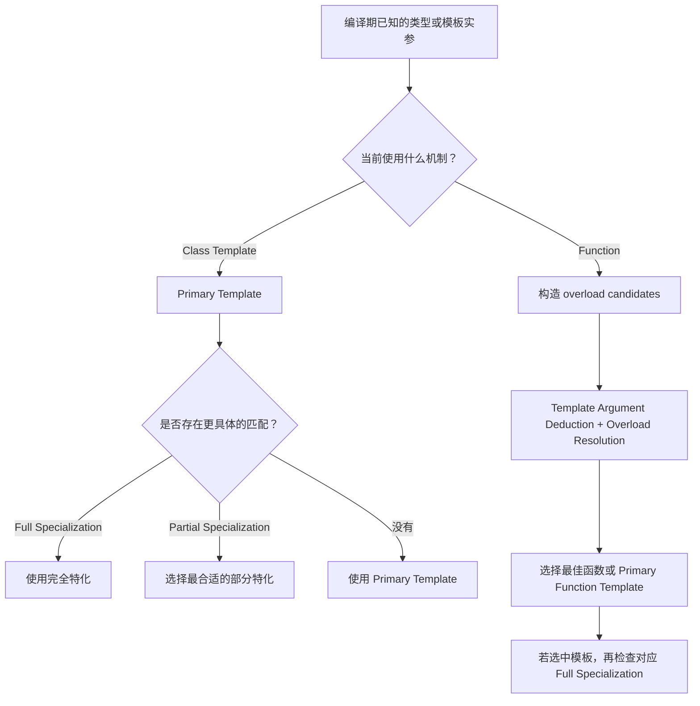

## 从通用模板到更具体的实现

上一阶段中，Template 可以理解为一个编译期参数化定义：

```cpp
template<typename T>
struct Printer {
    static void print(const T& value) {
        // 通用实现
    }
};
```

这里的 `Printer<T>` 可以处理任意满足实现要求的 `T`。

但实际程序经常遇到另一类需求：

> 大多数类型使用同一种通用实现，但某些特定类型或某一类类型需要不同的实现。

例如，我们可能希望：

- 一般类型使用默认实现；
- `bool` 使用专门实现；
- 所有指针类型使用另一套实现。

如果每一种情况都重新设计一个完全独立的类，代码之间就失去了模板所表达的共同关系。

C++ Template 提供的核心思路是：

**先定义一个 Primary Template 描述通用情况，再针对特定 Template Arguments 提供更具体的 specialization。**

编译器已经在编译期知道 Template Arguments，因此可以在编译期确定应该使用哪一个实现。

这就是这一阶段需要建立的核心Mental Model。

## Primary Template 是选择的起点

考虑一个简单的 Class Template：

```cpp
template<typename T>
struct TypePrinter {
    static void print() {
        std::cout << "general type\n";
    }
};
```

这是 **Primary Template**。

它定义默认规则：如果没有更加具体的实现适用于当前 Template Arguments，就使用这个模板。

例如：

```cpp
TypePrinter<int>::print();
TypePrinter<double>::print();
```

如果没有其他 specialization，`TypePrinter<int>` 和 `TypePrinter<double>` 都根据 Primary Template 形成。

Primary Template 因此可以理解为：

**模板这一组实现中的通用版本。**

Specialization 并不是一个与它完全无关的新模板，而是在这个 Primary Template 的基础上说明：

> 当 Template Arguments 满足某些更具体的条件时，不使用通用定义，而使用这里提供的定义。

## Full Specialization：针对一组确定的实参

如果希望某一组完全确定的 Template Arguments 使用不同实现，可以提供 **Full Specialization**，也称 Explicit Specialization。

例如希望 `bool` 使用专门实现：

```cpp
#include <iostream>

template<typename T>
struct TypePrinter {
    static void print() {
        std::cout << "general type\n";
    }
};

template<>
struct TypePrinter<bool> {
    static void print() {
        std::cout << "bool type\n";
    }
};
```

这里：

```cpp
template<typename T>
struct TypePrinter;
```

对应 Primary Template。

而：

```cpp
template<>
struct TypePrinter<bool>;
```

表示针对 `T = bool` 的 Full Specialization。

使用时：

```cpp
TypePrinter<int>::print();   // general type
TypePrinter<bool>::print();  // bool type
```

对于 `TypePrinter<int>`，没有针对 `int` 的 specialization，因此使用 Primary Template。

对于 `TypePrinter<bool>`，存在完全匹配的 Full Specialization，因此使用专门定义。

Full Specialization 中模板实参已经完全确定，所以开头写的是：

```cpp
template<>
```

其中不再声明新的 Template Parameter。

### Full Specialization 可以拥有完全不同的实现

Specialization 并不是简单地修改 Primary Template 中的一两个成员。

例如：

```cpp
template<typename T>
struct Storage {
    T value;

    void save() {
        // 通用存储方式
    }
};

template<>
struct Storage<bool> {
    unsigned char value;

    void save() {
        // bool 专用存储方式
    }
};
```

`Storage<bool>` 可以拥有不同的数据成员、成员函数和内部实现。

因此更合适的理解不是“对 Primary Template 做局部修改”，而是：

**对于同一个模板名字和某组特定 Template Arguments，提供另一份完整定义。**

当然，Full Specialization 必须建立在已经声明的 Primary Template 之上。

## Full Specialization 只能匹配一个确定情况

假设现在希望：

- 普通类型使用默认实现；
- `bool` 使用特殊实现；
- 所有指针类型都使用另一种实现。

Full Specialization 可以处理 `bool`：

```cpp
template<>
struct TypePrinter<bool> {
    // ...
};
```

但是“所有指针类型”不是某一个确定类型。

可能存在：

```cpp
int*
double*
char*
MyType*
```

如果只使用 Full Specialization，就必须分别为每一种具体指针类型提供 specialization，这显然没有表达出真正的规则：

> 只要 `T` 是某种指针，就使用这个实现。

描述这种“一类 Template Arguments”正是 Partial Specialization 的作用。

## Partial Specialization：为一类实参提供实现

Class Template 可以进行 **Partial Specialization**。

例如：

```cpp
#include <iostream>

template<typename T>
struct TypePrinter {
    static void print() {
        std::cout << "general type\n";
    }
};

template<typename T>
struct TypePrinter<T*> {
    static void print() {
        std::cout << "pointer type\n";
    }
};
```

第二个定义不是针对某一个确定类型，例如 `int*`。

它描述的是一个模式：

```cpp
T*
```

只要实际 Template Argument 能匹配这个模式，就可以使用这个 Partial Specialization。

例如：

```cpp
TypePrinter<int>::print();      // Primary Template
TypePrinter<int*>::print();     // Partial Specialization
TypePrinter<double*>::print();  // Partial Specialization
```

对于 `TypePrinter<int*>`，编译器发现 `int*` 可以匹配 `T*`，其中 `T = int`。

对于 `TypePrinter<double*>`，同样可以匹配，其中 `T = double`。

所以 Partial Specialization 仍然包含尚未确定的 Template Parameter：

```cpp
template<typename T>
struct TypePrinter<T*> {
    // ...
};
```

这也是它和 Full Specialization 最直接的区别。

| 形式 | 描述的范围 | 示例 |
| --- | --- | --- |
| Primary Template | 通用情况 | `TypePrinter<T>` |
| Partial Specialization | 一类 Template Arguments | `TypePrinter<T*>` |
| Full Specialization | 一组完全确定的 Template Arguments | `TypePrinter<bool>` |

## Partial Specialization 不只是匹配类型形式

Partial Specialization 可以根据多个 Template Arguments 之间的关系描述更具体的情况。

例如：

```cpp
template<typename T, typename U>
struct PairInfo {
    static constexpr int value = 0;
};
```

Primary Template 可以接受任意两个类型，例如：

```cpp
PairInfo<int, double>
PairInfo<char, float>
PairInfo<int, int>
```

如果希望“两个类型相同”时使用不同实现，可以写：

```cpp
template<typename T>
struct PairInfo<T, T> {
    static constexpr int value = 1;
};
```

这里没有指定某个确定类型。

它描述的是：

> 第一个 Template Argument 和第二个 Template Argument 必须是同一个类型。

因此：

```cpp
static_assert(PairInfo<int, double>::value == 0);
static_assert(PairInfo<int, int>::value == 1);
static_assert(PairInfo<double, double>::value == 1);
```

`PairInfo<int, double>` 不匹配 `<T, T>`，因此使用 Primary Template。

`PairInfo<int, int>` 可以令 `T = int`，所以匹配 Partial Specialization。

这体现了 Partial Specialization 的真正价值：**它可以描述 Template Arguments 的某种模式，而不仅是列举一个具体类型。**

## 多个实现同时匹配时选择更具体的版本

现在同时加入 Primary Template、Partial Specialization 和 Full Specialization：

```cpp
template<typename T, typename U>
struct PairInfo {
    static constexpr int value = 0;
};

template<typename T>
struct PairInfo<T, T> {
    static constexpr int value = 1;
};

template<>
struct PairInfo<int, int> {
    static constexpr int value = 2;
};
```

观察：

```cpp
static_assert(PairInfo<int, double>::value == 0);
static_assert(PairInfo<double, double>::value == 1);
static_assert(PairInfo<int, int>::value == 2);
```

`PairInfo<int, double>` 只能使用 Primary Template。

`PairInfo<double, double>` 匹配 `<T, T>`，所以使用 Partial Specialization。

`PairInfo<int, int>` 则存在针对这一组确定 Template Arguments 的 Full Specialization，因此使用对应的完整 specialization。

对于多个 Partial Specialization，如果不止一个可以匹配， 编译器会比较它们，选择能够确定为 **more specialized** 的版本。如果无法确定唯一的最佳匹配，则程序会产生歧义，编译失败。

因此不要把 specialization 理解为按照代码从上到下进行 `if` 判断。

它更接近：

**编译器根据 Template Arguments，在所有适用的模板定义之间选择最合适的定义。**

## Class Template 为什么适合 Partial Specialization

Class Template 的 Partial Specialization 可以直接表达“某一类类型需要另一种类定义”。

例如：

```cpp
template<typename T>
struct Wrapper {
    static void info() {
        std::cout << "value\n";
    }
};

template<typename T>
struct Wrapper<T*> {
    static void info() {
        std::cout << "pointer\n";
    }
};
```

`Wrapper<T*>` 描述的是完整的一类类型：

- `Wrapper<int*>`
- `Wrapper<double*>`
- `Wrapper<MyType*>`

编译器可以根据 `Wrapper<...>` 中已经确定的 Template Arguments，检查它们是否符合 Partial Specialization 描述的模式。

C++ 允许 Class Template 进行这种 Partial Specialization；Variable Template 从 C++14 开始也支持 Partial Specialization。Function Template 则没有 Partial Specialization 这种语言机制。

这并不意味着函数无法表达类似需求。对于 Function Template，C++ 已经有另一套非常适合完成这种选择的机制：**Function Overloading**。

## Function Template 可以 Full Specialization

Function Template 可以进行 Full Specialization。

例如：

```cpp
#include <iostream>

template<typename T>
void print(T value) {
    std::cout << "general\n";
}

template<>
void print<int>(int value) {
    std::cout << "int specialization\n";
}
```

调用：

```cpp
print(1);    // int specialization
print(1.5);  // general
```

Primary Function Template 是：

```cpp
template<typename T>
void print(T value);
```

而：

```cpp
template<>
void print<int>(int value);
```

为其中 `T = int` 的情况提供 Full Specialization。

因此需要明确：

**Function Template 可以 Full Specialization。**

但是 Function Template **不能 Partial Specialization**。也就是说，不能像 Class Template 那样通过 Partial Specialization 直接描述“所有 `T*` 都使用另一份函数模板实现”。

对于这种需求，Function Template 通常使用 **Function Overloading**。

例如：

```cpp
template<typename T>
void print(T value) {
    std::cout << "general\n";
}

template<typename T>
void print(T* value) {
    std::cout << "pointer\n";
}
```

第二个定义不是 Partial Specialization，而是另一个 Function Template overload。编译器会通过 Template Argument Deduction 和 overload resolution，在调用时选择合适的函数模板。

## Function Overloading 表达函数的“部分特化需求”

假设希望：

- 普通参数使用一个实现；
- 指针参数使用另一种实现。

可以定义两个 Function Template overload：

```cpp
#include <iostream>

template<typename T>
void print(T value) {
    std::cout << "general\n";
}

template<typename T>
void print(T* value) {
    std::cout << "pointer\n";
}
```

调用：

```cpp
int value = 10;
int* ptr = &value;

print(value);  // general
print(ptr);    // pointer
```

对于 `print(value)`，只有通用形式适合。

对于 `print(ptr)`，两个 Function Template 都可以形成候选：

- `print(T)` 可以令 `T = int*`。
- `print(T*)` 可以令 `T = int`。

随后 Function Template 的 partial ordering 会判断 `print(T*)` 更加具体，因此选择指针版本。

从使用效果来看，这与 Class Template Partial Specialization 很像：

Class Template 可以写：

```cpp
template<typename T>
struct Handler;

template<typename T>
struct Handler<T*>;
```

Function Template 则写成两个 overload：

```cpp
template<typename T>
void handle(T);

template<typename T>
void handle(T*);
```

因此在基础阶段可以形成一个非常实用的对应关系：

> Class Template 需要根据一类 Template Arguments 提供不同实现时，考虑 Partial Specialization；Function Template 需要根据函数参数形式提供不同实现时，通常考虑 Overloading。

## Function Overload 与 Function Specialization 不是同一机制

这是 Function Template 中最容易产生误解的地方。

下面两个函数：

```cpp
template<typename T>
void process(T value) {
    // #1
}

template<typename T>
void process(T* value) {
    // #2
}
```

是两个不同的 **Function Template overload**。

而：

```cpp
template<typename T>
void process(T value) {
    // Primary Template
}

template<>
void process<int>(int value) {
    // Full Specialization
}
```

第二个函数不是新的 overload，而是第一个 Primary Function Template 的 specialization。

这一区别会直接影响编译器如何选择函数。

对于 Function Template，**overload resolution 主要在普通函数和 Primary Function Templates 之间进行；Explicit Specialization 本身不是一个独立的 overload candidate。**

编译器首先确定哪个 Primary Function Template 被选中，然后再检查这个 Primary Template 对当前 Template Arguments 是否存在合适的 Full Specialization。

下面的例子最能体现这种区别：

```cpp
template<typename T>
void f(T) {
    // #1：通用 Function Template
}

template<>
void f<int*>(int*) {
    // #2：#1 针对 int* 的 Full Specialization
}

template<typename T>
void f(T*) {
    // #3：指针 Function Template overload
}

int* ptr = nullptr;
f(ptr);
```

直觉上可能会认为 `#2` 专门针对 `int*`，应该优先。

但 overload resolution 比较的是 Primary Function Templates `#1` 和 `#3`。

对于指针参数，`#3` 的 `f(T*)` 比 `#1` 的 `f(T)` 更具体，因此选择 `#3`。

`#2` 是 `#1` 的 specialization，而 `#1` 已经没有被 overload resolution 选中，所以最终不会调用 `#2`。这一行为也是 cppreference 特别强调的 Function Overloads 与 Function Specializations 的区别。

这也是为什么在 Function Template 中，为不同参数形式设计不同实现时，**Overloading 通常比 Explicit Specialization 更自然，也更容易理解和维护。**

## 普通函数也可以参与 Function Template Overloading

Function Template 还可以和普通非模板函数一起 overload：

```cpp
#include <iostream>

void print(int value) {
    std::cout << "int overload\n";
}

template<typename T>
void print(T value) {
    std::cout << "template\n";
}
```

调用：

```cpp
print(10);
```

`print(int)` 和模板产生的 `print<int>(int)` 都是精确匹配。在匹配质量相同的情况下，非模板函数优先，因此选择普通函数。

而：

```cpp
print(3.14);
```

模板可以得到 `print<double>(double)`，它能够精确匹配；普通 `print(int)` 需要进行类型转换，因此模板版本匹配更好。

所以编译期选择并不是简单的“普通函数优先”或“更具体代码写在后面就优先”。

Function Template 最终仍然遵循 overload resolution 的规则来确定最佳候选。

## Compile-time Type Selection

Specialization 不仅可以选择不同的函数实现，也可以在编译期选择**不同的类型**。

例如，希望根据一个编译期 `bool` 参数选择不同类型：

```cpp
template<bool UseFloat>
struct ValueType;

template<>
struct ValueType<true> {
    using type = float;
};

template<>
struct ValueType<false> {
    using type = int;
};
```

现在：

```cpp
using A = ValueType<true>::type;
using B = ValueType<false>::type;
```

编译器在编译期已经知道 Template Argument：

- `ValueType<true>` 使用第一个 Full Specialization，因此 `A` 是 `float`。
- `ValueType<false>` 使用第二个 Full Specialization，因此 `B` 是 `int`。

如果使用 C++17 或更高版本，可以通过 `std::is_same_v` 验证结果：

```cpp
#include <type_traits>

static_assert(std::is_same_v<A, float>);
static_assert(std::is_same_v<B, int>);
```

这里并不存在运行时：

```cpp
if (UseFloat) {
    // ...
}
```

因为 `UseFloat` 是 Template Argument，选择发生在编译期间。

这就是最基础的 **Compile-time Type Selection** 思想：

**把类型或编译期值作为模板输入，通过模板匹配、specialization 或 overload，让编译器在编译阶段确定最终使用的类型或实现。**

这里使用 `std::is_same_v` 只是为了验证结果，不需要进一步展开 Type Traits。

## 编译器到底在选择什么

把这一阶段的几个机制放在一起，可以看到它们解决的是同一个更大的问题：



对于 Class Template，可以把选择理解成：

- Primary Template 提供通用实现；
- Partial Specialization 描述某一类更具体的 Template Arguments；
- Full Specialization描述某一组完全确定的 Template Arguments；
- 当多个 Partial Specialization 同时匹配时，选择能够确定为更加 specialized 的版本，否则产生歧义。

对于 Function Template，思路有所不同：

- Function Template 可以 Full Specialization；
- Function Template 不能 Partial Specialization；
- 不同参数模式通常通过 Function Overloading 表达；
- overload resolution 先选择普通函数或 Primary Function Template；
- 如果选中了某个 Primary Function Template，再考虑它针对当前参数是否有 Full Specialization。

因此，**Class Template Specialization 和 Function Template Overloading 都可以实现“针对不同编译期信息选择不同实现”，但它们不是同一套语言机制。**

学习这一阶段真正需要保留的 Mental Model 不是某几个 `template<>` 语法，而是：

**先提供一个通用规则，再描述哪些编译期输入应该使用更具体的规则；编译器根据已经知道的类型和模板参数，在编译期完成匹配与选择。**

## 参考资料

- *C++ Templates: The Complete Guide, 2nd Edition*，重点对应 Function Template Overloading、Class Template Specializations 与 Partial Specialization 等基础章节。出版社目录可确认这些主题位于基础部分的 Function Templates 与 Class Templates 章节。
- cppreference：Templates、Explicit (full) template specialization、Partial template specialization、Function template、Overload resolution。