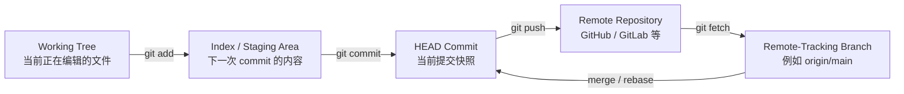
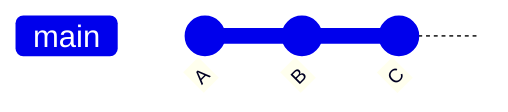
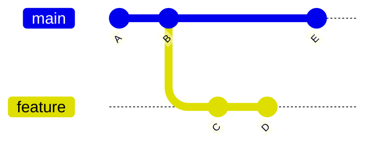
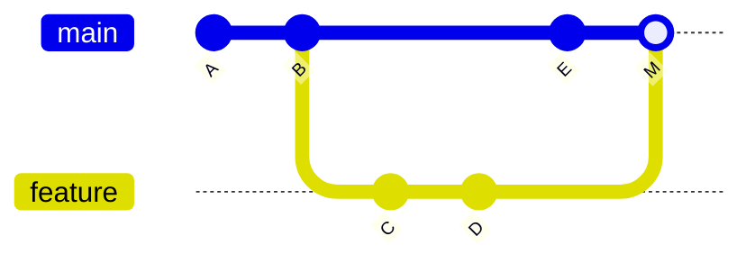
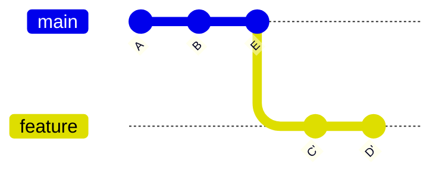
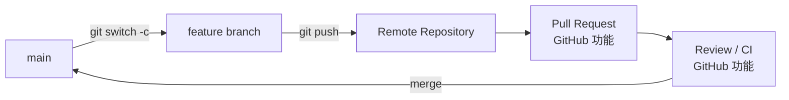
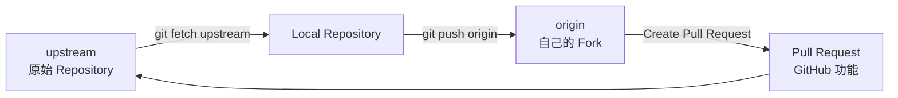

## Git 的状态模型

使用 Git 时，最重要的不是大量命令，而是重新建立下面几个判断：

- 当前 `HEAD` 在哪里？
- 当前分支指向哪个 commit？
- working tree 中有哪些修改？
- index 中已经准备了哪些修改？
- 本地分支和 remote-tracking branch 有什么差异？
- 接下来执行的命令会改变哪一层状态？
- 如果操作错误，能否恢复？

Git 日常开发中最重要的几层状态可以表示为：



其中最容易混淆的是 working tree、index 和 `HEAD`。

Git 官方文档将 index 也称为 staging area，它保存的是准备进入下一次 commit 的内容。因此：

```bash
git add file.cpp
```

并不是简单地“标记这个文件需要提交”，而是把这个文件**当前的内容**加入 index。如果之后继续修改该文件，需要再次执行 `git add`，新修改才会进入下一次 commit。

检查这三层状态时最常用：

```bash
git status
git diff
git diff --staged
```

它们分别回答不同问题。

`git status` 用于观察 working tree、index 和当前分支的整体状态。

```bash
git diff
```

默认比较：

```text
working tree <-> index
```

也就是：

> 当前还有哪些修改没有进入 staging area？

而：

```bash
git diff --staged
```

比较：

```text
index <-> HEAD
```

也就是：

> 如果现在执行 `git commit`，将提交哪些变化？

因此恢复 Git 使用后，一个值得重新形成的习惯是：

```bash
git status
git diff

git add <file>

git diff --staged
git commit
```

不要在没有确认 staged 内容的情况下机械执行 `git add . && git commit`。

## HEAD、branch 和 commit 的关系

Git branch 可以理解为一个指向 commit 的可移动引用。

假设当前历史为：



如果 `main` 指向 `C`，并且当前正在 `main` 上工作，可以理解为：

```text
HEAD -> main -> C
```

再次执行：

```bash
git commit
```

产生新 commit `D` 后：

```text
HEAD -> main -> D
```

原来的 `C` 没有移动。

移动的是 `main` 这个 branch reference。

因此理解很多 Git 操作时，可以先问：

> 这个操作是在修改文件，还是在移动某个 reference？

例如：

```bash
git reset <commit>
```

会改变当前 branch 指向的位置，并且根据 reset mode 决定是否继续修改 index 和 working tree。

而：

```bash
git switch feature
```

会让 `HEAD` 切换到另一个 branch，同时更新 index 和 working tree，使其匹配目标 branch。

## 接手仓库时先观察，不要直接修改历史

重新进入一个很久没有操作的仓库，或者遇到 Git 问题时，第一步不应该是直接执行：

```text
pull
reset
rebase
force push
```

先观察仓库当前状态。

一组常用的诊断命令是：

```bash
git status
git branch -vv
git remote -v
git log --oneline --graph --decorate --all
```

其中：

```bash
git status
```

检查 working tree、index 和当前 branch。

```bash
git branch -vv
```

重点观察：

- 当前在哪个本地 branch
- branch 是否配置 upstream
- upstream 是哪个 remote-tracking branch
- branch 是否 ahead / behind

```bash
git remote -v
```

确认当前配置了哪些 remote。

```bash
git log --oneline --graph --decorate --all
```

用于观察：

- commit history
- `HEAD`
- 本地 branch
- remote-tracking branch
- branch 从哪里产生分叉
- 是否存在 merge commit

出现问题时，可以先按照下面的顺序判断：

```text
status
→ HEAD / branch
→ commit history
→ remote
→ fetch
→ 比较本地与 remote-tracking branch
→ 决定下一步操作
```

核心原则是：

<mark>先弄清当前状态，再修改状态。</mark>

## `switch`、`restore` 与以前常用的 `checkout`

以前使用 Git 时可能已经习惯：

```bash
git checkout main
git checkout -b feature/login
git checkout -- file.cpp
```

这些操作现在也可以分别写成：

```bash
git switch main
git switch -c feature/login
git restore file.cpp
```

可以先记住职责上的区别：

| 目的 | 命令 |
| --- | --- |
| 切换已有 branch | `git switch <branch>` |
| 创建并切换 branch | `git switch -c <branch>` |
| 切换回上一个 branch | `git switch -` |
| 临时查看某个 commit | `git switch --detach <commit>` |
| 恢复 working tree 中的文件 | `git restore <file>` |
| 取消 staging | `git restore --staged <file>` |

`git checkout` 并没有失效。

`switch` 和 `restore` 的主要价值是把“切换 branch”和“恢复文件”两个不同职责拆开，使操作对象更清楚。

## 日常 feature branch 开发流程

假设团队以 `main` 为主分支，一个典型 feature 开发过程可以先更新本地 `main`：

```bash
git switch main
git fetch origin
```

此时 `fetch` 会更新类似：

```text
origin/main
```

这样的 remote-tracking branch，但不会自动修改本地 `main`。

先检查：

```bash
git status
git log --oneline --graph --decorate --all
```

如果确认：

```text
main
```

只是单纯落后于：

```text
origin/main
```

可以执行：

```bash
git merge --ff-only origin/main
```

`--ff-only` 表示只有能够 fast-forward 时才更新，否则停止，让你自己处理已经分叉的历史。

然后创建 feature branch：

```bash
git switch -c feature/login
```

开发过程中：

```bash
git status
git diff
```

确认需要提交的修改后：

```bash
git add src/login.cpp
```

再次确认 staged 内容：

```bash
git diff --staged
```

然后提交：

```bash
git commit -m "Add login validation"
```

如果一个文件中同时存在多个逻辑无关的修改，可以使用：

```bash
git add -p
```

按 hunk 选择进入 index 的修改，从而避免把无关变化塞进同一个 commit。

第一次推送 branch 时：

```bash
git push -u origin feature/login
```

`-u` 是 `--set-upstream` 的缩写，用于建立本地 branch 与 upstream branch 的关系。

## local branch、remote-tracking branch 和 remote branch

这一组概念很容易混淆。

假设存在：

```text
main
origin/main
GitHub 上的 main
```

它们不是同一个东西。

`main` 是：

> 本地 branch。

`origin/main` 是：

> 本地保存的 remote-tracking branch。

GitHub 上真正的 `main` 则存在于 remote repository。

`origin/main` 表示的是：

> Git 最近一次与 `origin` 通信以后，本地记录的远程 `main` 状态。

因此：

```bash
git log origin/main
```

并不能保证看到服务器当前最新的 `main`。

先执行：

```bash
git fetch origin
```

Git 才会根据 remote 状态更新对应的 remote-tracking branches。

这也是为什么诊断远程历史问题时，通常应该先 `fetch`。

## `fetch`、`pull` 和 `push`

### `git fetch`

```bash
git fetch origin
```

会从 remote 获取本地缺少的对象和引用信息，并更新配置对应的 remote-tracking branches，例如：

```text
origin/main
origin/feature/login
```

它不会自动把这些变化整合进当前 branch。

因此 `fetch` 很适合用来先同步远程信息，再观察 history：

```bash
git fetch origin
git log --oneline --graph --decorate --all
```

然后再决定需要 merge 还是 rebase。

### `git pull`

`git pull` 可以理解为两个阶段：

```text
fetch
+
将获取到的历史整合进当前 branch
```

整合方式可能是 merge、rebase 或仅允许 fast-forward，具体取决于参数和配置。

因此在重新恢复 Git 使用期间，如果对当前 history 没有把握，可以先显式拆开：

```bash
git fetch origin
```

观察以后再执行：

```bash
git merge origin/main
```

或者：

```bash
git rebase origin/main
```

这样更容易理解每一步到底改变了什么。

### `git push`

例如：

```bash
git push origin feature/login
```

会尝试使用本地 `feature/login` 更新 remote repository 中对应的 branch，并传输远程缺少的对象。

如果 remote branch 已经包含本地不知道的新 commit，普通 push 通常会拒绝进行非 fast-forward 更新。

此时第一反应不应该是 force push，而应该：

```bash
git fetch origin
git log --oneline --graph --decorate --all
```

先确认双方历史为什么发生了分叉。

## Fast-forward 是什么

假设：


如果本地 `main` 指向 `B`，而 `origin/main` 指向 `C`，并且本地在 `B` 后没有额外 commit：

```text
A -- B -- C
     ^    ^
    main  origin/main
```

那么把 `main` 更新到 `C` 时不需要创建新的 commit，只需要让 `main` 向前移动：

```text
A -- B -- C
          ^
       main
       origin/main
```

这就是 fast-forward。

因此：

```bash
git merge --ff-only origin/main
```

可以理解为：

> 如果当前 branch 可以单纯向前移动，就更新；如果已经与目标 branch 分叉，就停止。

## 分支产生分叉以后真正的问题是什么

假设：



此时：

- `main` 包含 `E`
- `feature` 包含 `C`、`D`
- 两条 branch 从 `B` 开始产生分叉

接下来真正的问题不是“使用哪个命令”，而是：

> 应该怎样整合两条历史？

日常开发中最重要的两种方式是：

- merge
- rebase

## merge 保留已有历史关系

假设当前在 `main`：

```bash
git switch main
git merge feature
```

如果不能 fast-forward，Git 会创建一个具有两个 parent 的 merge commit：



原来的：

```text
C
D
E
```

仍然保持原有 ancestry。

因此 merge 可以理解为：

> 保留两条已经发生的开发历史，并创建一个新的 commit 把它们连接起来。

## rebase 会重新应用 commit

假设历史为：

```text
      C -- D  feature
     /
A -- B -- E  main
```

当前在 `feature`：

```bash
git switch feature
git rebase main
```

Git 会把 `feature` 上相对于 `main` 需要保留的提交重新应用到新的 base 上。

结果可以理解为：



新的 `C'`、`D'` 与原来的 `C`、`D` 不是同一个 commit。

即使文件修改相同，它们的 parent 已经改变，因此 commit identity 也会改变。

所以：

**rebase 会重写被重新应用的那段 commit history。**

## merge 与 rebase 应该怎样选择

不要只记：

```text
merge = 历史不直
rebase = 历史漂亮
```

真正重要的问题是：

> 这段 commit history 是否适合被重新创建？

### 自己尚未共享的 feature history

例如只有自己使用：

```text
feature/my-work
```

这种 history 可以根据团队 workflow 使用 rebase 更新 base：

```bash
git fetch origin
git rebase origin/main
```

### 已经被其他人依赖的共享 history

如果一些 commit 已经 push，并且其他开发者可能基于它们继续工作，那么 rebase 会让这些 commits 被新的 commits 替代。

因此核心原则是：

<mark>不要在没有团队约定的情况下随意重写别人已经依赖的共享历史。</mark>

具体使用 merge、rebase，或者 GitHub 的 squash merge / rebase merge，应以项目 workflow 为准。

## merge conflict 表示 Git 无法安全决定最终结果

Git 可以自动合并很多变化。

如果两个 branch：

- 修改不同文件
- 修改同一文件的不同区域

Git 往往可以自动完成 merge。

但如果出现竞争性修改，例如双方修改同一段内容，Git 可能无法确定最终应该保留什么。

这时就会产生 merge conflict。

Conflict 并不是仓库“坏掉了”，而是 Git 暂停当前操作，等待你确定最终内容。

第一步应该执行：

```bash
git status
```

确认：

- 哪些文件存在 conflict
- 当前正在进行 merge、rebase 还是其他操作
- 下一步 Git 期望执行什么

## 处理 merge conflict

假设：

```bash
git merge feature
```

发生 conflict。

先：

```bash
git status
```

冲突文件中可能出现：

```text
<<<<<<< HEAD
current branch content
=======
other branch content
>>>>>>> feature
```

这些 marker 表示 Git 无法自动决定最终内容。

处理 conflict 的核心不是“删除 marker”，而是：

> 根据程序应该实现的最终行为，编辑出正确的最终文件。

修改完成以后：

```bash
git add path/to/file
```

此时 `git add` 表示：

> 把解决后的最终内容写入 index，并把该路径标记为已经解决。

所有冲突解决后：

```bash
git merge --continue
```

也可以在相应情况下通过 `git commit` 完成 merge。

如果决定完全放弃这次 merge：

```bash
git merge --abort
```

Git 官方文档同时提醒：如果开始 merge 前 working tree 中存在复杂的未提交修改，`git merge --abort` 不一定能够完美恢复这些修改。因此执行复杂 merge 前，最好先让当前工作处于可恢复状态。

## 处理 rebase conflict

执行：

```bash
git rebase main
```

时，如果某个 commit 无法重新应用，rebase 会暂停。

先检查：

```bash
git status
```

解决 conflict 后：

```bash
git add <file>
git rebase --continue
```

如果后续 commit 再次发生 conflict，则重复：

```text
解决文件
→ git add
→ git rebase --continue
```

如果决定取消整个 rebase：

```bash
git rebase --abort
```

会尝试把 branch 恢复到 rebase 开始前的位置。

因此遇到冲突时最重要的习惯是：

<mark>不要在不知道当前 Git 正处于什么操作的情况下继续执行新的 history-changing command。</mark>

先看：

```bash
git status
```

## 撤销操作前先判断要修改哪一层

遇到错误以后，不要只问：

> Git 怎么撤销？

应该先判断错误发生在哪一层：

```text
working tree
index
commit history
shared history
```

不同情况需要不同操作。

## 丢弃未 staged 的 tracked 修改

如果文件已经修改，但还没有 staged：

```bash
git diff -- file.cpp
```

确认确实不需要这些修改以后：

```bash
git restore file.cpp
```

默认情况下，这会使用 index 中的版本恢复 working tree。

因此 working tree 中对应的未保存修改会丢失。

## 取消 staging，但保留 working tree 修改

已经执行：

```bash
git add file.cpp
```

但不希望它进入下一次 commit：

```bash
git restore --staged file.cpp
```

这会更新 index，而 working tree 中的修改仍然保留。

因此：

```text
git restore <file>
```

和：

```text
git restore --staged <file>
```

操作的层次不同。

## 修改最近一次 commit

如果刚刚 commit 后发现：

- commit message 写错
- 漏掉了一个文件
- 当前 commit 内容需要补充

并且这段 history 仍然适合修改，可以使用：

```bash
git add forgotten-file
git commit --amend
```

或者只修改 commit message：

```bash
git commit --amend
```

需要注意：

**amend 会产生一个新的 commit，原 commit hash 会改变。**

因此已经共享的 commit 是否应该 amend，需要先考虑是否会影响其他人的 history。

## 理解 `reset --soft`、默认 reset 与 `reset --hard`

假设：

```text
A -- B -- C
          ^
         HEAD
```

现在执行：

```bash
git reset HEAD~1
```

核心动作之一是让当前 branch 从 `C` 回到 `B`。

不同 mode 决定 index 和 working tree 是否一起改变。

### `git reset --soft`

```bash
git reset --soft HEAD~1
```

结果可以理解为：

```text
branch / HEAD：回到 B
index：保留 C 对应的修改
working tree：保留修改
```

适合：

> commit 不想保留，但希望修改仍然 staged。

### 默认 `git reset`

```bash
git reset HEAD~1
```

通常等价于：

```bash
git reset --mixed HEAD~1
```

结果：

```text
branch / HEAD：回到 B
index：重置为 B
working tree：保留修改
```

因此原来 `C` 中的修改重新变成 unstaged changes。

### `git reset --hard`

```bash
git reset --hard HEAD~1
```

会同时更新：

- 当前 branch
- index
- working tree

使它们匹配目标 commit。

因此可能直接覆盖尚未保存进 Git history 的 working tree 修改。

执行前应该先检查：

```bash
git status
git diff
git diff --staged
```

不要把 `git reset --hard` 当作普通的“清理仓库”命令。

## `reset` 与 `revert` 的区别

假设：

```text
A -- B -- C
```

发现 `C` 是错误 commit。

如果 `C` 仍然只是自己的本地 history，可以根据需要考虑：

```bash
git reset ...
```

它可以把当前 branch 移回较早的位置。

但如果 `C` 已经进入需要保留的共享历史，通常更适合：

```bash
git revert C
```

`revert` 不会删除 `C`，而是创建一个新的 commit：

```text
A -- B -- C -- D
```

其中 `D` 用新的修改反转 `C` 带来的效果。

因此可以建立下面的核心区别：

| 命令 | 主要目的 |
| --- | --- |
| `git restore` | 恢复 working tree 或 index 中的文件内容 |
| `git reset` | 调整当前 branch / HEAD，并根据 mode 调整 index、working tree |
| `git revert` | 创建新 commit 来撤销已有 commit 的效果 |

面对共享 history 时，`revert` 的关键价值是：

> 保留已经发生的 commit history，通过新的 commit 表达撤销。

## commit 看起来丢失时先检查 reflog

假设原来：

```text
A -- B -- C
```

误执行：

```bash
git reset --hard HEAD~2
```

现在：

```text
main -> A
```

普通：

```bash
git log
```

可能已经看不到 `B` 和 `C`。

这并不意味着应该立即认定 commit 已经无法恢复。

Git 的 reflog 会记录本地 repository 中 branch tip、`HEAD` 等 references 的更新历史。

先检查：

```bash
git reflog
```

可能看到类似：

```text
abcd123 HEAD@{0}: reset: moving to HEAD~2
9876abc HEAD@{1}: commit: Add feature
1234def HEAD@{2}: commit: Refactor parser
```

找到需要恢复的 commit 后，一个稳妥的做法是先创建 branch：

```bash
git branch rescue 9876abc
```

再确认：

```bash
git log --oneline --graph --decorate --all
```

确认目标 commit 已经重新被 branch reference 指向以后，再决定是否需要让原 branch 回到该 commit。

恢复流程可以记成：

```text
发现 commit 看不到了
→ 停止继续改写 history
→ git reflog
→ 找到目标 commit
→ 创建 rescue branch
→ 检查 history
→ 再决定如何恢复原 branch
```

`reflog` 是本地 reference log，不应该把它当成永久备份机制。

## 误删 branch 时怎样恢复

执行：

```bash
git branch -D feature
```

删除的是 branch reference。

如果该 branch 上的 commit 暂时没有其他 branch 或 tag 指向，它们可能不会出现在普通 branch history 中，但并不代表这些 Git objects 会在删除 branch 的瞬间立刻消失。

刚刚误删 branch 时，可以优先检查：

```bash
git reflog
```

必要时：

```bash
git reflog --all
```

找到原 branch tip 后：

```bash
git branch feature-recovered <commit>
```

这里仍然体现了同一个恢复原则：

<mark>先重新建立一个 reference 指向目标 commit，再继续进行其他历史操作。</mark>

## push 被拒绝时怎样诊断

如果：

```bash
git push
```

因为 non-fast-forward 被拒绝，不要第一时间：

```bash
git push --force
```

先：

```bash
git fetch origin
git branch -vv
git log --oneline --graph --decorate --all
```

然后判断：

- remote 是否出现了本地没有的新 commit
- 当前 branch 是否进行了 rebase
- 是否正在 push 正确的 branch
- upstream 是否配置正确

如果只是双方产生分叉，需要根据团队 workflow 决定 merge 或 rebase。

例如：

```bash
git rebase origin/main
```

或者：

```bash
git merge origin/main
```

## `--force-with-lease` 与 `--force`

如果自己的 feature branch 已经 push，然后又进行了 rebase，那么 commit history 会发生变化，普通 push 可能被拒绝。

如果项目明确允许重写这个 branch，可以使用：

```bash
git push --force-with-lease
```

相比：

```bash
git push --force
```

`--force-with-lease` 会增加对 remote ref 当前值的检查。当 remote branch 已经发生了自己没有预期到的变化时，push 可以被拒绝，而不是直接覆盖。

但需要注意：

<mark>`--force-with-lease` 并不意味着所有 force push 都自动安全。</mark>

它仍然属于 history rewrite 场景。

是否允许对某个 branch force push，首先应服从团队 workflow 和 branch protection 规则。

## 如何阅读 Git history

日常 Git 能力不只是“会提交”，还应该能够从 history 判断仓库发生了什么。

### 查看整体 history

```bash
git log --oneline --graph --decorate --all
```

重点观察：

- `HEAD`
- local branches
- remote-tracking branches
- branch 分叉位置
- merge commit

### 查看一个 commit

```bash
git show <commit>
```

可以用于检查该 commit 的基本信息和具体修改。

### 查看 working tree 修改

```bash
git diff
```

### 查看下一次 commit 准备提交的内容

```bash
git diff --staged
```

### 比较两个 commit

```bash
git diff <commit-a> <commit-b>
```

### 查看 `feature` 中 `main` 没有的 commits

```bash
git log main..feature
```

这里关注的是：

> 能从 `feature` 到达，但不能从 `main` 到达的 commits。

### 查看 feature 从分叉以后整体修改了什么

```bash
git diff main...feature
```

这里的三个点会使用 merge base 作为比较基准，因此很适合观察：

> feature 相对于它和 main 的共同起点增加了哪些变化？

需要注意：

```bash
git log A..B
```

和：

```bash
git diff A..B
```

虽然都出现 `..`，但属于不同命令的 revision / diff 语义，不应该仅根据符号把它们理解成完全相同的操作。

## GitHub Pull Request 与 Git 本身要区分

下面这些属于 Git：

- commit
- branch
- merge
- rebase
- remote
- fetch
- push
- tag

而 Pull Request 是 GitHub 提供的协作功能。

GitLab 中对应的协作概念通常称为 Merge Request。

Pull Request 建立在 Git branch 和 commit history 之上，并进一步提供：

- 代码审查
- 讨论
- CI / status checks
- approval
- branch protection
- merge interface

因此典型开发流程可以分为两层。

Git 操作：

```bash
git switch -c feature/login

# 修改代码

git add <files>
git commit -m "Add login validation"
git push -u origin feature/login
```

之后：

> 在 GitHub 上创建 Pull Request。

创建、review、approve 和 merge Pull Request 属于 GitHub 的平台功能，而不是 Git command。

## 团队 branch workflow

一个常见的 branch-based collaboration 可以表示为：



本地开始开发前：

```bash
git switch main
git fetch origin
git merge --ff-only origin/main
git switch -c feature/cache
```

开发并提交：

```bash
git add <files>
git commit
```

如果 feature 开发期间 `main` 又发生了变化，根据项目 workflow 可以：

```bash
git fetch origin
git rebase origin/main
```

或者：

```bash
git fetch origin
git merge origin/main
```

然后 push feature branch：

```bash
git push -u origin feature/cache
```

至于 Pull Request 最终使用：

- merge commit
- squash merge
- rebase merge

属于 GitHub repository 的协作策略，应以具体项目规范为准。

## Fork workflow 中的 `origin` 与 `upstream`

Fork 是 GitHub 等代码托管平台提供的 repository-level 功能，不是 Git 本身的 object 或 branch 类型。

GitHub 中，fork 是一个与 upstream repository 保持关联的独立 repository。

在本地参与 fork-based workflow 时，常见配置是：

```text
origin   -> 自己的 fork
upstream -> 原始 repository
```

检查：

```bash
git remote -v
```

如果尚未配置 upstream：

```bash
git remote add upstream <original-repository-url>
```

整体关系可以表示为：



同步上游：

```bash
git fetch upstream
```

如果本地 `main` 没有自己的额外开发 history，可以：

```bash
git switch main
git merge --ff-only upstream/main
```

需要同步自己的 fork 时再：

```bash
git push origin main
```

实际开发通常在 feature branch 上进行，而不是直接在自己的 `main` 上堆 feature commits：

```bash
git switch -c feature/new-kernel
```

之后把 feature branch push 到自己的 fork，再通过 GitHub Pull Request 向 upstream repository 提交变更。

## 常见问题应该怎样诊断

### 修改了文件，但 commit 中没有

检查：

```bash
git status
git diff
git diff --staged
```

确认修改是否真正进入 index。

### `git diff` 没有输出，但 `git status` 显示有 staged 修改

检查：

```bash
git diff --staged
```

因为默认：

```bash
git diff
```

比较的是 working tree 与 index。

### `git fetch` 后代码没有变化

这是正常情况。

`fetch` 更新 remote-tracking branches，而不会自动修改当前 branch。

查看：

```bash
git log --oneline --graph --decorate --all
```

然后再决定是否需要：

```bash
git merge origin/main
```

或者：

```bash
git rebase origin/main
```

### push 被拒绝

先：

```bash
git fetch origin
git branch -vv
git log --oneline --graph --decorate --all
```

先看双方 history，而不是直接 force push。

### 进入 detached HEAD

检查：

```bash
git status
```

如果是为了查看某个 commit：

```bash
git switch --detach <commit>
```

进入 detached HEAD 本身并不是错误。

如果在 detached HEAD 状态产生了需要保留的新 commit，可以在切走以前创建 branch：

```bash
git switch -c rescue-work
```

让 branch reference 指向当前 commit。

### 不知道刚才的 Git 命令把仓库变成什么状态

先：

```bash
git status
```

然后：

```bash
git log --oneline --graph --decorate --all
```

如果怀疑 branch 或 `HEAD` 的位置发生了错误移动：

```bash
git reflog
```

在理解当前状态以前，不要连续尝试：

```text
reset
rebase
force push
```

## 撤销与恢复速查

| 当前问题 | 首先考虑 |
| --- | --- |
| 未 staged 的 tracked 修改不需要了 | `git restore <file>` |
| staged 错文件但想保留修改 | `git restore --staged <file>` |
| 最近 commit 内容或 message 需要修改 | `git commit --amend` |
| 本地 commit 不想要，修改继续保持 staged | `git reset --soft` |
| 本地 commit 不想要，修改保留为 unstaged | `git reset` |
| commit 和 tracked 修改都确定不要 | `git reset --hard` |
| 已共享 commit 需要反向撤销 | `git revert` |
| rebase 做到一半需要取消 | `git rebase --abort` |
| merge 做到一半需要取消 | `git merge --abort` |
| reset / rebase 后 commit 看不到 | `git reflog` |
| branch 误删 | `git reflog` 后重新建立 branch |
| push non-fast-forward | `git fetch` 后检查双方 history |

这张表不应该机械背诵。

真正应该记住的问题是：

> 我要改变的是 working tree、index、branch pointer，还是已经共享的 commit history？

## 资料依据

本文围绕实际开发能力恢复整理，核心依据为 Git 官方文档与 Pro Git。

Git 官方资料入口：

- [Git Reference](https://git-scm.com/docs)
- [Pro Git](https://git-scm.com/book/en/v2)

GitHub 官方资料入口：

- [GitHub Docs](https://docs.github.com/)