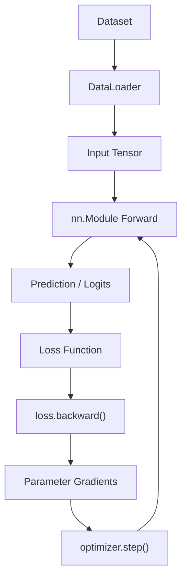
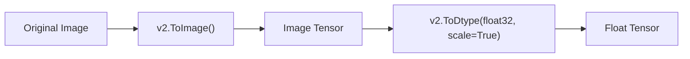
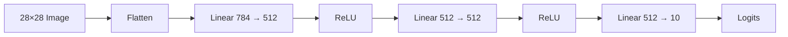
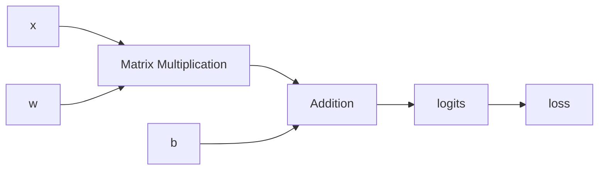
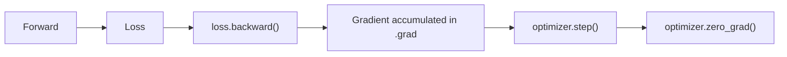
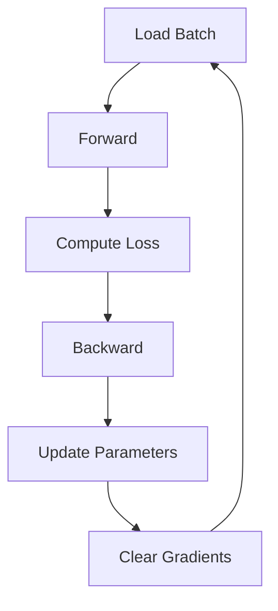
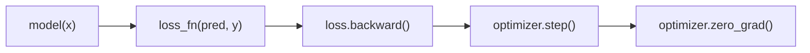
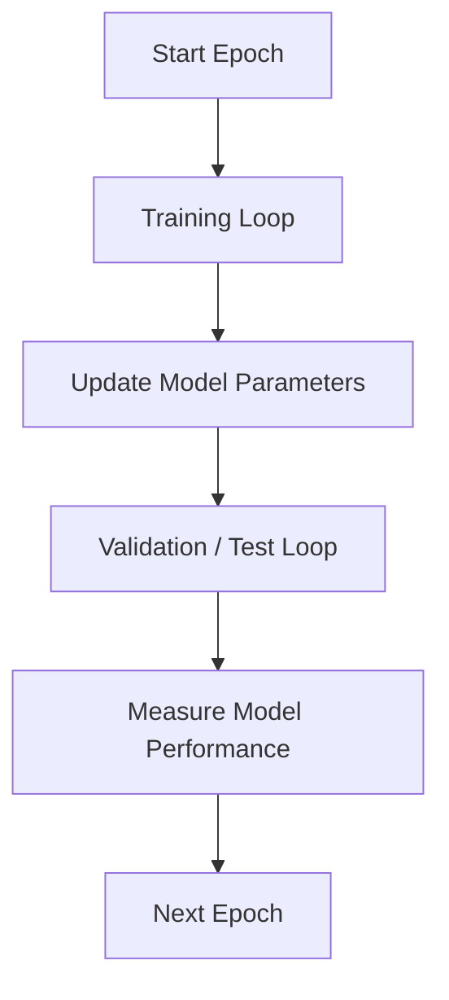
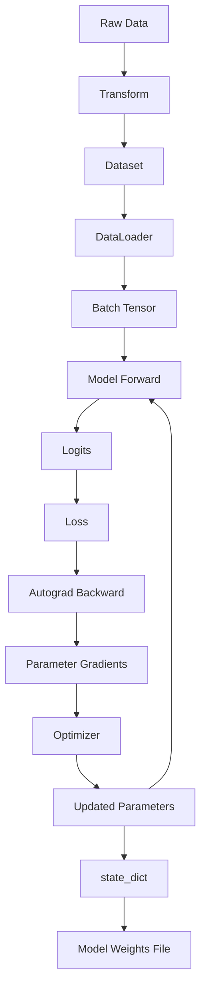

## 1. PyTorch 基本工作流

PyTorch 官方的 `Learn the Basics` 教程围绕一个完整的机器学习工作流展开：

1. 使用 Tensor 表示数据。
2. 使用 `Dataset` 保存样本，使用 `DataLoader` 批量读取数据。
3. 使用 Transform 对输入和标签进行预处理。
4. 继承 `nn.Module` 定义神经网络。
5. 使用 `torch.autograd` 自动计算梯度。
6. 定义损失函数和优化器。
7. 执行训练循环和测试循环。
8. 使用 `state_dict` 保存和恢复模型参数。

整个流程可以概括为：



官方基础教程统一使用 FashionMNIST 作为示例数据集。FashionMNIST 包含 60000 个训练样本和 10000 个测试样本，每个样本是一张 `28 × 28` 的灰度图像，对应 10 个类别中的一个。

---

## 2. Tensor

### 2.1 Tensor 是什么

Tensor 是 PyTorch 中最基本的数据结构。

模型的输入、输出、参数都使用 Tensor 表示。

Tensor 与 NumPy 的 `ndarray` 非常相似，但 Tensor 可以运行在 CPU 或 CUDA、MPS、MTIA、XPU 等硬件加速设备上，同时能够参与 PyTorch 的自动微分。

### 2.2 创建 Tensor

可以直接通过 Python 数据创建 Tensor：

```python
import torch

data = [
    [1, 2],
    [3, 4],
]

# PyTorch 会根据输入数据自动推断 dtype
x = torch.tensor(data)

print(x)
```

也可以从 NumPy 数组创建 Tensor：

```python
import numpy as np
import torch

array = np.array([
    [1, 2],
    [3, 4],
])

# 从 NumPy ndarray 创建 Tensor
x = torch.from_numpy(array)
```

还可以根据已有 Tensor 创建具有相同形状的 Tensor：

```python
import torch

x = torch.tensor([
    [1, 2],
    [3, 4],
])

# 保留 x 的 shape 和 dtype
ones = torch.ones_like(x)

# 保留 shape，但显式指定新的 dtype
random_values = torch.rand_like(x, dtype=torch.float32)
```

对于只知道形状的情况，可以直接创建随机值、全 0 或全 1 Tensor：

```python
import torch

shape = (2, 3)

random_tensor = torch.rand(shape)
ones_tensor = torch.ones(shape)
zeros_tensor = torch.zeros(shape)
```

### 2.3 Tensor 的基本属性

Tensor 最重要的三个属性是：

| 属性 | 含义 |
| --- | --- |
| `tensor.shape` | Tensor 的形状 |
| `tensor.dtype` | 元素的数据类型 |
| `tensor.device` | Tensor 当前所在设备 |

例如：

```python
import torch

x = torch.rand(3, 4)

print(x.shape)
print(x.dtype)
print(x.device)
```

默认情况下，Tensor 创建在 CPU 上。

---

## 3. Tensor 与设备

当前 PyTorch 使用 `torch.accelerator` 检测可用的硬件加速设备。

```python
import torch

if torch.accelerator.is_available():
    # 获取当前可用的 accelerator
    device = torch.accelerator.current_accelerator()
else:
    device = torch.device("cpu")

print(device)
```

Tensor 不会自动移动到 accelerator，需要显式调用 `.to()`：

```python
import torch

x = torch.rand(3, 4)

if torch.accelerator.is_available():
    device = torch.accelerator.current_accelerator()

    # 将 Tensor 从 CPU 移动到 accelerator
    x = x.to(device)
```

需要注意，<mark>设备之间的数据复制存在时间和内存开销，因此移动大型 Tensor 并不是免费的操作。</mark>

---

## 4. Tensor 基本操作

### 4.1 索引和切片

Tensor 支持类似 NumPy 的索引方式：

```python
import torch

x = torch.ones(4, 4)

# 第一行
first_row = x[0]

# 第一列
first_column = x[:, 0]

# 最后一列
last_column = x[..., -1]

# 修改第二列
x[:, 1] = 0
```

### 4.2 拼接 Tensor

可以使用 `torch.cat()` 沿指定维度连接 Tensor：

```python
import torch

x = torch.ones(2, 3)

# 在 dim=1 上进行拼接
result = torch.cat([x, x, x], dim=1)

print(result.shape)
```

PyTorch 还提供 `torch.stack()`，其语义与 `torch.cat()` 不同：`stack` 会增加新的维度，而 `cat` 在已有维度上进行连接。

### 4.3 矩阵乘法与逐元素乘法

矩阵乘法：

```python
import torch

x = torch.rand(3, 4)

# 两种写法等价
y1 = x @ x.T
y2 = x.matmul(x.T)
```

逐元素乘法：

```python
import torch

x = torch.rand(3, 4)

# 对应位置的元素分别相乘
y1 = x * x
y2 = x.mul(x)
```

### 4.4 单元素 Tensor 转 Python 数值

如果 Tensor 中只有一个元素，可以使用 `.item()` 取得对应的 Python 数值：

```python
import torch

x = torch.ones(4, 4)

total = x.sum()

# 从单元素 Tensor 中取出 Python 数值
value = total.item()

print(value)
```

---

## 5. In-place 操作

PyTorch 中以下划线 `_` 结尾的方法通常表示 in-place 操作，即直接修改原 Tensor。

例如：

```python
import torch

x = torch.ones(3)

# 直接修改 x 本身
x.add_(5)

print(x)
```

类似的操作还有：

- `copy_()`；
- `t_()`；
- `zero_()`。

<mark>in-place 操作虽然能够节省部分内存，但可能因为立即覆盖历史值而给自动微分带来问题，因此通常不推荐使用。</mark>

---

## 6. Tensor 与 NumPy

CPU 上的 Tensor 与 NumPy 数组可以共享底层内存。

### 6.1 Tensor 转 NumPy

```python
import torch

tensor = torch.ones(5)

# 转换为 NumPy ndarray
array = tensor.numpy()

# 修改 Tensor
tensor.add_(1)

# array 也会看到相同的变化，因为二者共享内存
print(tensor)
print(array)
```

### 6.2 NumPy 转 Tensor

```python
import numpy as np
import torch

array = np.ones(5)

# torch.from_numpy() 可以与原 NumPy 数组共享内存
tensor = torch.from_numpy(array)

array += 1

print(array)
print(tensor)
```

这种共享关系意味着修改其中一个对象时，另一个对象也可能发生变化。

---

## 7. Dataset 与 DataLoader

在 PyTorch 中，数据处理主要由两个组件完成：

- `torch.utils.data.Dataset`；
- `torch.utils.data.DataLoader`。

二者承担不同职责：

| 组件 | 作用 |
| --- | --- |
| `Dataset` | 保存样本以及对应标签，并定义如何取得单个样本 |
| `DataLoader` | 对 Dataset 进行批处理、迭代、采样和数据加载 |

这样可以将数据处理代码与模型训练代码分离。

---

## 8. 使用已有 Dataset

TorchVision 提供了多个已经实现好的 Dataset。

官方教程使用 FashionMNIST：

```python
import torch
from torchvision import datasets
from torchvision.transforms import v2

transform = v2.Compose([
    # 将 PIL Image 或 ndarray 转换为 Image Tensor
    v2.ToImage(),

    # 转换为 float32，同时把像素值缩放到 [0, 1]
    v2.ToDtype(torch.float32, scale=True),
])

training_data = datasets.FashionMNIST(
    root="data",        # 数据保存位置
    train=True,         # 加载训练集
    download=True,      # 本地不存在时自动下载
    transform=transform,
)

test_data = datasets.FashionMNIST(
    root="data",
    train=False,        # 加载测试集
    download=True,
    transform=transform,
)
```

几个主要参数的作用是：

| 参数                 | 含义         |
| ------------------ | ---------- |
| `root`             | 数据存储目录     |
| `train`            | 选择训练集还是测试集 |
| `download`         | 数据不存在时是否下载 |
| `transform`        | 对输入样本执行变换  |
| `target_transform` | 对标签执行变换    |

`Dataset` 可以像普通序列一样通过索引访问：

```python
image, label = training_data[0]

print(image.shape)
print(label)
```

---

## 9. 自定义 Dataset

如果数据不是 TorchVision 内置数据集，可以继承 `Dataset` 实现自己的数据集。

自定义 Dataset 至少需要实现：

- `__init__()`
- `__len__()`
- `__getitem__()`

官方教程使用“图片目录 + CSV 标签文件”作为示例：

```python
import os
import pandas as pd

from torch.utils.data import Dataset
from torchvision.io import decode_image


class CustomImageDataset(Dataset):
    def __init__(
        self,
        annotations_file,
        image_dir,
        transform=None,
        target_transform=None,
    ):
        # 读取样本文件名和标签
        self.labels = pd.read_csv(annotations_file)

        self.image_dir = image_dir
        self.transform = transform
        self.target_transform = target_transform

    def __len__(self):
        # 返回整个 Dataset 中的样本数量
        return len(self.labels)

    def __getitem__(self, index):
        # 根据 index 找到对应图片
        image_path = os.path.join(
            self.image_dir,
            self.labels.iloc[index, 0],
        )

        # 解码图片得到 Tensor
        image = decode_image(image_path)

        # 读取对应标签
        label = self.labels.iloc[index, 1]

        # 对输入执行可选变换
        if self.transform:
            image = self.transform(image)

        # 对标签执行可选变换
        if self.target_transform:
            label = self.target_transform(label)

        return image, label
```

三个函数各自负责：

`__init__()`创建 Dataset 时执行一次，用于保存：

- 数据文件位置；
- 标签信息；
- `transform`；
- `target_transform`。

 `__len__()`返回 Dataset 中样本数量：

```python
length = len(dataset)
```

最终会调用：

```python
dataset.__len__()
```

 `__getitem__()`根据索引加载并返回一个样本：

```python
image, label = dataset[index]
```

最终会调用：

```python
dataset.__getitem__(index)
```

---

## 10. DataLoader

`Dataset` 每次负责取得一个样本，而实际训练通常需要：

- minibatch；
- 数据打乱；
- 批量迭代；
- 多进程数据加载。

`DataLoader` 对这些操作进行了封装。

```python
from torch.utils.data import DataLoader

train_dataloader = DataLoader(
    training_data,
    batch_size=64,
    shuffle=True,
)

test_dataloader = DataLoader(
    test_data,
    batch_size=64,
    shuffle=True,
)
```

可以像普通 Python iterable 一样遍历：

```python
for images, labels in train_dataloader:
    # images 包含一个 batch 的输入
    # labels 包含对应的标签
    print(images.shape)
    print(labels.shape)

    break
```

对于 FashionMNIST，`batch_size=64` 时，一个 batch 中输入的典型形状为`[64, 1, 28, 28]`。分别对应：`batch × channel × height × width`。

---

## 11. Transforms

原始数据通常不能直接输入模型，因此需要先进行转换。

TorchVision Dataset 提供两个参数：

- `transform`：变换输入特征；
- `target_transform`：变换标签。

当前官方教程使用 `torchvision.transforms.v2`。

### 11.1 `v2.ToImage()`

`v2.ToImage()` 将 PIL Image 或 NumPy `ndarray` 转换为 TorchVision Image Tensor。

### 11.2 `v2.ToDtype()`

例如：

```python
from torchvision.transforms import v2
import torch

transform = v2.Compose([
    v2.ToImage(),

    # 转换为 float32，并根据输入 dtype 对数值进行缩放
    v2.ToDtype(torch.float32, scale=True),
])
```

在 FashionMNIST 示例中，处理后的像素值为 `float32`，并缩放到 `[0, 1]`。

### 11.3 Compose

`v2.Compose()` 用于按照顺序组合多个 Transform：

```python
transform = v2.Compose([
    v2.ToImage(),
    v2.ToDtype(torch.float32, scale=True),
])
```

数据依次经过：



### 11.4 Lambda Transform

如果需要自定义转换逻辑，可以使用 `v2.Lambda`。

官方教程使用它将类别编号转换为 one-hot Tensor：

```python
import torch
import torch.nn.functional as F

from torchvision.transforms import v2

target_transform = v2.Lambda(
    lambda label: F.one_hot(
        torch.tensor(label),
        num_classes=10,
    ).float()
)
```

例如标签`3`可以被转换为长度为 10 的 one-hot Tensor。

---

## 12. 使用 `nn.Module` 构建模型

PyTorch 中神经网络由不同的 layer/module 组成。这些组件位于`torch.nn`。所有 PyTorch 神经网络模块都继承自`nn.Module`自定义神经网络时，同样需要继承 `nn.Module`。

---

## 13. 选择模型运行设备

官方当前教程使用：

```python
import torch

device = (
    torch.accelerator.current_accelerator().type
    if torch.accelerator.is_available()
    else "cpu"
)

print(f"Using {device} device")
```

随后将模型移动到对应设备：

```python
model = NeuralNetwork().to(device)
```

模型参数和输入数据必须位于能够共同执行计算的设备上。

---

## 14. 定义神经网络

官方 FashionMNIST 示例使用一个简单的全连接网络：

```python
from torch import nn


class NeuralNetwork(nn.Module):
    def __init__(self):
        super().__init__()

        # 将 28×28 图像展开成 784 维向量
        self.flatten = nn.Flatten()

        # 顺序执行多个网络层
        self.linear_relu_stack = nn.Sequential(
            nn.Linear(28 * 28, 512),
            nn.ReLU(),

            nn.Linear(512, 512),
            nn.ReLU(),

            # FashionMNIST 有 10 个类别，因此输出 10 个 logits
            nn.Linear(512, 10),
        )

    def forward(self, x):
        # [N, 1, 28, 28] -> [N, 784]
        x = self.flatten(x)

        # 执行前向计算
        logits = self.linear_relu_stack(x)

        return logits
```

核心结构是：



---

## 15. `forward()`

继承 `nn.Module` 后，需要实现：

```python
def forward(self, x):
    ...
```

它描述输入数据如何经过网络。

实际执行模型时应该调用：

```python
logits = model(x)
```

而不是直接调用：

```python
model.forward(x)
```

因为调用 `model(x)` 时，PyTorch 除了执行 `forward()`，还会执行 `nn.Module` 内部的其他机制。

---

## 16. 常见网络层

### 16.1 `nn.Flatten`

FashionMNIST 输入 Tensor 的结构类似`[batch_size, 1, 28, 28]`。`nn.Flatten()` 保留 batch 维，将后面的维度展开`[batch_size, 784]`。例如：

```python
from torch import nn

flatten = nn.Flatten()

flat = flatten(images)
```

### 16.2 `nn.Linear`

`nn.Linear` 执行线性变换：

```python
layer = nn.Linear(
    in_features=784,
    out_features=512,
)
```

输入最后一个维度为 784，输出最后一个维度变为 512。

### 16.3 `nn.ReLU`

<mark>如果只连续使用线性层，模型仍然只能表示线性变换。因此需要非线性激活函数。</mark>官方示例使用：

```python
activation = nn.ReLU()

output = activation(input_tensor)
```

ReLU 将负值映射为 0，保留正值。

### 16.4 `nn.Sequential`

`nn.Sequential` 可以按照定义顺序执行多个 Module：

```python
from torch import nn

network = nn.Sequential(
    nn.Linear(784, 512),
    nn.ReLU(),
    nn.Linear(512, 10),
)
```

调用`output = network(x)`时，输入会依次经过这些 Module。

---

## 17. Logits 与 Softmax

模型最后一个线性层输出的是 logits：

```python
logits = model(x)
```

对于 FashionMNIST：

```python
logits.shape
```

通常为`[batch_size, 10]`。每个样本对应 10 个类别的原始预测值。

如果希望得到概率，可以使用 `nn.Softmax`：

```python
from torch import nn

softmax = nn.Softmax(dim=1)

probabilities = softmax(logits)

# 找到概率最大的类别
prediction = probabilities.argmax(dim=1)
```

在后面的训练过程中，`nn.CrossEntropyLoss` 可以直接接收 logits，因此不需要在传入该损失函数之前手动应用 Softmax。

---

## 18. Autograd

神经网络训练需要计算：损失函数对每个模型参数的梯度。

PyTorch 提供自动微分系统`torch.autograd`。它会记录 Tensor 之间的计算关系，并自动执行反向传播。

---

## 19. `requires_grad`

考虑：

```python
import torch

x = torch.ones(5)
target = torch.zeros(3)

# w 和 b 是需要训练的参数，因此需要记录梯度
w = torch.randn(5, 3, requires_grad=True)
b = torch.randn(3, requires_grad=True)

logits = x @ w + b
```

这里：

- `x` 是输入；
- `w` 是权重；
- `b` 是偏置。

因为 `w` 和 `b` 需要根据 loss 更新，所以设置：

```python
requires_grad=True
```

也可以在 Tensor 创建后开启梯度追踪：

```python
x.requires_grad_(True)
```

---

## 20. 计算图

当 Tensor 参与运算时，Autograd 会记录这些计算，并形成计算图。

例如：

```python
logits = x @ w + b
```

可以抽象为：



其中 `w` 和 `b` 是需要计算梯度的叶子 Tensor。

计算产生的 Tensor 可以通过：

```python
tensor.grad_fn
```

查看对应的反向传播函数信息。

---

## 21. `backward()`

假设已经计算出 loss：

```python
import torch.nn.functional as F

loss = F.binary_cross_entropy_with_logits(
    logits,
    target,
)
```

调用：

```python
# 从 loss 开始执行反向传播
loss.backward()
```

PyTorch 会自动计算 loss 对需要梯度的叶子 Tensor 的导数。

随后可以从 `.grad` 中访问结果：

```python
print(w.grad)
print(b.grad)
```

也就是：

- `w.grad`：loss 对 `w` 的梯度；
- `b.grad`：loss 对 `b` 的梯度。

---

## 22. 梯度会累积

PyTorch 的一个重要行为是<mark>梯度默认进行累积，而不是自动覆盖。</mark>

例如连续执行两次：

```python
loss.backward()
loss.backward()
```

第二次得到的梯度会继续加到已有 `.grad` 中。

因此训练时通常需要清空上一轮梯度。

优化器提供：

```python
optimizer.zero_grad()
```

完整关系是：



---

## 23. 关闭梯度追踪

在模型推理或测试过程中通常不需要计算梯度。

可以使用：

```python
with torch.no_grad():
    prediction = model(x)
```

在这个作用域内产生的计算不会被 Autograd 记录。<mark>这样可以避免不必要的梯度计算。</mark>

另一种方式是：

```python
detached = tensor.detach()
```

`detach()` 返回一个脱离当前计算图的 Tensor：

```python
print(detached.requires_grad)
```

结果为：

```python
False
```

关闭梯度追踪常见于：

- 只执行前向计算；
- 不希望某部分计算参与梯度计算的场景。

---

## 24. 训练模型

有了Dataset、DataLoader、Model、Autograd之后就可以开始优化模型参数。

训练过程本质上不断重复：



---

## 25. Hyperparameters

Hyperparameters 是训练开始前人为指定的参数。

官方教程重点介绍三个：

| Hyperparameter | 含义 |
| --- | --- |
| Epoch | 完整遍历数据集的次数 |
| Batch Size | 每次参数更新前处理的样本数量 |
| Learning Rate | 每一步更新模型参数的幅度 |

例如：

```python
learning_rate = 1e-3
batch_size = 64
epochs = 5
```

这些参数会影响训练和模型收敛过程。

---

## 26. Loss Function

损失函数衡量模型输出与真实目标之间的差异。

官方教程提到：

- `nn.MSELoss`：常用于回归；
- `nn.NLLLoss`：用于分类；
- `nn.CrossEntropyLoss`：结合了 LogSoftmax 和 NLLLoss。

FashionMNIST 分类示例使用：

```python
from torch import nn

loss_fn = nn.CrossEntropyLoss()
```

模型直接输出 logits：

```python
pred = model(x)
```

然后：

```python
loss = loss_fn(pred, target)
```

不需要提前对 `pred` 手动执行 Softmax。

---

## 27. Optimizer

Optimizer 根据计算得到的梯度更新模型参数。

官方基础教程使用随机梯度下降 SGD：

```python
import torch

optimizer = torch.optim.SGD(
    # 注册需要优化的模型参数
    model.parameters(),

    # 指定学习率
    lr=1e-3,
)
```

优化过程涉及三个核心操作：

```python
# 1. 根据当前 loss 计算梯度
loss.backward()

# 2. 根据梯度更新模型参数
optimizer.step()

# 3. 清空已经累积的梯度
optimizer.zero_grad()
```

---

## 28. Training Loop

一个基本训练循环如下：

```python
def train_loop(dataloader, model, loss_fn, optimizer, device):
    # 切换到训练模式
    model.train()

    for x, y in dataloader:
        # 输入和模型需要位于同一设备
        x = x.to(device)
        y = y.to(device)

        # 1. Forward：计算模型输出
        pred = model(x)

        # 2. 计算当前 batch 的 loss
        loss = loss_fn(pred, y)

        # 3. Backward：计算参数梯度
        loss.backward()

        # 4. 根据梯度更新参数
        optimizer.step()

        # 5. 清除当前梯度，避免累积到下一个 batch
        optimizer.zero_grad()
```

这几个操作构成 PyTorch 训练的核心：



---

## 29. `model.train()`

训练开始前调用：

```python
model.train()
```

它会将模型切换为训练模式。

对于一些训练和推理阶段行为不同的 Module，例如：

- Dropout；
- Batch Normalization；

训练模式和评估模式会产生不同的行为。

即使当前 FashionMNIST 示例模型中没有这些层，官方教程仍建议明确调用 `model.train()`。

---

## 30. Test Loop

测试阶段不需要更新参数，因此：

1. 使用 `model.eval()`；
2. 使用 `torch.no_grad()`。

```python
def test_loop(dataloader, model, loss_fn, device):
    # 切换到评估模式
    model.eval()

    size = len(dataloader.dataset)
    num_batches = len(dataloader)

    total_loss = 0.0
    correct = 0

    # 测试阶段不需要构建梯度计算图
    with torch.no_grad():
        for x, y in dataloader:
            x = x.to(device)
            y = y.to(device)

            # Forward
            pred = model(x)

            # 累积 loss
            total_loss += loss_fn(pred, y).item()

            # argmax(dim=1) 得到预测类别
            correct += (
                pred.argmax(dim=1) == y
            ).type(torch.float).sum().item()

    average_loss = total_loss / num_batches
    accuracy = correct / size

    print(
        f"Accuracy: {accuracy * 100:.1f}%, "
        f"Avg loss: {average_loss:.6f}"
    )
```

---

## 31. `model.eval()`

评估模型前应该调用：

```python
model.eval()
```

它将模型切换到评估模式。

需要注意：`model.eval()`和`torch.no_grad()`解决的不是同一个问题。

`model.eval()` 控制部分 Module 的训练/推理行为，例如 Dropout 和 Batch Normalization。

`torch.no_grad()` 则关闭 Autograd 对当前计算的梯度记录。

测试或推理时通常同时使用：

```python
model.eval()

with torch.no_grad():
    output = model(x)
```

---

## 32. 完整 Epoch 训练过程

模型通常训练多个 Epoch：

```python
epochs = 5

for epoch in range(epochs):
    print(f"Epoch {epoch + 1}")

    # 使用训练数据更新参数
    train_loop(
        train_dataloader,
        model,
        loss_fn,
        optimizer,
        device,
    )

    # 使用测试数据检查模型表现
    test_loop(
        test_dataloader,
        model,
        loss_fn,
        device,
    )
```

因此一个 Epoch 包含两个主要阶段：



---

## 33. 保存模型

训练结束之后通常需要把模型参数保存到磁盘。

PyTorch 模型内部通过：

```python
model.state_dict()
```

保存模型参数。

官方推荐保存 `state_dict`：

```python
import torch

# 保存模型参数，而不是直接序列化整个模型对象
torch.save(
    model.state_dict(),
    "model_weights.pth",
)
```

`state_dict` 本质上保存了模型需要学习的参数。

---

## 34. 加载模型参数

加载 `state_dict` 时，需要先创建相同模型结构：

```python
model = NeuralNetwork()
```

然后加载参数：

```python
state_dict = torch.load(
    "model_weights.pth",

    # 官方教程推荐加载权重时使用 weights_only=True
    weights_only=True,
)

model.load_state_dict(state_dict)
```

推理前切换到评估模式：

```python
model.eval()
```

完整形式为：

```python
import torch

model = NeuralNetwork()

# 从文件中只加载权重相关数据
weights = torch.load(
    "model_weights.pth",
    weights_only=True,
)

# 将参数写入模型
model.load_state_dict(weights)

# 推理前进入 evaluation mode
model.eval()
```

---

## 35. 为什么推荐保存 `state_dict`

除了保存 `state_dict`，PyTorch 也允许直接保存整个模型：

```python
torch.save(
    model,
    "model.pth",
)
```

对应加载方式：

```python
model = torch.load(
    "model.pth",
    weights_only=False,
)
```

但是官方教程将这种方式视为旧式用法。

直接保存完整模型依赖 Python `pickle`，因此加载模型时还依赖原来的 Python 类定义。

相比之下，官方推荐：

```python
torch.save(model.state_dict(), path)
```

加载时：

```python
model = ModelClass()
model.load_state_dict(
    torch.load(path, weights_only=True)
)
```

---

## 36. 从数据到训练完成

把前面的组件连接起来，一个 PyTorch 基础训练程序可以划分成以下几个阶段。

### 第一步：准备数据

```python
training_data = datasets.FashionMNIST(...)
test_data = datasets.FashionMNIST(...)
```

### 第二步：创建 DataLoader

```python
train_dataloader = DataLoader(
    training_data,
    batch_size=64,
    shuffle=True,
)

test_dataloader = DataLoader(
    test_data,
    batch_size=64,
    shuffle=True,
)
```

### 第三步：定义模型

```python
class NeuralNetwork(nn.Module):
    ...
```

### 第四步：创建模型并选择设备

```python
device = (
    torch.accelerator.current_accelerator().type
    if torch.accelerator.is_available()
    else "cpu"
)

model = NeuralNetwork().to(device)
```

### 第五步：定义 Loss 和 Optimizer

```python
loss_fn = nn.CrossEntropyLoss()

optimizer = torch.optim.SGD(
    model.parameters(),
    lr=1e-3,
)
```

### 第六步：执行训练

```python
for epoch in range(epochs):
    train_loop(
        train_dataloader,
        model,
        loss_fn,
        optimizer,
        device,
    )

    test_loop(
        test_dataloader,
        model,
        loss_fn,
        device,
    )
```

### 第七步：保存参数

```python
torch.save(
    model.state_dict(),
    "model_weights.pth",
)
```

完整的数据和计算关系为：



---

## 37. PyTorch 基础组件之间的关系

可以把 PyTorch 的主要基础组件归纳为：

| 组件                          | 核心作用                |
| --------------------------- | ------------------- |
| `torch.Tensor`              | 保存数据并执行数值计算         |
| `Dataset`                   | 描述如何访问单个样本          |
| `DataLoader`                | 批量、迭代和加载 Dataset    |
| `torchvision.transforms.v2` | 对输入或标签进行转换          |
| `nn.Module`                 | PyTorch 模型和网络层的基本抽象 |
| `forward()`                 | 定义模型前向计算            |
| `torch.autograd`            | 自动建立计算关系并计算梯度       |
| Loss Function               | 衡量模型预测误差            |
| `torch.optim`               | 根据梯度更新模型参数          |
| `state_dict`                | 保存模型参数状态            |
| `torch.save()`              | 将模型状态写入磁盘           |
| `torch.load()`              | 从磁盘恢复模型状态           |

从一个训练 Step 的角度，最核心的代码关系可以压缩为：

```python
# Forward
pred = model(x)

# Compute loss
loss = loss_fn(pred, y)

# Backward
loss.backward()

# Update parameters
optimizer.step()

# Clear accumulated gradients
optimizer.zero_grad()
```

理解这五步之后，就能够理解 PyTorch 官方教程中模型训练的核心执行过程。

---

## 38. 本文覆盖范围

本文按照 PyTorch 官方 `Learn the Basics` 教程整理，覆盖：

- Quickstart；
- Tensors；
- Datasets & DataLoaders；
- Transforms；
- Build the Neural Network；
- Automatic Differentiation with `torch.autograd`；
- Optimizing Model Parameters；
- Save and Load the Model。