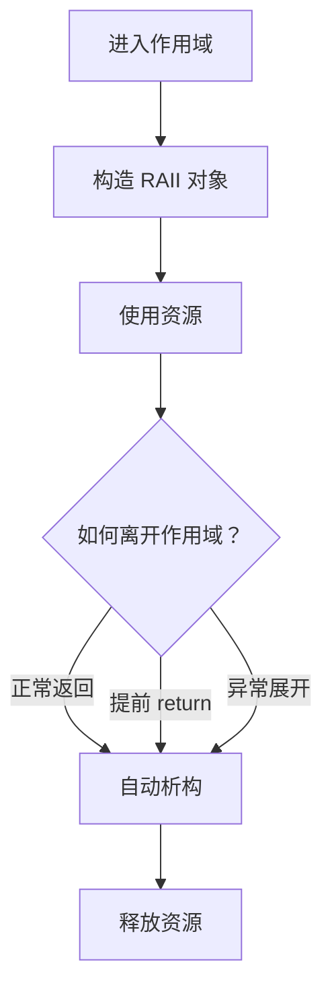
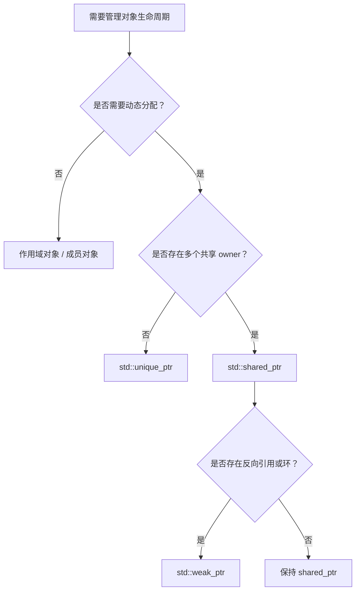
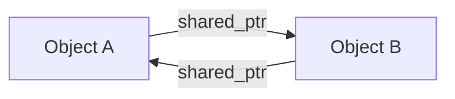
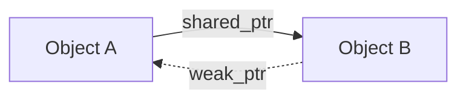
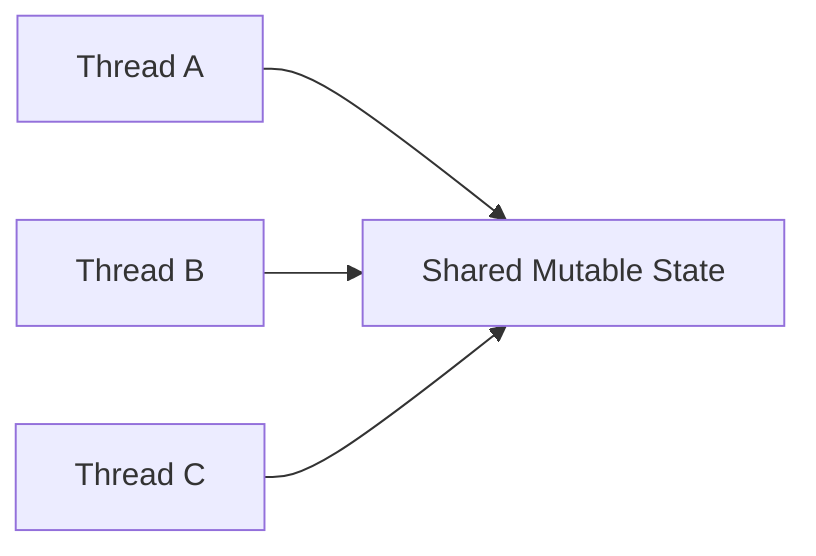
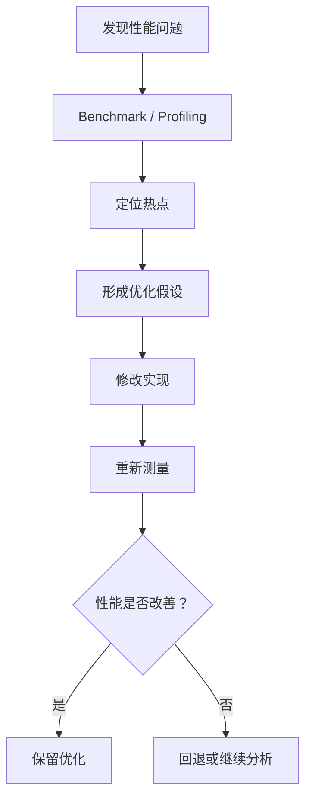
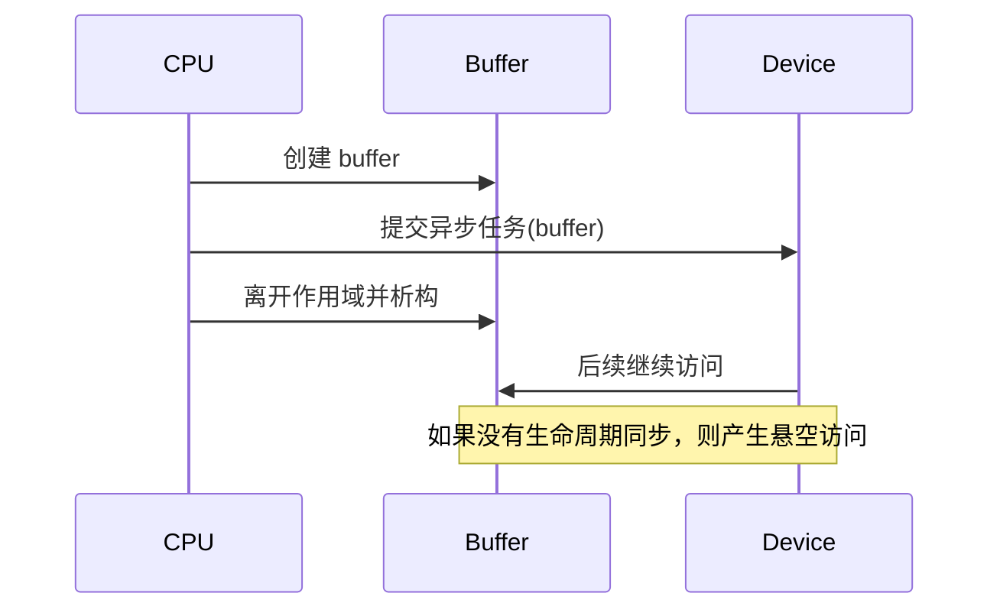

## 本文范围

本文不是 C++ 语法手册，也不会按照 C++11、C++14、C++17、C++20 的版本顺序罗列语言特性，而是参考 **C++ Core Guidelines**，按照生产环境中真正需要建立的编程模型整理现代 C++。

C++ Core Guidelines 的很多规则，本质上都围绕三个目标：

1. **让所有权清晰。**
2. **让生命周期可推理。**
3. **让错误尽可能在编译期暴露。**

---

## 1. Modern C++ 的核心思维

现代 C++ 并不是简单地把 `new/delete` 换成智能指针，也不是看到 `auto`、lambda 和模板就算 Modern C++。

真正重要的是从：

> 手工管理状态和资源

逐渐转变为：

> 使用类型系统和对象生命周期表达程序约束。

例如，传统代码可能这样管理资源：

```cpp
void process() {
    Resource* r = acquire_resource();

    do_work(r);

    release_resource(r);
}
```

问题在于，一旦中间增加：

- `return`
- 异常
- 新的条件分支
- 后续维护者忘记释放

资源管理就可能失效。

现代 C++ 更倾向：

```cpp
void process() {
    ResourceHandle resource = acquire_resource();
    do_work(resource);
}
```

`ResourceHandle` 的析构函数负责释放资源。

控制流和资源生命周期因此绑定：



这也是理解现代 C++ 最重要的入口。

---

## 2. 类型系统：尽可能让类型表达意图

对应 Core Guidelines 的核心思想包括 `P.1`、`P.3`、`P.4`、`P.5`。

### 2.1 不要滥用基础类型表达不同含义

例如：

```cpp
void launch(int device, int stream, int priority);
```

三个参数全是 `int`，调用者非常容易传错：

```cpp
launch(priority, device, stream);
```

编译器不会报错。

更好的设计是：

```cpp
struct DeviceId {
    int value;
};

struct StreamId {
    int value;
};

struct Priority {
    int value;
};

void launch(DeviceId device, StreamId stream, Priority priority);
```

此时交换参数会直接变成编译错误。

这就是所谓的 **strong type** 思想：

> 如果两个值语义不同，即使底层表示相同，也值得考虑使用不同的类型。

在大型系统中，这比依赖注释安全得多。

---

## 3. 初始化：对象一旦存在，就应该处于有效状态

Core Guidelines 强调尽可能初始化变量，而不是先定义、之后再赋值。

不推荐：

```cpp
int batch_size;

if (config.enabled()) {
    batch_size = config.batch_size();
}
```

因为存在未初始化路径。

更好：

```cpp
const int batch_size =
    config.enabled() ? config.batch_size() : default_batch_size;
```

### 3.1 初始化优于赋值

考虑：

```cpp
std::string name;
name = get_name();
```

更自然的是：

```cpp
std::string name = get_name();
```

第一种方式经历：

1. 默认构造。
2. 再执行赋值。

第二种直接构造目标对象，同时代码也更容易证明变量始终有效。

---

### 3.2 `{}` 初始化需要理解语义差异

Core Guidelines 推荐统一、明确的初始化方式，但 `{}` 并不是任何场景下都可以机械替换 `()`。

例如：

```cpp
std::vector<int> a(10);
std::vector<int> b{10};
```

含义完全不同：

- `a` 包含 10 个元素。
- `b` 包含一个值为 `10` 的元素。

因此不能把现代 C++理解成所有初始化都改成花括号。

应该首先理解构造函数重载和 `std::initializer_list`。

---

## 4. `const`：把“不修改”写进类型系统

`const` 是现代 C++ 最基础也最重要的工具之一。

原则可以简单概括为：

> 默认不修改，需要修改时再去掉限制。

例如：

```cpp
void process(const Tensor& tensor);
```

表示：

- 不复制 `tensor`。
- 函数不应该修改 `tensor`。

成员函数同样如此：

```cpp
class Tensor {
public:
    std::size_t size() const {
        return size_;
    }

private:
    std::size_t size_;
};
```

这里的：

```cpp
std::size_t size() const;
```

意味着该函数不会修改对象的逻辑状态。

---

### 4.1 `const T*` 和 `T* const`

```cpp
const int* p;
```

表示：

> 不能通过 `p` 修改所指对象。

```cpp
int* const p = &x;
```

表示：

> 指针 `p` 自身不能指向其他地址。

```cpp
const int* const p = &x;
```

两者都不能修改。

---

## 5. `auto`：减少重复，而不是隐藏重要类型

`auto` 很适合：

- 迭代器。
- lambda 返回值。
- 模板相关复杂类型。
- 类型从右侧已经非常明确的情况。

例如：

```cpp
auto it = tensor_map.find(name);
```

比：

```cpp
std::unordered_map<std::string, Tensor>::iterator it =
    tensor_map.find(name);
```

更清晰。

---

### 5.1 不要为了使用 `auto` 而使用 `auto`

例如：

```cpp
auto timeout = get_timeout();
```

如果阅读代码无法判断它是：

- `int`
- `double`
- `std::chrono::milliseconds`
- `std::chrono::seconds`

那么显式类型可能更清楚：

```cpp
std::chrono::milliseconds timeout = get_timeout();
```

判断标准不是新不新，而是：

> 哪一种写法更准确地表达意图。

---

## 6. 函数参数设计

这是生产 C++ 中非常重要的一部分。

Core Guidelines `F.16` 建议：

> 小且复制成本低的输入参数按值传递，其他输入参数通常使用 `const T&`。

可以粗略整理成：

| 语义 | 常见写法 |
|---|---|
| 小型值类型输入 | `T` |
| 大对象只读输入 | `const T&` |
| 必须修改调用者对象 | `T&` |
| 参数允许为空 | `T*` |
| 转移所有权 | `std::unique_ptr<T>` |
| 明确共享所有权 | `std::shared_ptr<T>` |
| 连续数据视图 | `std::span<T>` |
| 字符串只读视图 | `std::string_view` |

---

### 6.1 小型对象按值传递

例如：

```cpp
void set_device(int device_id);
```

没必要：

```cpp
void set_device(const int& device_id);
```

对于 `int`、指针、枚举等小类型，reference 反而增加了一层间接访问语义。

---

### 6.2 大对象只读时使用 `const T&`

```cpp
void execute(const Graph& graph);
```

表达：

- 函数不拥有 `graph`。
- 函数不会修改 `graph`。
- 不发生 Graph 的整体复制。

---

### 6.3 `T&` 表示调用者明确允许修改

```cpp
void normalize(Tensor& tensor);
```

看到接口就能知道：

> 调用之后 `tensor` 可能发生变化。

不要隐藏这种副作用。

---

### 6.4 `T*` 通常表示可空的非 owning 引用

例如：

```cpp
void set_allocator(Allocator* allocator);
```

可能意味着：

```cpp
set_allocator(nullptr);
```

是合法操作。

如果不能为空，更推荐：

```cpp
void set_allocator(Allocator& allocator);
```

---

## 7. 返回值优于输出参数

Core Guidelines `F.20`：

> 对于输出值，优先返回结果，而不是使用 output parameter。

不推荐：

```cpp
void create_tensor(
    const Shape& shape,
    Tensor* result);
```

更自然：

```cpp
Tensor create_tensor(const Shape& shape);
```

调用：

```cpp
Tensor tensor = create_tensor(shape);
```

现代编译器可以使用 copy elision 和 move semantics，高层代码无需为了“避免复制”而过早改成输出参数。

---

### 7.1 返回多个值

可以使用结构体：

```cpp
struct ParseResult {
    Graph graph;
    Metadata metadata;
};

ParseResult parse_model(const std::string& path);
```

比：

```cpp
void parse_model(
    const std::string& path,
    Graph* graph,
    Metadata* metadata);
```

更容易理解。

结构体还给不同返回值提供了名字。

---

## 8. 不要返回局部对象的引用或指针

Core Guidelines `F.43` 明确禁止返回指向局部对象的 pointer/reference。

```cpp
const std::string& get_name() {
    std::string name = "worker";
    return name;
}
```

函数返回后`name`已经被析构。返回的引用成为 **dangling reference**。

正确做法是：

```cpp
std::string get_name() {
    return "worker";
}
```

现代 C++ 中返回对象本身通常非常正常。

---

## 9. Ownership：现代 C++ 最核心的问题之一

面对一个指针，首先应该问：

> 谁拥有这个对象？

所谓 ownership，意味着：

> 谁负责最终结束这个对象的生命周期？

Core Guidelines `R.3` 建议把普通 `T*` 看作 **non-owning pointer**。

推荐的所有权模型如下：



优先级通常可以理解为：

```text
value / scoped object
↓
unique_ptr
↓
shared_ptr
```

也就是说：

> 能不用 heap 就不用 heap；必须 heap 时优先唯一所有权；确实需要共享生命周期才使用共享所有权。

---

## 10. RAII（Resource Acquisition Is Initialization）

Core Guidelines `R.1`：

> 使用 resource handle 和 RAII 自动管理资源。

RAII 不只是管理内存。

资源还包括：

- 文件。
- 文件描述符。
- socket。
- mutex。
- thread。
- GPU stream。
- GPU event。
- device memory。
- mmap。
- 数据库连接。
- 临时文件。

核心模式：

```cpp
class Resource {
public:
    Resource() {
        acquire();
    }

    ~Resource() {
        release();
    }

private:
    void acquire();
    void release();
};
```

资源生命周期变为：

```text
对象生命周期 == 资源生命周期
```

因此程序不再需要在每条控制流路径上手动释放资源。

---

## 11. 优先作用域对象，而不是动态分配

Core Guidelines `R.5`：

> 不要无意义地 heap allocate。

不推荐：

```cpp
auto config = std::make_unique<Config>();
config->load();
```

如果不需要动态生命周期：

```cpp
Config config;
config.load();
```

即可。

动态内存通常意味着额外的：

- allocation/deallocation。
- pointer indirection。
- 生命周期复杂度。
- ownership 问题。
- cache locality 损失。

因此：

> `make_unique` 比 `new` 好，并不意味着 `make_unique` 比直接创建对象更好。

---

## 12. `std::unique_ptr`

Core Guidelines `R.20` 和 `R.21` 的重要结论是：

> ownership 应该使用智能指针表达，并且默认优先 `unique_ptr`。

```cpp
auto tensor = std::make_unique<Tensor>();
```

意味着：

> 当前只有一个 owner。

---

### 12.1 `unique_ptr` 不可复制

```cpp
auto p1 = std::make_unique<Tensor>();

auto p2 = p1;  // error
```

因为复制意味着出现两个 owner。

需要转移所有权：

```cpp
auto p2 = std::move(p1);
```

之后：

```cpp
p1 == nullptr
```

---

### 12.2 用参数表达 ownership transfer

```cpp
void set_backend(std::unique_ptr<Backend> backend);
```

调用：

```cpp
set_backend(std::move(backend));
```

这一接口非常明确：

> 调用方正在把 Backend 的所有权交出去。

---

## 13. `std::shared_ptr`

只有真正需要：

> 多个对象共同决定某个对象什么时候销毁

时才应该使用 `shared_ptr`。

例如：

```cpp
std::shared_ptr<Model> model;
```

复制：

```cpp
auto model2 = model;
```

意味着共享 ownership。

---

### 13.1 为什么不要默认使用 `shared_ptr`

Core Guidelines `R.21` 推荐优先 `unique_ptr`。

原因不仅是引用计数成本。

更重要的是：

```cpp
std::shared_ptr<T>
```

会让生命周期变得难以推理。

看到：

```cpp
std::unique_ptr<T>
```

可以直接知道：

> 一个 owner。

看到：

```cpp
std::shared_ptr<T>
```

则必须进一步分析：

> 到底谁持有引用？谁最终决定对象什么时候销毁？

大型系统中，这种复杂度通常比引用计数本身更值得警惕。

---

## 14. `std::weak_ptr`

两个 `shared_ptr` 互相引用可能产生 cycle：



即使外部已经不再使用 A 和 B：

```text
A.ref_count > 0
B.ref_count > 0
```

对象仍无法销毁。

可以把其中一条非 owning 关系改为 `weak_ptr`：



使用：

```cpp
if (auto object = weak.lock()) {
    object->run();
}
```

---

## 15. 不要把智能指针当普通函数参数

Core Guidelines `R.30`：

> 只有接口确实需要表达 lifetime semantics 时，才把智能指针作为参数。

假设函数只是使用 Tensor：

不推荐：

```cpp
void process(const std::shared_ptr<Tensor>& tensor);
```

这会让接口无缘无故依赖：

```text
shared ownership
```

如果函数只是访问：

```cpp
void process(const Tensor& tensor);
```

更合适。

只有函数需要：

- 保存一个 shared owner。
- 增加引用计数。
- 延长对象生命周期。

才应该传 `shared_ptr`。

---

## 16. Rule of Zero

Core Guidelines `C.20`：

> 如果能够不自己实现默认操作，就不要实现。

考虑：

```cpp
class Model {
private:
    std::string name_;
    std::vector<Tensor> tensors_;
};
```

这些成员都已经正确实现：

- destructor。
- copy constructor。
- move constructor。
- copy assignment。
- move assignment。

因此：

```cpp
class Model {
public:
    ~Model() = default;
};
```

通常甚至都没有必要。

直接：

```cpp
class Model {
private:
    std::string name_;
    std::vector<Tensor> tensors_;
};
```

就是最好的设计。

这就是 **Rule of Zero**。

---

## 17. Rule of Five

如果类自己管理底层资源，例如：

```cpp
class Buffer {
private:
    void* data_;
};
```

并且必须自己实现析构逻辑，那么必须认真考虑：

- destructor。
- copy constructor。
- copy assignment。
- move constructor。
- move assignment。

即：

```cpp
class Buffer {
public:
    ~Buffer();

    Buffer(const Buffer&);
    Buffer& operator=(const Buffer&);

    Buffer(Buffer&&) noexcept;
    Buffer& operator=(Buffer&&) noexcept;
};
```

Core Guidelines `C.21` 强调：

> 一旦开始自定义 copy、move 或 destructor，就应该系统性检查其他特殊成员函数。

但工程中的优先策略仍然是：

> 尽可能通过 RAII 成员实现 Rule of Zero，而不是手写 Rule of Five。

---

## 18. Move Semantics

Move semantics 的目的”不是让所有东西都变快“，而是：

> 对可以转移内部资源的对象，避免昂贵的深拷贝。

例如：

```cpp
std::vector<int> a(1'000'000);

std::vector<int> b = std::move(a);
```

通常可以直接转移：

- data pointer。
- size。
- capacity。

而不是复制一百万个元素。

---

### 18.1 `std::move` 本身不会移动任何东西

非常重要：

```cpp
std::move(x)
```

本质上只是把表达式转换成适合绑定到 rvalue reference 的形式。

真正发生 move 的是：

```cpp
T(T&&);
```

或者：

```cpp
T& operator=(T&&);
```

因此：

```cpp
std::move
```

更接近：

> “允许后续操作从这个对象中转移资源。”

而不是：

> “执行移动”。

---

### 18.2 move 之后不要假设原对象的具体值

例如：

```cpp
std::string a = "hello";
std::string b = std::move(a);
```

之后：

```cpp
a
```

仍然是一个合法对象，但不要依赖它仍然是 `"hello"`。

一般原则：

> moved-from 对象可以被析构或重新赋值，但不要依赖其不必要的具体状态。

---

## 19. 不要无脑 `std::move`

错误习惯：

```cpp
return std::move(result);
```

很多普通返回场景应该直接：

```cpp
return result;
```

让编译器执行：

- NRVO。
- copy elision。
- 必要时的隐式 move。

人为加入 `std::move` 有时反而会妨碍优化。

---

## 20. Perfect Forwarding

模板库中可能遇到：

```cpp
template <typename T>
void wrapper(T&& value) {
    target(std::forward<T>(value));
}
```

这里：

```cpp
T&&
```

在模板类型推导语境下是 forwarding reference。

`std::forward<T>` 的目的，是保留调用者传入参数的 value category。

例如：

```cpp
wrapper(x);
wrapper(std::move(x));
```

第一个可以继续作为 lvalue。

第二个可以继续作为 rvalue。

需要记住：

> 普通业务代码很少需要手写 perfect forwarding。

真正需要它的通常是：

- 泛型库。
- container wrapper。
- factory。
- callback wrapper。
- framework 基础设施。

---

## 21. `struct` 和 `class`

两者语言能力几乎相同，核心差别是默认访问权限。

工程中可以使用一个非常实用的约定：

`struct`表示：<mark>数据本身</mark>。

例如：

```cpp
struct Shape {
    int batch;
    int channels;
    int height;
    int width;
};
```

通常：

- 没有复杂 invariant。
- 成员可以公开。

 `class`表示： <mark>有明确 invariant 和行为的抽象</mark>。

例如：

```cpp
class MemoryPool {
public:
    explicit MemoryPool(std::size_t capacity);

    void* allocate(std::size_t bytes);
    void deallocate(void* ptr);

private:
    std::size_t capacity_;
};
```

---

## 22. Constructor 应建立 invariant

一个对象成功构造以后，应该满足自身约束。

例如：

```cpp
class ThreadPool {
public:
    explicit ThreadPool(std::size_t workers) {
        if (workers == 0) {
            throw std::invalid_argument("workers must be positive");
        }

        // ...
    }
};
```

不推荐：

```cpp
ThreadPool pool;
pool.init(8);
```

因为在`ThreadPool pool;`和`pool.init(8);`之间，存在一个“不完整对象”。

更糟糕的是：

```cpp
ThreadPool pool;
pool.run();
```

可能在运行时才发现对象没有初始化。

---

## 23. 单参数构造函数通常使用 `explicit`

例如：

```cpp
class Device {
public:
    explicit Device(int id);
};
```

可以避免：

```cpp
Device d = 1;
```

这种隐式转换。

必须：

```cpp
Device d{1};
```

调用者明确表达：

> 我要构造一个 Device。

---

## 24. 继承：只有真正存在多态关系时使用

不要因为“复用代码”就立即选择 inheritance。

例如：

```cpp
class Logger {
    // ...
};

class Engine : public Logger {
};
```

如果 `Engine` 并不是一种 `Logger`，这种继承关系语义错误。

更自然：

```cpp
class Engine {
private:
    Logger logger_;
};
```

即：<mark>优先 composition</mark>。

---

## 25. 多态基类需要正确处理 destructor

假设：

```cpp
class Backend {
public:
    virtual void run() = 0;
};
```

然后：

```cpp
Backend* backend = new CudaBackend;
delete backend;
```

如果基类 destructor 不正确支持多态析构，会产生严重问题。

典型接口：

```cpp
class Backend {
public:
    virtual ~Backend() = default;

    virtual void run() = 0;
};
```

---

## 26. 使用 `override`

不推荐：

```cpp
class CudaBackend : public Backend {
public:
    void run();
};
```

推荐：

```cpp
class CudaBackend : public Backend {
public:
    void run() override;
};
```

如果基类接口发生变化，编译器可以帮助发现错误。

---

## 27. 尽量避免裸 `new` / `delete`

不推荐：

```cpp
Tensor* tensor = new Tensor;

process(tensor);

delete tensor;
```

优先：

```cpp
auto tensor = std::make_unique<Tensor>();

process(*tensor);
```

或者根本不需要动态分配：

```cpp
Tensor tensor;

process(tensor);
```

现代工程代码里看到：

```cpp
new
delete
malloc
free
```

都值得立即确认：<mark>这里为什么不能由一个 RAII 类型管理？</mark>

---

## 28. STL 容器：默认先考虑 `std::vector`

对于需要连续存储的动态数组：

```cpp
std::vector<T>
```

通常是最值得首先考虑的数据结构。

优势包括：

- 连续内存。
- cache locality 较好。
- 与 C API 互操作方便。
- 支持随机访问。
- 生态成熟。

例如：

```cpp
std::vector<float> weights;
```

---

### 28.1 提前知道大小时使用 `reserve`

```cpp
std::vector<Tensor> tensors;
tensors.reserve(num_tensors);

for (...) {
    tensors.emplace_back(...);
}
```

`reserve` 可以减少动态扩容。

注意：

```cpp
reserve()
```

改变的是 capacity，而不是 size。

因此：

```cpp
std::vector<int> v;
v.reserve(10);

v[0] = 1;  // error: size 仍然是 0
```

应该：

```cpp
v.push_back(1);
```

---

## 29. `std::span`

现代系统代码中经常需要表达：<mark> 我不拥有这块连续内存，只是临时访问</mark>。

传统接口：

```cpp
void process(float* data, std::size_t size);
```

可以使用：

```cpp
void process(std::span<float> data);
```

它同时表达：

- pointer。
- length。
- non-owning view。

调用：

```cpp
std::vector<float> buffer(1024);

process(buffer);
```

对于 AI Infra 中大量：

- tensor storage。
- communication buffer。
- serialization buffer。

这种 abstraction 非常有价值。

---

## 30. `std::string_view`

如果函数只需要读取字符串而不取得所有权：

```cpp
void log(std::string_view message);
```

可以接受多种字符串来源，而无需构造新的 `std::string`。例如：

```cpp
log("worker started");

std::string message = "ready";
log(message);
```

---

### 30.1 最大风险：生命周期

`string_view` 不拥有数据。因此：

```cpp
std::string_view get_name() { // 错误
    std::string name = "worker";
    return name;
}
```

返回后`name`已经销毁。必须始终问：<mark>string_view 指向的数据是否比 view 活得更久？</mark>

---

## 31. Range-based `for`

如果只遍历元素：

```cpp
for (const auto& tensor : tensors) {
    process(tensor);
}
```

通常优于：

```cpp
for (std::size_t i = 0; i < tensors.size(); ++i) {
    process(tensors[i]);
}
```

第一种直接表达：遍历 tensors。如果确实需要 index，再使用 index。

---

## 32. 优先标准算法表达意图

例如查找：

不推荐手写：

```cpp
bool found = false;

for (const auto& item : items) {
    if (item == target) {
        found = true;
        break;
    }
}
```

可以：

```cpp
const auto it = std::find(
    items.begin(),
    items.end(),
    target);

const bool found = it != items.end();
```

现代 C++ 的重要思想之一是：<mark>优先表达“要做什么”，而不是展开“怎么做”。</mark>

---

## 33. Lambda

lambda 非常适合表达局部行为：

```cpp
std::sort(
    tensors.begin(),
    tensors.end(),
    [](const Tensor& lhs, const Tensor& rhs) {
        return lhs.size() < rhs.size();
    });
```

---

### 33.1 谨慎使用 `[&]` 和 `[=]`

例如：

```cpp
auto task = [&]() {
    use(buffer);
};
```

必须考虑：<mark>task 执行时 buffer 是否还存在？</mark>

对于异步系统尤其危险。例如：

```cpp
void launch() {
    Tensor tensor;

    executor.submit([&] {
        process(tensor);
    });
}
```

如果 callback 在`launch()`返回之后执行，那么 `tensor` 已经销毁。这是典型的 lifetime bug。异步代码中应该明确分析每个 capture 的生命周期。

---

## 34. Error Handling

Core Guidelines 的核心原则之一是：<mark> 先定义错误处理策略，而不是每个函数自己决定。</mark>

大型项目最危险的情况不是使用`exception`或者不用`exception`而是不同模块使用完全不同的错误语义。

---

## 35. Exception

对于无法完成函数职责的错误，Core Guidelines 倾向使用异常表达失败。例如：

```cpp
Tensor load_tensor(const std::string& path);
```

如果无法读取，可以：

```cpp
throw LoadError(...);
```

这样正常路径仍然很干净：

```cpp
Tensor tensor = load_tensor(path);
run(tensor);
```

---

### 35.1 RAII 让 exception safety 成为可能

例如：

```cpp
void run() {
    std::lock_guard<std::mutex> lock(mutex_);

    Tensor tensor = load_tensor();

    process(tensor);
}
```

即使：

```cpp
load_tensor()
```

或者：

```cpp
process()
```

抛出异常，`lock_guard` 的析构仍然释放 mutex。

这正是 RAII 与异常处理能够良好配合的关键原因。

---

## 36. `std::expected`

C++23 提供：

```cpp
std::expected<T, E>
```

用于显式表达<mark>成功值 or 错误值</mark>。示意：

```cpp
std::expected<Tensor, Error> load_tensor(
    std::string_view path);
```

调用：

```cpp
auto result = load_tensor(path);

if (!result) {
    handle_error(result.error());
    return;
}

Tensor tensor = std::move(*result);
```

如果项目：

- 禁止 exception。
- API 边界需要显式错误。
- 错误属于正常控制流的一部分。

这类 result type 非常有价值。但最重要的仍然不是选择某一种机制，而是<mark>整个项目采用一致且清晰的 error model。</mark>

---

## 37. `std::optional`

如果<mark>没有值</mark>本身是正常状态：

```cpp
std::optional<Device> find_device(int id);
```

调用：

```cpp
if (auto device = find_device(id)) {
    use(*device);
}
```

不要使用特殊值：

```cpp
int device = -1;
```

然后约定`-1 == not found`。类型系统能够表达“可能不存在”，就不要依赖魔法数字。

---

## 38. `noexcept`

`noexcept` 表达<mark>这个函数不会向调用者传播异常。</mark>

例如移动构造函数常见：

```cpp
Buffer(Buffer&& other) noexcept;
```

但不能为了“优化”无脑添加：

```cpp
void foo() noexcept;
```

如果 `foo()` 实际发生异常并逃逸，程序会调用：

```cpp
std::terminate()
```

因此<mark> noexcept 是接口契约，不只是性能 hint。</mark>

---

## 39. Concurrency：先避免共享，再讨论锁

Core Guidelines `CP.3` 的核心思想：<mark>尽量减少多个线程共享可写数据。</mark>

最容易推理的并发系统往往不是：

```text
到处加 mutex
```

而是：

```text
减少 mutable shared state
```

例如：


通常比：



更容易维护。

---

## 40. Data Race

Core Guidelines `CP.2`：<mark>避免 data race</mark>。

简单理解，如果两个线程同时访问同一块内存：

- 至少一个线程写。
- 没有正确同步。

就可能发生 data race。例如：

```cpp
int counter = 0;

void worker() {
    ++counter;
}
```

两个线程同时执行：

```cpp
worker();
```

不是安全的。

---

## 41. Mutex 也要使用 RAII

Core Guidelines `CP.20`：<mark>不要手写 lock() / unlock()</mark>。

```cpp
// 错误
mutex.lock();

do_work();

mutex.unlock();
```

如果：

```cpp
do_work();
```

抛出异常或者中途 return：

```cpp
mutex.unlock();
```

可能永远不会执行。使用：

```cpp
std::lock_guard<std::mutex> lock(mutex_);

do_work();
```

或者：

```cpp
std::scoped_lock lock(mutex_);
```

---

## 42. 多把锁使用 `std::scoped_lock`

```cpp
// 错误
mutex_a.lock();
mutex_b.lock();
```

另一个线程如果反过来：

```cpp
mutex_b.lock();
mutex_a.lock();
```

可能形成 deadlock。使用：

```cpp
std::scoped_lock lock(mutex_a, mutex_b);
```

可以使用标准库提供的 deadlock avoidance 机制。

---

## 43. 不要持锁调用未知代码

Core Guidelines `CP.22`：<mark>不要在持有 mutex 时调用行为未知的代码</mark>。例如：

```cpp
{
    std::lock_guard<std::mutex> lock(mutex_);
    callback();
}
```

`callback()` 内部可能：

- 再次尝试获取 mutex。
- 获取其他锁。
- 阻塞。
- 调用外部模块。
- 执行非常耗时的操作。

因此非常容易产生：

- deadlock。
- 长时间 lock contention。

更好的模式通常是：

```cpp
Callback callback;

{
    std::lock_guard<std::mutex> lock(mutex_);
    callback = callback_;
}

callback();
```

先完成共享状态访问，再释放锁，再执行外部代码。

---

## 44. `std::jthread`

C++20 提供：

```cpp
std::jthread
```

相比直接使用：

```cpp
std::thread
```

它提供更 RAII 化的线程生命周期管理。例如：

```cpp
std::jthread worker([] {
    run_worker();
});
```

离开作用域时能够自动处理线程 join。这与现代 C++ 的整体思想一致：<mark> 生命周期应该由对象负责管理</mark>。

---

## 45. `volatile` 不是线程同步工具

不要写：

```cpp
volatile bool ready = false;
```

然后把它当作多线程同步变量。

`volatile` 主要描述：<mark>读写不能按照普通内存访问随意优化掉</mark>。它不提供正确的线程同步语义。

多线程同步应该使用：

- mutex。
- atomic。
- condition variable。
- 更高层并发抽象。

---

## 46. `std::atomic`

简单计数等场景可以：

```cpp
std::atomic<std::size_t> counter{0};

counter.fetch_add(1);
```

但不要因为 atomic 看起来比 mutex “低级”就认为一定更快。尤其涉及`memory_order`时，代码复杂度会迅速增加。

默认原则：<mark>不确定时首先写正确且简单的同步逻辑，再根据性能分析决定是否需要更低层的原子操作</mark>。

---

## 47. Memory Order

需要认识这些概念：

- `memory_order_relaxed`
- `memory_order_acquire`
- `memory_order_release`
- `memory_order_acq_rel`
- `memory_order_seq_cst`

但对于普通业务代码：<mark>不应该仅凭直觉手写复杂 lock-free algorithm</mark>。

这类代码需要非常严格地理解：

- C++ memory model。
- CPU memory model。
- happens-before。
- compiler reordering。
- CPU reordering。
- ABA。
- reclamation。

能够正确解释 memory ordering，比记住 API 更重要。

---

## 48. Performance：先测试

Core Guidelines `Per.6`：<mark>不要在没有测试的情况下声称某种写法性能更好</mark>。

例如：

```text
shared_ptr 一定很慢
virtual 一定很慢
exception 一定很慢
lambda 一定比普通函数快
手写循环一定比 STL 快
```

这些都不能脱离实际程序、编译器、硬件和 workload 判断。

正确流程：



---

## 49. 真正重要的性能因素

相比很多语言级微优化，更应该优先关注：

<mark>内存分配</mark>

频繁`new delete malloc free`可能成为明显成本。因此常见优化方向包括：

- object pool。
- memory pool。
- arena allocator。
- buffer reuse。

<mark>数据布局</mark>

例如：`Array of Structs`和`Struct of Arrays`在不同访问模式下 cache 行为可能完全不同。

<mark>Cache Locality</mark>

连续`std::vector<T>`经常比大量离散 heap node 更符合现代 CPU cache。

<mark>Copy</mark>

必须区分`小对象 copy`和`大型 tensor / buffer copy`。后者可能涉及：

- MB/GB 级数据。
- host-device transfer。
- NUMA。
- PCIe。
- NVLink。
- network。

因此真正重要的是：<mark>明确数据是否拥有、是否复制、数据在哪里。</mark>

---

## 50. 不要为了“性能”退回裸指针式编程

错误思路：

```text
RAII 有额外成本
smart pointer 有额外成本
class 有额外成本
STL 有额外成本
```

然后把代码全部改成：

```cpp
void*
malloc
free
raw pointer
```

现代 C++ 的很多抽象遵循 zero-overhead abstraction 思路：<mark>不使用的能力不应该付出成本；合理使用高级抽象时，不应该天然比手写低级实现更差</mark>。应该根据 benchmark 决定，而不是根据语法看起来“底层”还是“高级”。

---

## 51. Undefined Behavior

生产环境中必须高度关注 UB。典型来源包括：

- dangling pointer。
- dangling reference。
- buffer overflow。
- use-after-free。
- signed integer overflow。
- invalid iterator。
- uninitialized memory。
- data race。
- incorrect type punning。
- invalid lifetime。
- double free。

UB 最危险的地方是：程序并不一定立即 crash。它可能：

- Debug 正常。
- Release 出错。
- GCC 正常。
- Clang 出错。
- CPU A 正常。
- CPU B 出错。
- 改一行无关代码之后突然出错。

所以，“程序现在能跑”不能证明代码没有 UB。

---

## 52. Cast

现代 C++ 应尽量避免 C-style cast：

```cpp
Foo* foo = (Foo*)ptr;
```

<mark>如果确实需要 cast，应明确表达意图。</mark>

`static_cast`用于类型系统允许的显式转换：

```cpp
double value = 3.14;
int x = static_cast<int>(value);
```

`dynamic_cast`用于多态 hierarchy 的运行时检查：

```cpp
if (auto* cuda = dynamic_cast<CudaBackend*>(backend)) {
    cuda->run_cuda();
}
```

但如果程序大量依赖 `dynamic_cast`，也应该考虑：类型设计是否存在问题？

 `const_cast`移除或增加 `const` 属性。通常值得警惕。如果频繁使用：

```cpp
const_cast<T*>
```

通常说明：API 的 const-correctness 有问题。

`reinterpret_cast`表示非常底层的位级或表示层转换。开发中某些底层边界确实可能需要，但应该：<mark> 尽量封装在很小的低层模块中。</mark>不要让 `reinterpret_cast` 在普通业务逻辑中扩散。

---

## 53. Enum 使用 `enum class`

传统：

```cpp
enum DeviceType {
    CPU,
    CUDA
};
```

名字进入外部作用域。更推荐：

```cpp
enum class DeviceType {
    Cpu,
    Cuda
};
```

使用`DeviceType::Cuda`同时避免与整数之间发生过多隐式转换。

---

## 54. `nullptr`

永远优先`nullptr`而不是`NULL`或者`0`。例如：

```cpp
void process(int);
void process(void*);

process(0);
```

可能调用：

```cpp
process(int);
```

而：

```cpp
process(nullptr);
```

明确表示空指针。

---

## 55. `constexpr`

如果某个值可以在编译期确定，可以考虑：

```cpp
constexpr std::size_t kAlignment = 64;
```

函数也可以：

```cpp
constexpr int square(int x) {
    return x * x;
}
```

现代 C++ 越来越强调：<mark>能在编译期验证的事情尽量不要拖到运行时。</mark>但不要为了使用 `constexpr` 把普通代码过度模板化。

---

## 56. `static_assert`

如果约束可以在编译期检查：

```cpp
static_assert(sizeof(Header) == 64);
```

比运行时：

```cpp
if (sizeof(Header) != 64) {
    abort();
}
```

更自然。例如底层数据格式、ABI、模板参数约束中尤其常见。

---

## 57. Templates：把模板当泛型工具，而不是炫技工具

一个简单模板：

```cpp
template <typename T>
T max_value(T lhs, T rhs) {
    return lhs > rhs ? lhs : rhs;
}
```

真正困难的是：<mark>`T` 到底需要满足什么条件？</mark>

传统模板错误往往产生极长的编译错误。

---

## 58. Concepts

C++20 可以显式描述模板约束：

```cpp
template <std::integral T>
T add(T lhs, T rhs) {
    return lhs + rhs;
}
```

或者：

```cpp
template <typename T>
concept TensorLike = requires(T tensor) {
    tensor.data();
    tensor.size();
};

template <TensorLike T>
void process(T& tensor) {
    // ...
}
```

Concepts 的价值不是缩短几个字符，而是<mark>把泛型接口对类型的要求正式写进接口。</mark>

---

## 59. 宏尽量限制在必要范围

例如：

```cpp
#define SQUARE(x) ((x) * (x))
```

存在很多潜在问题。

更推荐：

```cpp
template <typename T>
constexpr T square(T x) {
    return x * x;
}
```

宏没有正常的：

- 类型检查。
- namespace。
- scope。
- 函数语义。

但一些系统编程、编译配置、CUDA 或平台相关代码仍可能需要宏。正确策略不是“绝不使用”，而是：<mark>把必要的宏封装在清晰的边界内。</mark>

---

## 60. Header 与编译依赖

大型 C++ 项目中，header dependency 会直接影响：

- build time。
- incremental compilation。
- 模块耦合。

避免无必要 include：

```cpp
#include "huge_header.h"
```

如果接口只需要声明：

```cpp
class Backend;
```

可以考虑 forward declaration。但不能机械追求 forward declaration。对于：

```cpp
std::unique_ptr<Backend>
```

和 destructor 定义位置等问题，需要理解 incomplete type 的限制。

核心目标仍是：<mark>降低模块耦合，而不是追求最少 include 数字。</mark>

---

## 61. PImpl（Pointer to Implementation）

当实现细节非常复杂，或者需要降低 header dependency 时，可以使用 PImpl：

```cpp
// .h 文件
class Engine {
public:
    Engine();
    ~Engine();

    void run();

private:
    class Impl;
    std::unique_ptr<Impl> impl_;
};

// .cpp文件
class Engine::Impl {
public:
    void run() {
        // ...
    }
};
```

优点：

- 隐藏实现。
- 降低编译依赖。
- API 更稳定。

代价：

- heap allocation。
- pointer indirection。
- 实现复杂度。

因此不要无脑为所有类使用 PImpl。

---

## 62. Lifetime 问题

代码经常存在：

```text
CPU object lifetime
GPU operation lifetime
buffer lifetime
stream lifetime
callback lifetime
thread lifetime
```

这些生命周期可能不同步。例如：

```cpp
void launch() {
    Buffer buffer;

    async_execute(buffer.data());

    // function returns
}
```

如果`async_execute`只是提交异步任务，那么函数结束时`buffer destroyed`。但 GPU 或后台线程可能仍然访问`buffer.data()`形成 use-after-free。

逻辑关系：



因此一个非常重要的问题永远是：<mark>异步任务完成之前，相关资源由谁持有？</mark>这比“应该用裸指针还是引用”更底层、更重要。

---

## 63. Ownership 和 Synchronization 是两个不同问题

例如，`std::shared_ptr<Tensor>`只能解决 Tensor 是否仍然存在。它不能自动解决，多个线程同时修改 Tensor 是否安全。也就是说：`Lifetime Safety ≠ Thread Safety`。这是非常容易混淆的一点。即使对象由 `shared_ptr` 管理：

```cpp
auto tensor = std::make_shared<Tensor>();
```

多个线程：

```cpp
tensor->write(...);
```

仍然可能产生 data race。

---

## 64. API 边界要特别清楚

大型系统常常横跨：

- C++。
- C。
- CUDA。
- Python。
- RPC。
- device runtime。
- third-party library。

真正危险的通常是边界。例如一个接口：

```cpp
void* get_buffer();
```

需要明确：

- 返回的是什么类型？
- 谁拥有？
- 多大？
- alignment 是什么？
- memory 位于 host 还是 device？
- 生命周期多久？
- 是否允许异步访问？
- 谁负责释放？
- 使用什么 allocator 释放？

一个好的 C++ wrapper 应尽可能把这些约束放进类型和 RAII 对象中。

---

## 65. C API 要用 C++ RAII 包装

假设某 C API：

```cpp
Handle* create_handle();
void destroy_handle(Handle*);
```

不要让`destroy_handle()`散布在业务代码里。可以：

```cpp
class HandleWrapper {
public:
    HandleWrapper()
        : handle_(create_handle()) {
        if (!handle_) {
            throw std::runtime_error("failed to create handle");
        }
    }

    ~HandleWrapper() {
        destroy_handle(handle_);
    }

    HandleWrapper(const HandleWrapper&) = delete;
    HandleWrapper& operator=(const HandleWrapper&) = delete;

private:
    Handle* handle_;
};
```

更进一步可以使用自定义 deleter：

```cpp
struct HandleDeleter {
    void operator()(Handle* handle) const noexcept {
        destroy_handle(handle);
    }
};

using UniqueHandle =
    std::unique_ptr<Handle, HandleDeleter>;
```

此后业务代码只需要面对`UniqueHandle`而不是手工管理 C resource。

---

## 66. 一些需要形成条件反射的危险信号

看到以下代码时应该立即提高警惕。

### 裸 owning pointer

```cpp
Foo* foo = new Foo;
```

>谁 delete？

### 手工锁

```cpp
mutex.lock();
```

>为什么不用 RAII lock？

### `shared_ptr` 到处传播

```cpp
void foo(std::shared_ptr<T>);
void bar(std::shared_ptr<T>);
void baz(std::shared_ptr<T>);
```

>这些函数真的都需要共享 ownership 吗？

### `std::move`

```cpp
return std::move(x);
```

>这里真的需要 move 吗？

### lambda 引用捕获进入异步执行器

```cpp
executor.submit([&] {
    use(x);
});
```

>callback 执行时 `x` 还活着吗？

### `string_view` / `span`

```cpp
std::string_view view;
std::span<float> data;
```

>backing storage 活多久？

### 裸 `void*`

```cpp
void* buffer;
```

>类型、大小、位置、ownership 和 lifetime 在哪里表达？

### 大量 `reinterpret_cast`

>这种底层复杂性是否可以封装在一个边界层？

### 全局 mutable state

```cpp
GlobalManager manager;
```

>初始化顺序、并发访问和销毁顺序如何保证？

---

## 67. 推荐形成的默认编码习惯

对于普通对象：

```cpp
T object;
```

而不是：

```cpp
T* object = new T;
```

对于唯一所有权：

```cpp
std::unique_ptr<T>
```

对于真正共享生命周期：

```cpp
std::shared_ptr<T>
```

对于观察但不拥有：

```cpp
T&
```

或者：

```cpp
T*
```

对于连续内存 view：

```cpp
std::span<T>
```

对于字符串 view：

```cpp
std::string_view
```

对于可能不存在：

```cpp
std::optional<T>
```

对于多个返回结果：

```cpp
struct Result;
```

对于修改参数：

```cpp
T&
```

对于大对象只读参数：

```cpp
const T&
```

对于锁：

```cpp
std::lock_guard
```

或：

```cpp
std::scoped_lock
```

对于线程生命周期：

```cpp
std::jthread
```

对于枚举：

```cpp
enum class
```

对于空指针：

```cpp
nullptr
```

对于继承 override：

```cpp
override
```

对于编译期约束：

```cpp
static_assert
```

以及 C++20：

```cpp
concept
```

---

## 68. Core Guidelines 重点规则索引

不需要背规则编号，但可以把以下规则作为回查入口。

| Rule    | 核心思想                                     |
| ------- | ---------------------------------------- |
| `P.1`   | 直接在代码中表达思想                               |
| `P.3`   | 表达意图                                     |
| `P.4`   | 尽量实现静态类型安全                               |
| `P.5`   | 优先编译期检查                                  |
| `P.8`   | 不泄漏资源                                    |
| `P.10`  | 优先 immutable data                        |
| `F.16`  | 输入参数合理选择 value / `const&`                |
| `F.20`  | 输出值优先使用 return                           |
| `F.43`  | 不返回局部对象的 pointer/reference               |
| `C.20`  | Rule of Zero                             |
| `C.21`  | 自定义特殊成员函数时系统考虑 copy/move/destructor      |
| `R.1`   | 使用 RAII                                  |
| `R.3`   | raw pointer 默认 non-owning                |
| `R.5`   | 不要无意义 heap allocation                    |
| `R.20`  | ownership 使用 smart pointer               |
| `R.21`  | 优先 `unique_ptr`                          |
| `R.24`  | 使用 `weak_ptr` 打破 shared ownership cycle  |
| `R.30`  | smart pointer 参数只用于表达 lifetime semantics |
| `E.1`   | 提前设计 error handling strategy             |
| `E.6`   | 使用 RAII 避免泄漏                             |
| `CP.2`  | 避免 data race                             |
| `CP.3`  | 减少 writable shared state                 |
| `CP.20` | mutex 使用 RAII                            |
| `CP.21` | 多 mutex 使用安全的统一锁定方式                      |
| `CP.22` | 持锁期间不要调用未知代码                             |
| `CP.8`  | 不使用 `volatile` 做线程同步                     |
| `Per.6` | 性能结论必须基于测试                               |

---

## 69. 最终需要建立的判断模型

面对一段 C++ 代码，可以依次问：

### 生命周期

> 这个对象什么时候创建、什么时候销毁？

### Ownership

> 谁负责销毁它？

### Borrowing

> 哪些 pointer/reference/view 只是临时观察它？

### 类型

> 编译器能否检查我的假设？

### Mutable State

> 哪些数据会发生修改？

### Concurrency

> 是否存在多个线程同时访问这些状态？

### Error

> 操作失败时，接口如何表达？

### Allocation

> 数据在哪里分配？是否真的需要 heap？

### Copy

> 这里有没有发生不必要的数据复制？

### Async

> 异步任务执行时，它访问的资源是否仍然存在？

### Performance

> 这是实际 profile 出来的热点，还是凭直觉猜测？

如果这些问题都能清楚回答，大部分现代 C++ 代码就已经具备很强的可维护性。

---

## 参考资料

- C++ Core Guidelines，Bjarne Stroustrup、Herb Sutter 等维护。
- ISO C++ Standard Library。
- cppreference。
- Guidelines Support Library（GSL）。

本文以 C++ Core Guidelines 的工程原则为主线，并以 C++17 / C++20 的常见现代 C++ 编程模型为主要讨论范围；部分标准库能力注明了 C++23 要求。