## 0. PyTorch Performance 的核心知识结构

```mermaid
flowchart TD
    A["PyTorch Performance"] --> B["Data Pipeline"]
    A --> C["CPU / GPU Execution"]
    A --> D["Memory"]
    A --> E["Profiler"]
    A --> F["Compiler"]
    A --> G["Distributed"]

    B --> B1["num_workers"]
    B --> B2["pin_memory"]

    C --> C1["Avoid Synchronization"]
    C --> C2["Tensor Core"]
    C --> C3["AMP"]

    D --> D1["Activation Checkpointing"]
    D --> D2["Memory Allocation"]

    E --> E1["ProfilerActivity"]
    E --> E2["record_function"]
    E --> E3["Operator Time"]
    E --> E4["Memory Profiling"]
    E --> E5["Trace"]
    E --> E6["Schedule"]

    F --> F1["TorchDynamo"]
    F --> F2["AOTAutograd"]
    F --> F3["TorchInductor"]
    F --> F4["Graph Break"]
    F --> F5["Guard"]
    F --> F6["Recompilation"]
    F --> F7["Dynamic Shape"]

    G --> G1["DDP"]
    G --> G2["Communication Overlap"]
    G --> G3["Load Balance"]
```

尤其需要建立下面的联系：

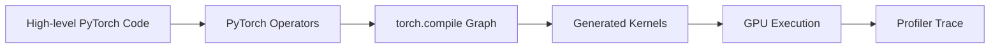

这样才能把Python / Framework、Compiler、Operator、CUDA Kernel、Hardware Execution联系起来理解。

## 1. PyTorch 性能优化在优化什么

PyTorch 模型的性能并不仅由模型中的 FLOPs 决定。从官方 Performance Tuning Guide 涉及的优化可以看到，一个训练或推理程序的性能可能受到多个环节影响：

- 数据是否能够及时送到计算设备；
- 是否进行了不必要的梯度计算；
- 是否产生过多的内存读写；
- 是否启动了大量零碎 Kernel；
- CPU 和 GPU 之间是否发生不必要的同步；
- Tensor Core 等硬件能力是否得到利用；
- 模型中间结果是否占用过多显存；
- 分布式训练中的通信能否与计算重叠；
- `torch.compile` 是否能够得到足够大的计算图进行优化。

可以把一个典型训练 Step 简化为：

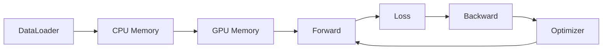

Performance Tuning Guide 中的许多优化，本质上是在减少这条路径上的等待、内存访问、Kernel Launch、同步或重复计算。

性能优化的基本原则不是看到某个优化选项就直接开启，而是：

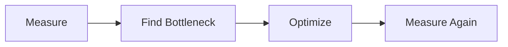

PyTorch Profiler 就是这套流程中用于定位性能瓶颈的主要工具之一。

---

## 2. 数据加载：避免 GPU 等待 CPU

### 2.1 `num_workers`

`DataLoader` 默认：

```python
num_workers=0
```

此时数据加载发生在主进程中，是同步执行的。这可能形成：

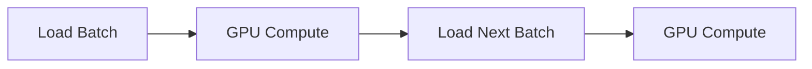

GPU 完成当前 Batch 后，需要等待 CPU 准备下一批数据。设置：

```python
from torch.utils.data import DataLoader

train_loader = DataLoader(
    dataset,
    batch_size=128,

    # 使用 worker 子进程加载和预处理数据
    num_workers=4,
)
```

可以让数据加载和模型计算发生一定程度的重叠。

`num_workers` 没有一个适用于所有机器的固定最优值，需要根据：

- CPU 核数；
- GPU 速度；
- 数据预处理复杂度；
- 数据所在存储设备；

进行调整。

<mark>如果 GPU 经常处于空闲状态，而 CPU 正在执行数据读取或预处理，数据管线可能就是性能瓶颈。</mark>

---

## 3. 使用 Pinned Memory

使用 GPU 训练时，官方 Performance Tuning Guide 推荐考虑：

```python
train_loader = DataLoader(
    dataset,
    batch_size=128,
    num_workers=4,

    # 使用 page-locked host memory
    pin_memory=True,
)
```

Pinned Memory 可以帮助提高 Host 到 GPU 的数据传输效率，并支持适当场景下的异步数据复制。

因此 GPU 训练的数据路径可以理解为：

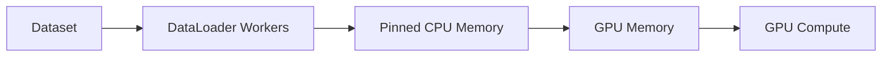

`num_workers > 0` 和 `pin_memory=True` 解决的是不同问题：

| 配置 | 主要作用 |
| --- | --- |
| `num_workers > 0` | 让数据加载和预处理与训练计算更容易重叠 |
| `pin_memory=True` | 优化 Host 到 Accelerator 的数据传输 |

它们通常可以组合使用。

---

## 4. 推理和验证时关闭梯度

Autograd 在 Forward 过程中需要记录反向传播所需的信息。

<mark>但进行validation、inference时通常不需要梯度。</mark> 因此可以：

```python
model.eval()

with torch.no_grad():
    # 不记录反向传播所需的 Autograd 信息
    output = model(inputs)
```

关闭梯度计算可以：

- 减少中间状态保存；
- 降低内存占用；
- 减少不必要的 Autograd 开销。

需要区分：`model.eval()`和`torch.no_grad()`。前者修改部分 Module 的训练/推理行为，后者控制 Autograd 是否记录计算。

---

## 5. Conv + BatchNorm 时关闭 Conv Bias

如果卷积层后面直接连接 BatchNorm：

```python
import torch.nn as nn

block = nn.Sequential(
    nn.Conv2d(
        in_channels=64,
        out_channels=128,
        kernel_size=3,
        padding=1,

        # 后面直接进行 BatchNorm，因此不需要额外 bias
        bias=False,
    ),
    nn.BatchNorm2d(128),
)
```

卷积 Bias 通常是不必要的，因为随后 BatchNorm 会进行均值中心化。因此关闭 Bias 可以减少不必要的参数和计算。

---

## 6. 将梯度设置为 `None`

训练过程中需要在下一次 Backward 前处理上一轮梯度。推荐使用：

```python
optimizer.zero_grad(set_to_none=True)
```

而不是强制将所有 Gradient Buffer 写成 0。也可以显式：

```python
for param in model.parameters():
    # 删除当前梯度引用，而不是写入全 0 Tensor
    param.grad = None
```

将梯度设为 `None` 可以减少显式的内存写操作。普通训练循环可以写成：

```python
for x, y in dataloader:
    optimizer.zero_grad(set_to_none=True)

    pred = model(x)
    loss = loss_fn(pred, y)

    loss.backward()
    optimizer.step()
```

需要注意，<mark>Gradient 为None和Gradient 为全 0 在部分代码中的行为存在差异，因此不能认为二者语义完全相同。</mark>

---

## 7. 为什么 Operator Fusion 可以提高性能

考虑：

```python
def fn(x):
    y = x + 1
    z = torch.relu(y)
    return z * 2
```

Eager Mode 下，这些操作通常分别执行。概念上：


对于很多 Elementwise Operation，性能并不主要受算术运算本身影响，而可能受到<mark>Kernel Launch、Global Memory读写</mark>影响。

如果多个操作能够融合：


就可以减少：

- Kernel Launch；
- GPU Global Memory 读写；
- 中间 Tensor Materialization。

`torch.compile` 的默认后端 TorchInductor 可以自动执行很多这类融合优化。

---

## 8. `torch.compile` 基本使用

最简单的函数级编译方式是：

```python
import torch


@torch.compile
def fn(x):
    y = x + 1
    y = torch.relu(y)
    return y * 2
```

对于模型：

```python
model = MyModel().cuda()

# 返回编译后的 callable
compiled_model = torch.compile(model)
```

之后正常调用：

```python
output = compiled_model(x)
```

`nn.Module` 当前也支持：

```python
model.compile()
```

入门阶段使用：

```python
compiled_model = torch.compile(model)
```

更容易区分 Eager Model 与 Compiled Model。

---

## 9. `torch.compile` 在做什么

当前官方文档中的主要编译组件包括：

- TorchDynamo；
- AOTAutograd；
- TorchInductor。

可以简化理解为：

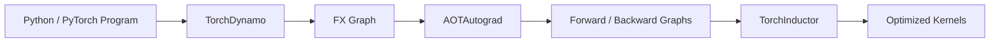

### 9.1 TorchDynamo

TorchDynamo 是 `torch.compile` 的前端。

它分析 Python Bytecode，并尝试将 PyTorch 计算捕获为可以被编译器处理的 Graph。

核心目标是：

> 将 Python 中尽可能多的 PyTorch 运算捕获为可优化的计算图。

### 9.2 AOTAutograd

训练过程中不仅存在 Forward，还存在 Backward。

AOTAutograd 可以捕获 Autograd 产生的计算，使 Forward 和 Backward 都能够进入后续编译过程。因此：

```python
compiled_model = torch.compile(model)
```

既可以用于推理，也可以用于训练。

### 9.3 TorchInductor

TorchInductor 是 `torch.compile` 默认使用的编译后端。它根据捕获到的计算图生成优化后的执行代码。对于 GPU，Triton 是 TorchInductor 使用的重要代码生成组件之一。

---

## 10. Eager Mode 与 Compile Mode

Eager Mode：

```python
a = torch.sin(x)
b = torch.cos(y)
c = a + b
```

每执行一个 PyTorch Operator，就立即 Dispatch 对应操作。

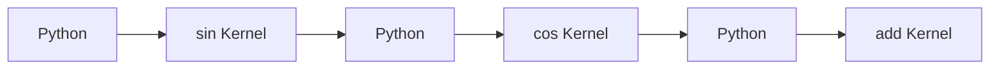

`torch.compile` 则尝试捕获更大的计算区域：

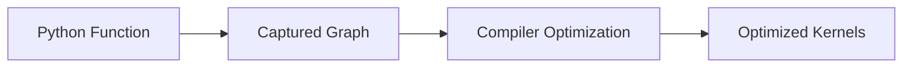

这样 Compiler 可以跨 Operator 观察计算关系，从而进行：

- Operator Fusion；
- Kernel 优化；
- Python Overhead 降低；
- 中间 Tensor 和 Memory Access 优化。

具体收益取决于实际 Workload。

---

## 11. Compilation 有成本

`torch.compile` 属于 JIT Compilation（Just-In-Time Compilation，即时编译）。第一次：

```python
compiled_model(x)
```

可能需要经历：

- Trace；
- Graph Capture；
- Compiler Optimization；
- Kernel Compilation；
- 部分模式下的 Autotuning。

因此第一次或前几次调用可能明显慢于 Eager Mode。

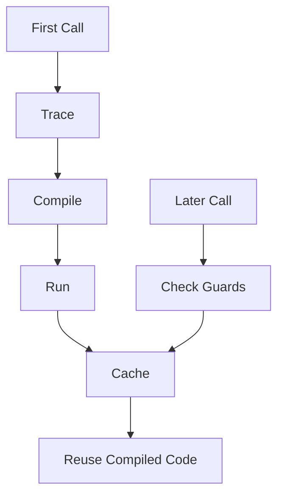

所以 Benchmark `torch.compile` 时不能简单地分别执行一次：

```python
eager_model(x)
compiled_model(x)
```

然后比较两个时间。

---

## 12. 正确测量 CUDA 执行时间

CUDA 操作默认异步执行。因此：

```python
start = time.time()
model(x)
end = time.time()
```

测量到的并不一定是 GPU 完整执行所花费的时间。可以使用 CUDA Event：

```python
import torch


def timed(fn):
    # CUDA Event 在 GPU 时间线上记录时间点
    start = torch.cuda.Event(enable_timing=True)
    end = torch.cuda.Event(enable_timing=True)

    start.record()

    result = fn()

    end.record()

    # 等待 GPU 完成前面提交的工作
    torch.cuda.synchronize()

    # 返回 GPU Event 之间的时间，单位为毫秒
    elapsed_ms = start.elapsed_time(end)

    return result, elapsed_ms
```

Compile 模式还需要先执行 Warmup：

```python
compiled_model = torch.compile(model)

# 首次调用包含编译开销
_ = compiled_model(x)

times = []

for _ in range(10):
    _, elapsed_ms = timed(lambda: compiled_model(x))
    times.append(elapsed_ms)
```

需要区分：

| 指标 | 含义 |
| --- | --- |
| Cold-start / Compile latency | 首次编译和执行需要的时间 |
| Steady-state latency | 编译完成后重复执行的时间 |

---

## 13. Graph Break

TorchDynamo 希望将程序捕获成计算图。但某些 Python 行为不能继续被捕获时，会产生`graph break`。例如 Tensor Data-dependent Control Flow：

```python
@torch.compile
def fn(x):
    # Python 控制流依赖 Tensor 的运行时值
    if x.sum() > 0:
        return x * 2

    return x - 2
```

Graph Break 后可以理解为：

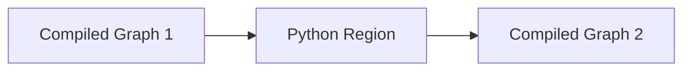

默认情况下，`torch.compile` 可以在 Graph Break 后回到 Python，再继续捕获后续代码。

因此 Graph Break 通常表示：

> 编译图被拆分，跨越 Break 的优化机会减少。

它并不一定意味着程序无法运行。

---

## 14. 为什么 Graph Break 会影响性能

假设原本存在：

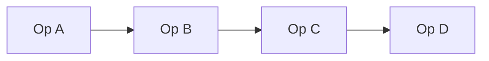

完整 Graph 允许编译器同时观察多个 Operator。如果中间发生 Graph Break：

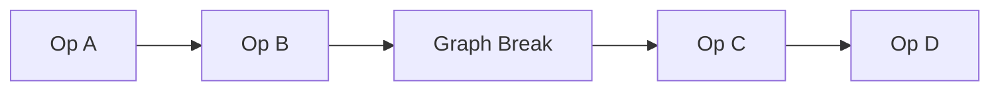

跨Break的Fusion、Scheduling、Graph-level Optimization就可能无法进行。

因此 `torch.compile` 性能不符合预期时，Graph Break 是需要检查的重要项目之一。

---

## 15. 使用 `fullgraph=True` 查找 Graph Break

默认：

```python
torch.compile(
    model,
    fullgraph=False,
)
```

允许 Graph Break。

调试时可以：

```python
compiled_model = torch.compile(
    model,

    # 要求目标区域被完整捕获
    fullgraph=True,
)
```

如果出现无法捕获的代码，Compilation 会直接报错。

因此 `fullgraph=True` 的主要用途之一是：

> 找到阻止完整 Graph Capture 的代码位置。

并不是要求所有模型正式运行时都必须使用它。

---

## 16. 使用 `TORCH_LOGS` 调试

`torch.compile` 官方文档提供了 `TORCH_LOGS`。

检查 Graph Break：

```bash
TORCH_LOGS="graph_breaks" python train.py
```

检查 Recompilation：

```bash
TORCH_LOGS="recompiles" python train.py
```

检查 Guard：

```bash
TORCH_LOGS="guards" python train.py
```

检查 Dynamic Shape：

```bash
TORCH_LOGS="dynamic" python train.py
```

也可以组合：

```bash
TORCH_LOGS="graph_breaks,recompiles,dynamic" python train.py
```

这些日志分别回答：

| 日志 | 用途 |
| --- | --- |
| `graph_breaks` | 为什么计算图被打断 |
| `guards` | 编译结果依赖哪些条件 |
| `recompiles` | 为什么重新编译 |
| `dynamic` | Dynamic Shape 如何被处理 |

---

## 17. Guard

编译生成的代码通常依赖一些运行时假设，例如：

- Tensor Shape；
- dtype；
- device；
- Python Object State。

这些条件通过 Guard 检查。

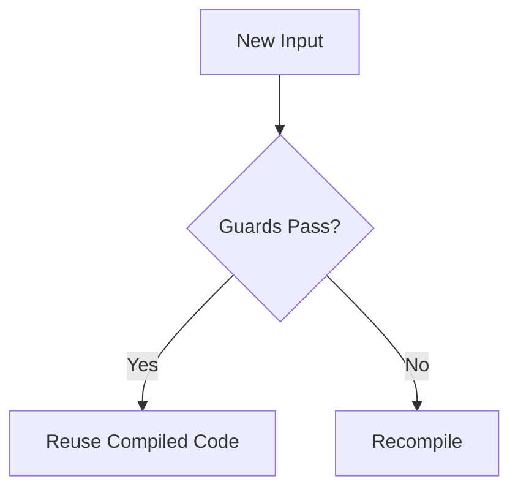

Guard 是保证编译后代码能够安全复用的重要机制。

因此 Compilation Cache 的语义不是<mark>编译一次之后无条件永远复用。</mark> 而是<mark>当当前输入和程序状态满足对应 Guard 时复用已有编译结果。</mark>

---

## 18. Recompilation

例如：

```python
import torch


@torch.compile
def fn(x):
    return x + 1
```

第一次：

```python
fn(torch.ones(3))
```

生成了某个 Compilation。之后：

```python
fn(torch.ones(4))
```

如果原来的 Guard 不再满足，就可能触发 Recompilation。


Recompilation 会重新支付 Compile Cost。因此频繁 Recompilation 可能严重影响性能。

可以使用：

```bash
TORCH_LOGS="recompiles" python train.py
```

查看发生 Recompile 的原因。

---

## 19. Dynamic Shape

实际 Workload 的 Tensor Shape 可能变化，例如：

- Batch Size；
- Sequence Length；
- 图像尺寸。

如果每种 Shape 都重新编译：

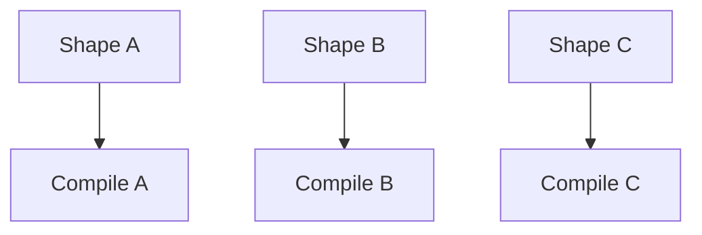

Compile Cost 会不断增加。Dynamic Shape 的目标是让同一个 Graph 支持多个尺寸：

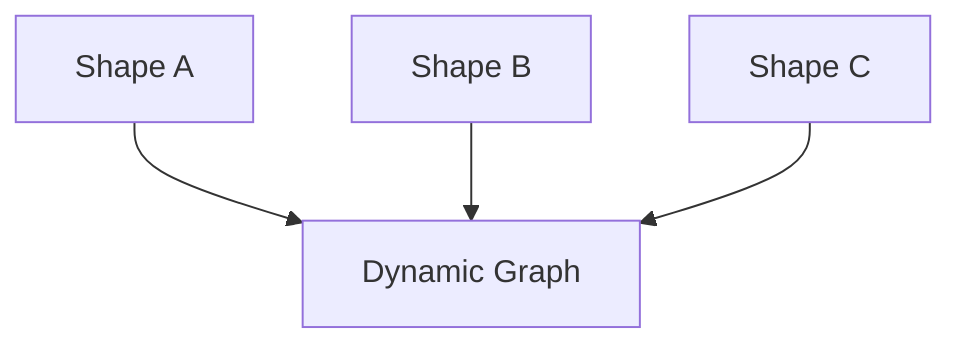

---

## 20. `dynamic` 参数

默认可以直接：

```python
compiled_model = torch.compile(model)
```

也就是：

```python
torch.compile(
    model,
    dynamic=None,
)
```

当前官方 Dynamic Shapes 文档描述的默认行为是，<mark>在出现 Shape 变化导致的 Recompile 后，编译器会尝试将发生变化的 Dimension 泛化为 Dynamic。</mark>因此入门阶段通常没有必要直接强制：

```python
torch.compile(
    model,
    dynamic=True,
)
```

将所有 Size 都强制 Dynamic 可能：

- 增加 Compile Complexity；
- 增加 Dynamic Shape 相关问题；
- 增加 Compile Time；
- 在部分情况降低性能。

因此应该根据实际 Shape 变化情况处理 Dynamic Shape。

---

## 21. `torch.compile` 的常用 Mode

`torch.compile` 提供多个常见 Mode：

| Mode | 主要目标 |
| --- | --- |
| `default` | 默认性能和编译开销平衡 |
| `reduce-overhead` | 减少 Python 与 Kernel Launch Overhead |
| `max-autotune` | 使用更多 Autotuning 搜索高性能实现 |
| `max-autotune-no-cudagraphs` | Max Autotune，但不使用 CUDA Graph |

默认：

```python
compiled_model = torch.compile(
    model,
    mode="default",
)
```

### 21.1 `reduce-overhead`

```python
compiled_model = torch.compile(
    model,

    # 尝试减少运行时 CPU / Kernel Launch Overhead
    mode="reduce-overhead",
)
```

该模式可以在适用场景中使用 CUDA Graph 等机制减少运行时 Overhead。

它比较适合<mark>Batch 较小、大量短 Kernel、CPU Launch Overhead比较明显</mark>的GPU Workload。

但并不是所有模型都适合 CUDA Graph，而且可能增加额外显存占用。

### 21.2 `max-autotune`

```python
compiled_model = torch.compile(
    model,

    # 花费更多编译时间搜索高性能实现
    mode="max-autotune",
)
```

这里存在典型 Trade-off：

- <mark>更高 Compile Cost</mark>
- <mark>潜在更高 Steady-state Performance</mark>

如果模型会执行大量 Iteration，Compile Cost 更容易被后续运行摊薄。

---

## 22. CUDA Graph

GPU Kernel 通常需要 CPU 发起 Launch。如果存在大量小 Kernel：

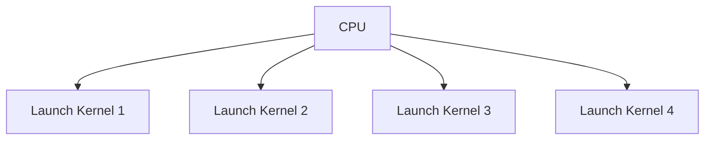

CPU Launch Overhead 可能成为瓶颈。CUDA Graph 可以捕获一段 GPU Work，然后进行 Replay：

```mermaid
flowchart LR
    A["CPU"] --> B["Replay CUDA Graph"]
    B --> C["GPU Work Sequence"]
```

`torch.compile` 的部分 Mode 可以利用 CUDA Graph 相关优化。但 CUDA Graph：

- 并不支持所有执行模式；
- 可能受到 Mutation 等行为限制；
- 可能增加额外设备内存使用。

---

## 23. 避免 CPU-GPU Synchronization

CUDA Execution 默认具有异步特性：

```mermaid
sequenceDiagram
    participant CPU
    participant GPU

    CPU->>GPU: Launch Kernel A
    CPU->>GPU: Launch Kernel B
    CPU->>GPU: Launch Kernel C
    GPU->>GPU: Execute queued kernels
```

CPU 不需要每提交一个 Kernel 都等待 GPU。但是：

```python
value = cuda_tensor.item()
```

要求 CPU 得到 GPU 上的实际值，因此需要同步。

```mermaid
sequenceDiagram
    participant CPU
    participant GPU

    CPU->>GPU: Launch kernels
    CPU->>GPU: Request tensor value
    GPU-->>CPU: Return value after required work finishes
    CPU->>CPU: Continue execution
```

应避免不必要的：

- `print(cuda_tensor)`；
- `cuda_tensor.item()`；
- `cuda_tensor.cpu()`；
- CPU/GPU 数据复制；
- Python Control Flow 依赖 CUDA Tensor 数值。

这些行为可能在关键训练路径中引入同步。

---

## 24. 直接在目标 Device 创建 Tensor

如果 Tensor 最终就是用于 GPU：

```python
x = torch.rand(
    1024,
    1024,

    # 直接分配到 CUDA Device
    device="cuda",
)
```

通常比：

```python
x = torch.rand(1024, 1024)

# 额外执行一次 Host -> Device Copy
x = x.cuda()
```

少一次不必要的数据传输。

---

## 25. Tensor Core 与矩阵计算精度

PyTorch 提供：

```python
torch.set_float32_matmul_precision(...)
```

控制 Float32 Matrix Multiplication 的内部计算精度策略。例如：

```python
import torch

# 允许使用更偏向性能的内部矩阵乘实现
torch.set_float32_matmul_precision("high")
```

当前主要选项包括：

- `"highest"`
- `"high"`
- `"medium"`

<mark>降低内部计算精度可能提高矩阵计算性能，因此需要结合模型对数值精度的要求进行选择。</mark>

---

## 26. Mixed Precision 与 AMP

GPU Workload 可以考虑 Mixed Precision。

核心思想是：<mark>不需要让模型中的所有 Operation 始终使用相同的高精度计算。</mark>

适合低精度计算的 Operation 可以使用更高效的数据类型，而数值敏感部分保持较高精度。

```mermaid
flowchart TD
    A["Operation"] --> B{"Suitable for Lower Precision?"}
    B -->|Yes| C["Lower Precision"]
    B -->|No| D["Higher Precision"]
```

PyTorch AMP 用于管理这种不同精度计算。

实际性能收益取决于：

- GPU 架构；
- Operator；
- Tensor Shape；
- Tensor Core 利用率。

---

## 27. cuDNN Autotuner

对于卷积模型，可以：

```python
import torch

# 对不同卷积算法进行 Benchmark
torch.backends.cudnn.benchmark = True
```

cuDNN 可以针对当前 Hardware 和 Input Shape 测试多种实现，并选择速度较好的算法。

它更适合：

> Input Shape 比较稳定的卷积 Workload。

如果 Shape 经常变化，重复 Algorithm Search 的开销可能抵消性能收益。

---

## 28. `channels_last`

PyTorch 对 CNN 支持 `channels_last` Memory Format（通道后置内存格式）的主要作用是大幅提升 CNN 在硬件上的计算效率与内存访问性能，尤其是在结合 Tensor Cores与混合精度（AMP / FP16 / BF16）训练时。

```python
# 模型
model = model.to(
    memory_format=torch.channels_last
)

# Tensor
x = x.to(
    memory_format=torch.channels_last
)
```

它主要面向适合这种 Memory Format 的 Computer Vision Workload，并不是所有模型的通用优化开关。

---

## 29. Activation Checkpointing

普通训练过程中，Forward 会保存 Backward 需要的一些中间 Tensor：

```mermaid
flowchart LR
    A["Forward"] --> B["Save Activations"]
    B --> C["Backward"]
    C --> D["Use Saved Activations"]
```

Activation Checkpointing 则选择只保存部分结果：

```mermaid
flowchart LR
    A["Forward"] --> B["Save Selected Activations"]
    B --> C["Backward"]
    C --> D["Recompute Missing Activations"]
    D --> E["Compute Gradients"]
```

PyTorch 提供`torch.utils.checkpoint`用于实现这种机制。

它是典型的：<mark>用更多计算换取更低显存占用</mark>。如果节省出的显存允许使用更大的 Batch Size，还可能间接改善 Hardware Utilization。

---

## 30. Variable Length 输入与内存预分配

NLP、Speech 等 Workload 经常具有不同 Sequence Length。

不断变化的 Shape 可能导致 Memory Allocator 面临更多Allocation、Reuse、Fragmentation问题。

Performance Tuning Guide 给出的一个策略是，<mark>先使用接近最大 Sequence Length 的 Batch 执行一次 Forward 和 Backward，让较大的 Buffer 提前得到分配，之后再开始正常训练。</mark>

目的在于使后续迭代能够复用已经分配的内存。

---

## 31. 不要在正式训练中一直开启 Debug API

例如：

```python
torch.autograd.detect_anomaly()
```

以及其他 Debug、Profiler、Correctness Checking 工具都会引入额外开销。

因此这些工具应该用于：

```mermaid
flowchart LR
    A["Debug / Profile"] --> B["Find Problem"]
    B --> C["Disable Debug Tools"]
    C --> D["Performance Run"]
```

<mark>Profiler 本身同样会带来性能开销。</mark> 因此：

> Profiler 用来测量程序，不应该将开启 Profiler 后的速度直接当成模型正常运行速度。

---

## 32. CPU Workload：NUMA

多Socket CPU Server通常具有NUMA（Non-Uniform Memory Access，非一致性内存访问）架构。

访问本地 NUMA Node Memory 和访问 Remote Node Memory 的成本不同。

因此可以考虑将 CPU 和 Memory 绑定到相同 NUMA Node：

```bash
numactl --cpunodebind=N --membind=N python train.py
```

这可以减少不必要的 Cross-Socket Memory Access。

---

## 33. CPU Workload：OpenMP

PyTorch CPU 计算大量使用线程并行。可以通过：

```bash
export OMP_NUM_THREADS=N
```

控制 OpenMP 使用的线程数量。<mark>更多线程并不意味着一定更快。</mark>

如果 Thread 不断在 CPU Core 之间迁移，可能造成：

- Cache Locality 下降
- Cache Line Invalidations
- Core 间通信
- Page Thrashing

相关配置还包括：

```bash
export OMP_SCHEDULE=STATIC
export OMP_PROC_BIND=CLOSE
export GOMP_CPU_AFFINITY="N-M"
```

实际设置需要根据机器 CPU Topology 调整。

---

## 34. CPU Memory Allocator

CPU 深度学习 Workload 还可以考虑`jemalloc`、`TCMalloc`等Allocator。

它们可以通过更积极的 Memory Reuse 减少部分频繁分配和释放的成本。

常见加载方式为：

```bash
export LD_PRELOAD=<allocator.so>:$LD_PRELOAD
```

这一类优化主要针对 CPU Server Workload。

---

## 35. 分布式训练优先使用 DDP

对于多 GPU Data Parallel Training，推荐`DistributedDataParallel`也就是`DDP`，而不是传统的`DataParallel`。

概念上，每个 GPU 对应一个独立 Process：

```mermaid
flowchart TD
    A["Global Batch"] --> B["Process 0 / GPU 0"]
    A --> C["Process 1 / GPU 1"]
    A --> D["Process 2 / GPU 2"]
    A --> E["Process 3 / GPU 3"]

    B --> F["Gradient Synchronization"]
    C --> F
    D --> F
    E --> F
```

---

### 35.1 Gradient Accumulation 时避免重复 All-Reduce

DDP 默认会在 Backward 期间执行 Gradient Synchronization。

如果使用 Gradient Accumulation，前面的 Micro Batch 并不一定需要立即同步。

可以使用`model.no_sync()`临时关闭同步。

```mermaid
flowchart LR
    A["Micro Batch 1"] --> B["Backward without All-Reduce"]
    B --> C["Micro Batch 2"]
    C --> D["Backward without All-Reduce"]
    D --> E["Final Micro Batch"]
    E --> F["Backward + All-Reduce"]
    F --> G["Optimizer Step"]
```

这样可以<mark>减少不必要的通信。</mark>

### 35.2 DDP 中的计算通信重叠

DDP 将 Parameter Gradient 划分为多个 Bucket。

一个 Bucket 中的 Gradient 计算完成之后，可以开始异步 All-Reduce，同时继续计算后面的 Gradient。

```mermaid
sequenceDiagram
    participant GPU as Backward Compute
    participant NCCL as Communication

    GPU->>GPU: Compute Bucket 1 gradients
    GPU->>NCCL: Start Bucket 1 All-Reduce
    GPU->>GPU: Compute Bucket 2 gradients
    GPU->>NCCL: Start Bucket 2 All-Reduce
```

因此 Multi-GPU Performance 还需要考虑：

- Communication；
- Synchronization；
- Load Balance；
- Compute / Communication Overlap。

### 35.3 Distributed Load Balance

如果不同 GPU 接收到的工作量不同：

```mermaid
flowchart TD
    A["GPU 0: Short Sequence"] --> D["Wait"]
    B["GPU 1: Short Sequence"] --> D
    C["GPU 2: Long Sequence"] --> E["Still Computing"]
    E --> D
```

整个 Distributed Step 的速度最终受到最慢 Worker 限制。

对于 Variable Length Workload，可以考虑：

- Sequence Length Bucketing
- 控制每个 Batch 的 Token 数
- 减少不同 Worker 之间的 Workload 差异

---

## 36. 为什么需要 PyTorch Profiler

在真正开始性能优化之前，需要先回答：

> 时间到底花在哪里？

PyTorch 提供`torch.profiler`用于收集训练或推理过程中的性能信息。

Profiler 可以用于分析：

- PyTorch Operator 的执行时间
- CPU Activity
- CUDA Kernel Activity
- XPU Activity
- Operator Input Shape
- Tensor Memory Allocation
- Python / TorchScript Stack
- 完整 Timeline Trace

因此性能优化流程应该是：

```mermaid
flowchart LR
    A["Slow Training / Inference"] --> B["PyTorch Profiler"]
    B --> C["Identify Expensive Region"]
    C --> D["Understand Bottleneck"]
    D --> E["Apply Optimization"]
    E --> F["Profile Again"]
```

Profiler 的目标不是自动优化模型，而是提供证据帮助确定：

> 下一步应该优化什么。

### 36.1 Profiler 的基本使用

主要 API 位于：

```python
from torch.profiler import (
    profile,
    ProfilerActivity,
    record_function,
)
```

最简单的 CPU Profiling：

```python
import torch
from torch.profiler import (
    profile,
    ProfilerActivity,
    record_function,
)


with profile(
    # 记录 CPU 上的 PyTorch Operator
    activities=[ProfilerActivity.CPU],

    # 记录 Operator 输入 Tensor Shape
    record_shapes=True,
) as prof:

    # 给某段用户代码添加可识别的名称
    with record_function("model_inference"):
        output = model(inputs)
```

然后查看结果：

```python
print(
    prof.key_averages().table(
        # 按总 CPU 时间排序
        sort_by="cpu_time_total",

        # 只显示前 10 项
        row_limit=10,
    )
)
```

Profiler 会记录上下文管理器内部发生的 PyTorch Operation。

### 36.2 `ProfilerActivity`

`activities` 决定 Profiler 记录哪些设备上的活动。常见选项包括：

| Activity | 含义 |
| --- | --- |
| `ProfilerActivity.CPU` | CPU 上的 PyTorch Operator、用户标记等 |
| `ProfilerActivity.CUDA` | CUDA Device Kernel |
| `ProfilerActivity.XPU` | XPU Device Kernel |

GPU Profiling 可以：

```python
from torch.profiler import profile, ProfilerActivity

activities = [
    ProfilerActivity.CPU,
    ProfilerActivity.CUDA,
]

with profile(
    # 同时记录 CPU 和 CUDA Activity
    activities=activities,
) as prof:
    model(inputs)
```

CPU Activity 很重要，因为一次 CUDA Kernel 的执行不仅包含 Device Kernel，还可能包含：

- Python
- PyTorch Dispatcher
- CUDA Runtime
- Kernel Launch

等 Host-side Activity。

### 36.3 `record_function`：给代码区域加标签

Profiler 默认可以看到大量底层 Operator。

但实际排查时，经常更关心：

- Data Loading
- Forward
- Loss
- Backward
- Optimizer Step

分别花了多少时间。可以用：

```python
from torch.profiler import record_function


with record_function("forward"):
    pred = model(x)

with record_function("loss"):
    loss = loss_fn(pred, y)

with record_function("backward"):
    loss.backward()

with record_function("optimizer"):
    optimizer.step()
```

这样 Profiler Timeline 中会出现自定义区域：

```mermaid
flowchart LR
    A["forward"] --> B["loss"]
    B --> C["backward"]
    C --> D["optimizer"]
```

这对于把大量底层 Operator 映射回训练代码结构非常有用。

### 36.4 如何阅读 Profiler Table

```python
print(
    prof.key_averages().table(
        sort_by="cpu_time_total",
        row_limit=10,
    )
)
```

会看到类似以下指标：

- Self CPU
- CPU Total
- CPU Time Avg
- Number of Calls

对于 CUDA Profiling，还可以看到：

- Self CUDA
- CUDA Total
- CUDA Time Avg。

Self Time 表示：

> 当前 Operator 自己消耗的时间，不包括它调用的 Child Operator。

Total Time 表示：

> 当前 Operator 自己和其 Child Operator 的总时间。


```mermaid
flowchart TD
    A["Operator A: Total Time"] --> B["Operator A Self Time"]
    A --> C["Child Operator B"]
    A --> D["Child Operator C"]
```

如果一个 High-level Operator 内部调用多个低层 Operator，它的`Total Time`可能很大，但`Self Time`可能很小。

因此分析性能时需要根据问题选择：

```python
sort_by="cpu_time_total"
```

或者：

```python
sort_by="self_cpu_time_total"
```

CUDA 同理。

### 36.5 根据 Input Shape 分组

<mark>同一个 Operator 在不同 Tensor Shape 下可能具有完全不同的执行成本。</mark>

首先启用：

```python
with profile(
    activities=[ProfilerActivity.CPU],

    # 必须记录 Shape，后面才能按 Shape 分组
    record_shapes=True,
) as prof:
    model(inputs)
```

然后：

```python
print(
    prof.key_averages(
        # 将同一个 Operator 的不同输入 Shape 分开统计
        group_by_input_shape=True,
    ).table(
        sort_by="cpu_time_total",
        row_limit=10,
    )
)
```

例如同一个`aten::convolution`可能分别作用于大Feature Map、小Feature Map它们的性能行为可能完全不同。

因此只看 Operator Name 有时不够，还需要结合 Input Shape。

### 36.6 使用 Profiler 分析内存

Profiler 还可以记录 Tensor Memory Allocation。

```python
with profile(
    activities=[ProfilerActivity.CPU],

    # 记录 Tensor Memory Allocation / Free
    profile_memory=True,

    record_shapes=True,
) as prof:
    model(inputs)
```

然后可以按 Memory Usage 排序：

```python
print(
    prof.key_averages().table(
        # 查看哪些 Operator 自己分配了最多 CPU Memory
        sort_by="self_cpu_memory_usage",
        row_limit=10,
    )
)
```

这里同样存在Self Memory、Total Memory的区别。

Self Memory 表示当前 Operator 自身分配或释放的 Memory，不包括 Child Operator 的 Allocation。

Profiler Memory 数据可以帮助发现：

- 大量临时 Tensor
- 某些 Operator 的高 Memory Cost
- Activation 占用
- 频繁 Allocation

但开启 Memory Profiling 本身也会产生额外 Profiling Overhead。

### 36.7 查看 Stack Trace

知道哪个 Operator 很慢之后，还需要知道：

> 这个 Operator 是代码中的哪一行触发的？

可以启用 Stack Trace：

```python
with profile(
    activities=[
        ProfilerActivity.CPU,
        ProfilerActivity.CUDA,
    ],

    # 记录 Operator 对应的调用栈
    with_stack=True,
) as prof:
    model(inputs)
```

然后可以按照 Stack 聚合：

```python
print(
    prof.key_averages(
        # 根据调用栈进行分组
        group_by_stack_n=5,
    ).table(
        sort_by="self_cuda_time_total",
        row_limit=10,
    )
)
```

这可以将底层 Operator 对应回：

- Python Source File
- Function
- Module Forward
- 调用位置

需要注意：<mark>Stack Trace 会额外增加 Profiling Overhead。</mark>因此没有必要一直开启。

### 36.8 导出 Trace

Table 非常适合快速查看最昂贵的 Operator。但它会丢失时间关系。

例如下面两个程序，Operator 总时间可能类似：

```mermaid
flowchart LR
    A["Kernel A"] --> B["Kernel B"]
    B --> C["Kernel C"]
```

和：

```mermaid
flowchart LR
    A["Kernel A"] --> B["Large Idle Gap"]
    B --> C["Kernel B"]
    C --> D["Kernel C"]
```

只看 Aggregated Table 并不容易发现中间的 Idle Gap。

因此 Profiler 可以导出完整 Trace：

```python
with profile(
    activities=[
        ProfilerActivity.CPU,
        ProfilerActivity.CUDA,
    ]
) as prof:
    model(inputs)

# 将 Timeline 导出为 JSON Trace
prof.export_chrome_trace("trace.json")
```

Trace 可以用于观察：

- CPU Operator
- CUDA Runtime
- CUDA Kernel
- Host / Device 时间关系
- Kernel Launch
- Synchronization
- Idle Gap

因此：

| 输出方式 | 更适合回答的问题 |
| --- | --- |
| `key_averages().table()` | 哪些 Operator 最贵 |
| Timeline Trace | 为什么整个 Step 很慢 |

### 36.9. 为什么不能 Profile 整个长训练任务

如果训练包含数万个 Step，而从头到尾一直记录：

```python
with profile(...) as prof:
    for batch in dataloader:
        ...
```

可能产生：

- 大量 Profiling Overhead
- 很大的 Trace File
- 很高的内存占用

因此 PyTorch Profiler 提供`torch.profiler.schedule`只记录训练中的特定 Step。

### 36.10 Profiler Schedule

```python
import torch

schedule = torch.profiler.schedule(
    # 一开始完全跳过 10 个 Step
    skip_first=10,

    # 每个 Profiling Cycle 先等待 5 个 Step
    wait=5,

    # 再进行 1 个 Warmup Step，但不保存结果
    warmup=1,

    # 正式记录 3 个 Step
    active=3,

    # 执行两个 Profiling Cycle
    repeat=2,
)
```

一个 Cycle 可以理解为：

```mermaid
flowchart LR
    A["Wait"] --> B["Warmup"]
    B --> C["Active Recording"]
    C --> D["Trace Ready"]
```

几个阶段的作用：

| 参数 | 含义 |
| --- | --- |
| `skip_first` | 开始 Profiling Cycle 前完全跳过的 Step |
| `wait` | Cycle 内 Profiler 不活动的 Step |
| `warmup` | 开始 Trace，但丢弃结果 |
| `active` | 正式记录 Trace |
| `repeat` | 重复多少个 Cycle |

Warmup 阶段用于避免刚开始 Profiling 时额外开销导致的数据偏差。

### 36.11 `prof.step()`

Schedule 需要知道训练进入了下一个 Step。因此每次 Iteration 结束后需要：

```python
prof.step()
```

例如：

```python
import torch
from torch.profiler import profile, ProfilerActivity


with profile(
    activities=[
        ProfilerActivity.CPU,
        ProfilerActivity.CUDA,
    ],

    schedule=torch.profiler.schedule(
        wait=1,
        warmup=1,
        active=2,
    ),
) as prof:

    for x, y in dataloader:
        optimizer.zero_grad(set_to_none=True)

        pred = model(x)
        loss = loss_fn(pred, y)

        loss.backward()
        optimizer.step()

        # 告诉 Profiler 当前训练 Step 已完成
        prof.step()
```

如果使用了 Schedule，却忘记`prof.step()`，Profiler 就无法按照训练 Iteration 推进其内部状态。

### 36.12 `on_trace_ready`

每完成一次 Active Profiling Cycle，Profiler 可以调用`on_trace_ready`处理刚刚得到的 Trace。

例如：

```python
import torch


def trace_handler(prof):
    # 输出当前 Cycle 中最耗时的 CUDA Operator
    print(
        prof.key_averages().table(
            sort_by="self_cuda_time_total",
            row_limit=10,
        )
    )

    # 每次 Active Cycle 结束后保存一个 Trace
    prof.export_chrome_trace(
        f"trace_{prof.step_num}.json"
    )


with torch.profiler.profile(
    activities=[
        torch.profiler.ProfilerActivity.CPU,
        torch.profiler.ProfilerActivity.CUDA,
    ],

    schedule=torch.profiler.schedule(
        wait=1,
        warmup=1,
        active=2,
    ),

    # 每次 Trace 准备完成时执行
    on_trace_ready=trace_handler,
) as prof:

    for x, y in dataloader:
        pred = model(x)
        loss = loss_fn(pred, y)

        loss.backward()

        prof.step()
```

因此长任务中的 Profiling 流程是：

```mermaid
flowchart TD
    A["Training Step"] --> B["prof.step()"]
    B --> C{"Active Cycle Finished?"}
    C -->|No| A
    C -->|Yes| D["on_trace_ready"]
    D --> E["Print / Save Trace"]
    E --> A
```

### 36.13 一个更实际的 Training Profiler 示例

对于完整训练 Step，可以使用 `record_function` 将不同区域标记出来：

```python
import torch
from torch.profiler import (
    profile,
    ProfilerActivity,
    record_function,
)


with profile(
    activities=[
        ProfilerActivity.CPU,
        ProfilerActivity.CUDA,
    ],

    # 只记录部分 Iteration
    schedule=torch.profiler.schedule(
        wait=1,
        warmup=1,
        active=3,
        repeat=1,
    ),

    # 记录输入 Shape，方便判断不同 Shape 的 Operator
    record_shapes=True,

    # 分析 Tensor Memory Allocation
    profile_memory=True,
) as prof:

    for x, y in dataloader:
        with record_function("host_to_device"):
            # 将 Batch 移动到 GPU
            x = x.cuda()
            y = y.cuda()

        optimizer.zero_grad(set_to_none=True)

        with record_function("forward"):
            # Forward Pass
            pred = model(x)

        with record_function("loss"):
            # Loss Calculation
            loss = loss_fn(pred, y)

        with record_function("backward"):
            # Backward Pass
            loss.backward()

        with record_function("optimizer_step"):
            # Parameter Update
            optimizer.step()

        # 推进 Profiler Schedule
        prof.step()
```

这样可以同时观察：

```mermaid
flowchart LR
    A["Host to Device"] --> B["Forward"]
    B --> C["Loss"]
    C --> D["Backward"]
    D --> E["Optimizer"]
```

并进一步展开每个区域中的 PyTorch Operator 和 CUDA Kernel。

## 37. 使用 Profiler 判断常见瓶颈

Profiler 本身给出的是数据。真正重要的是根据 Trace 判断瓶颈。

### 37.1 GPU 存在较大空闲区间

如果 Timeline 中 GPU Kernel 之间存在明显空白：

```mermaid
flowchart LR
    A["GPU Kernel"] --> B["Idle"]
    B --> C["GPU Kernel"]
    C --> D["Idle"]
    D --> E["GPU Kernel"]
```

应该进一步检查：

- DataLoader 是否过慢
- CPU 是否无法及时提交工作
- 是否存在同步
- 是否存在大量 Python Overhead

### 37.2 大量很短的 CUDA Kernel

如果：

- Kernel 数量很多
- 每个 Kernel 时间非常短
- CPU 不断 Launch Kernel

那么可能存在较高 Kernel Launch Overhead。

此时可以进一步考虑：

- Operator Fusion
- `torch.compile`
- CUDA Graph
- `mode="reduce-overhead"`

### 37.3 某个 Operator 占据大量 CUDA Time

如果 Profiler Table 显示某个 Operator 占据主要时间，应该进一步检查：

- Input Shape
- dtype
- Memory Format
- Tensor Core 是否能够有效使用
- 是否存在更适合的 PyTorch Operator

### 37.4 大量 CPU-GPU Synchronization

如果 Timeline 中 CPU 经常等待 GPU，可以进一步检查：

- `.item()`
- `.cpu()`
- `print(cuda_tensor)`
- Data-dependent Python Control Flow

### 37.5 Memory Allocation 很大

如果：

```python
profile_memory=True
```

显示某些 Operation 产生大量 Tensor Allocation，可以进一步检查：

- Activation
- 临时 Tensor
- 中间结果
- Activation Checkpointing 的适用性

---

## 38. Profiler 与 Benchmark 的区别

Profiler 和 Benchmark 解决的是两个不同问题。

Benchmark 回答：

> 整体到底快了多少？

Profiler 回答：

> 时间具体花在哪里？

```python
compiled_model = torch.compile(model)
```

优化后，需要 Benchmark：

```mermaid
flowchart LR
    A["Eager Runtime"] --> C["Compare"]
    B["Compiled Runtime"] --> C
```

而如果 Compiled Model 没有变快，则需要 Profiler：

```mermaid
flowchart LR
    A["Profiler"] --> B["Kernel Timeline"]
    A --> C["Operator Time"]
    A --> D["CPU/GPU Activity"]
```

因此正确流程是：

```mermaid
flowchart LR
    A["Benchmark Baseline"] --> B["Profile"]
    B --> C["Optimize"]
    C --> D["Benchmark Again"]
    D --> E["Profile Again if Needed"]
```

不要把 Profiler 的测量结果直接作为正常 Runtime Benchmark。

---

## 39. Profiler 与 `torch.compile` 的关系

Profiler 对 `torch.compile` 特别重要。假设开启：

```python
compiled_model = torch.compile(model)
```

但速度没有明显提升。仅仅知道 `torch.compile` 没有加速并不能判断原因。需要分别检查：

```mermaid
flowchart TD
    A["torch.compile not faster"] --> B["Profiler"]
    B --> C{"Many Small Kernels?"}
    B --> D{"GPU Idle?"}
    B --> E{"Synchronization?"}

    A --> F["Compiler Logs"]
    F --> G{"Graph Break?"}
    F --> H{"Recompile?"}
    F --> I{"Dynamic Shape?"}
```

也就是说<mark>Profiler 观察 Runtime。</mark>而：

- `TORCH_LOGS="graph_breaks"`；
- `TORCH_LOGS="recompiles"`；
- `TORCH_LOGS="guards"`；
- `TORCH_LOGS="dynamic"`；

用于观察 Compiler 行为。两类工具解决的问题不同。

---

## 40. Profiler 自身存在开销

Profiler 会增加运行时开销。特别是开启：

```python
record_shapes=True
profile_memory=True
with_stack=True
```

时，需要收集更多元数据。因此正式 Benchmark 时应该关闭 Profiler。正确流程是：

```mermaid
flowchart LR
    A["Enable Profiler"] --> B["Find Bottleneck"]
    B --> C["Disable Profiler"]
    C --> D["Benchmark Normal Runtime"]
```

Profiler 数据用于定位相对瓶颈，不应该将开启 Profiler 时的训练吞吐直接当成生产环境吞吐。

---

## 41. 一套基础 Performance 优化顺序

加入 Profiler 后，更合理的基础调优流程是：

```mermaid
flowchart TD
    A["Establish Correct Baseline"] --> B["Benchmark"]
    B --> C["Profile Representative Steps"]
    C --> D{"Main Bottleneck?"}

    D -->|Input Pipeline| E["Tune DataLoader"]
    D -->|Synchronization| F["Remove CPU-GPU Sync"]
    D -->|Many Small Kernels| G["Try torch.compile / Fusion"]
    D -->|Compute| H["Precision / Tensor Core"]
    D -->|Memory| I["Checkpointing / Allocation"]
    D -->|Distributed| J["DDP Communication"]

    G --> K["Check Graph Breaks"]
    K --> L["Check Recompilations"]
    L --> M["Check Dynamic Shapes"]

    E --> N["Benchmark Again"]
    F --> N
    H --> N
    I --> N
    J --> N
    M --> N
```

核心原则是：

> 不先判断瓶颈，就没有足够依据决定应该使用哪种优化。

---

## 42. 一个基础的高性能训练框架

综合前面的基础优化，一个训练程序可以形成下面的结构：

```python
import torch
from torch.utils.data import DataLoader


train_loader = DataLoader(
    dataset,
    batch_size=128,

    # 使用多个 Worker 准备数据
    num_workers=4,

    # GPU Training 时考虑使用 Pinned Memory
    pin_memory=True,

    shuffle=True,
)

model = MyModel().cuda()

# 使用 PyTorch Compiler 优化模型
model = torch.compile(model)

optimizer = torch.optim.AdamW(
    model.parameters(),
    lr=1e-3,
)

for x, y in train_loader:
    x = x.cuda()
    y = y.cuda()

    # 避免将全部 Gradient Buffer 显式写 0
    optimizer.zero_grad(set_to_none=True)

    # Forward
    pred = model(x)

    # Loss
    loss = loss_fn(pred, y)

    # Backward
    loss.backward()

    # Parameter Update
    optimizer.step()
```

这里涉及三类不同优化：

```mermaid
flowchart TD
    A["Input Pipeline"]
    B["Runtime / Compiler"]
    C["Training Loop"]

    A --> D["num_workers"]
    A --> E["pin_memory"]

    B --> F["torch.compile"]
    B --> G["Operator Fusion"]

    C --> H["set_to_none=True"]
```

它们解决的问题并不相同。是否需要这些优化，应该通过 Benchmark 和 Profiling 决定。

---

## 43. `torch.compile` 性能问题的基本排查流程

如果：

```python
compiled_model = torch.compile(model)
```

没有获得预期性能，可以分成 Runtime 和 Compiler 两部分检查。

```mermaid
flowchart TD
    A["torch.compile is slow"] --> B{"Cold Start?"}

    B -->|Yes| C["Separate Compile Time from Runtime"]

    B -->|No| D["Profile Runtime"]
    D --> E{"Graph Breaks?"}
    E -->|Yes| F["TORCH_LOGS=graph_breaks"]

    E -->|No| G{"Recompilations?"}
    G -->|Yes| H["TORCH_LOGS=recompiles"]

    G -->|No| I{"Changing Shapes?"}
    I -->|Yes| J["Inspect Dynamic Shape Behavior"]

    I -->|No| K["Inspect Runtime Trace"]
```

**Compile Time 很长**

重点检查：

- Cold Start；
- Recompilation；
- Autotuning。

**Runtime 没有变快**

Profiler 可以帮助检查：

- 大量短 Kernel；
- GPU Idle；
- Synchronization；
- Kernel Launch Overhead。

Compiler Log 则可以检查：

- Graph Break；
- Recompilation；
- Dynamic Shape。

**每隔一段时间突然变慢**

重点检查：`Recompilation`以及对应的 Guard Failure。

---

## 44. Performance Tuning 中的重要概念

| 概念 | 含义 |
| --- | --- |
| Data Loading Overhead | Accelerator 等待 CPU 准备数据 |
| Host-to-Device Transfer | CPU Memory 到 Device Memory 的数据复制 |
| Kernel Launch Overhead | CPU 向 GPU 提交 Kernel 的开销 |
| Memory-bound | 性能主要受到内存吞吐限制 |
| Operator Fusion | 合并多个 Operator，减少 Launch 和内存访问 |
| Synchronization | CPU 被迫等待 GPU |
| Tensor Core | 面向矩阵计算的专用硬件 |
| Mixed Precision | 根据 Operation 使用不同计算精度 |
| Activation Checkpointing | 使用额外计算降低 Activation Memory |
| Profiler | 收集 Operator、Device 和 Memory 性能信息 |
| Self Time | 当前 Operator 自身消耗的时间 |
| Total Time | 当前 Operator 与 Child Operator 的总时间 |
| Trace | 按时间展示 CPU / Device Activity |
| Graph Capture | 将 PyTorch 程序捕获为 Compiler Graph |
| Graph Break | Graph Capture 被中断 |
| Guard | 判断已有 Compilation 是否能够复用的条件 |
| Recompilation | Guard 不满足时重新编译 |
| Dynamic Shape | 一个 Compilation 支持多个输入尺寸 |
| Cold Start | 第一次执行时的 Compile Cost |
| DDP | PyTorch 推荐的多 GPU Data Parallel 方案 |

---

## 45. 从 Eager PyTorch 到 Compiled PyTorch

**Eager Mode**

```mermaid
flowchart LR
    A["Python"] --> B["PyTorch Op"]
    B --> C["Kernel"]
    C --> D["Python"]
    D --> E["PyTorch Op"]
    E --> F["Kernel"]
```

它的主要优点是动态、灵活、易于 Debug。但 Compiler 很难跨多个 Operator 做全局优化。

**Compile Mode**

```mermaid
flowchart LR
    A["Python Program"] --> B["TorchDynamo"]
    B --> C["FX Graph"]
    C --> D["AOTAutograd"]
    D --> E["Forward / Backward Graph"]
    E --> F["TorchInductor"]
    F --> G["Optimized Kernels"]
```

优势来自：

- Graph-level Optimization；
- Operator Fusion；
- Python Overhead 降低；
- Kernel Launch Overhead 降低；
- Memory Access 优化；
- Hardware-aware Code Generation。

同时也引入：

- Compile Time；
- Graph Break；
- Guard；
- Recompilation；
- Dynamic Shape。

因此理解 Compiler 性能需要同时观察：

```mermaid
flowchart LR
    A["Compiler Logs"] --> C["Performance Diagnosis"]
    B["PyTorch Profiler"] --> C
```

Compiler Logs 解释：

> 为什么编译器生成了这些 Graph？

Profiler 解释：

> 这些 Graph 最终在 Hardware 上是如何运行的？

---

## 46. 一套最小性能分析方法

面对一个训练程序，首先建立 Baseline。记录Step Time、Throughput、Peak Memory。

然后只 Profile 少量具有代表性的 Step：

```python
with torch.profiler.profile(
    activities=[
        torch.profiler.ProfilerActivity.CPU,
        torch.profiler.ProfilerActivity.CUDA,
    ],
    schedule=torch.profiler.schedule(
        wait=1,
        warmup=1,
        active=3,
    ),
) as prof:
    for x, y in dataloader:
        train_step(x, y)

        # 每个训练 Step 必须推进 Profiler
        prof.step()
```

接着依次回答：

1. GPU 是否存在明显 Idle？
2. CPU 是否成为提交瓶颈？
3. 是否存在大量很短的 Kernel？
4. 是否有明显 CPU-GPU Synchronization？
5. 哪些 Operator 占据主要 CUDA Time？
6. 哪些 Operation 消耗大量 Memory？
7. 使用 `torch.compile` 后 Kernel 数量和 Timeline 是否发生变化？
8. Compiler 是否存在 Graph Break 或 Recompilation？

最后只针对已经确认的瓶颈选择对应优化，并重新 Benchmark。完整流程为：

```mermaid
flowchart TD
    A["Baseline"] --> B["Profile"]
    B --> C["Identify Bottleneck"]
    C --> D["Form Hypothesis"]
    D --> E["Apply One Optimization"]
    E --> F["Benchmark"]
    F --> G{"Faster?"}
    G -->|Yes| H["Keep Optimization"]
    G -->|No| I["Revert / Re-evaluate"]
    H --> B
    I --> B
```

这比一次性开启大量所谓“性能优化选项”更容易判断每项修改到底产生了什么效果。

---

## 47. 本文覆盖范围

本文主要依据 PyTorch 官方以下资料整理：

- Performance Tuning Guide；
- PyTorch Profiler；
- `torch.profiler`；
- Introduction to `torch.compile`；
- `torch.compile` API Reference；
- `torch.compile` Programming Model；
- Dynamic Shapes；
- `torch.compile` Troubleshooting；
- Dealing with Recompilations。
