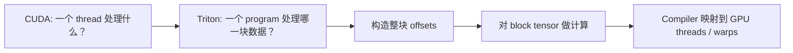
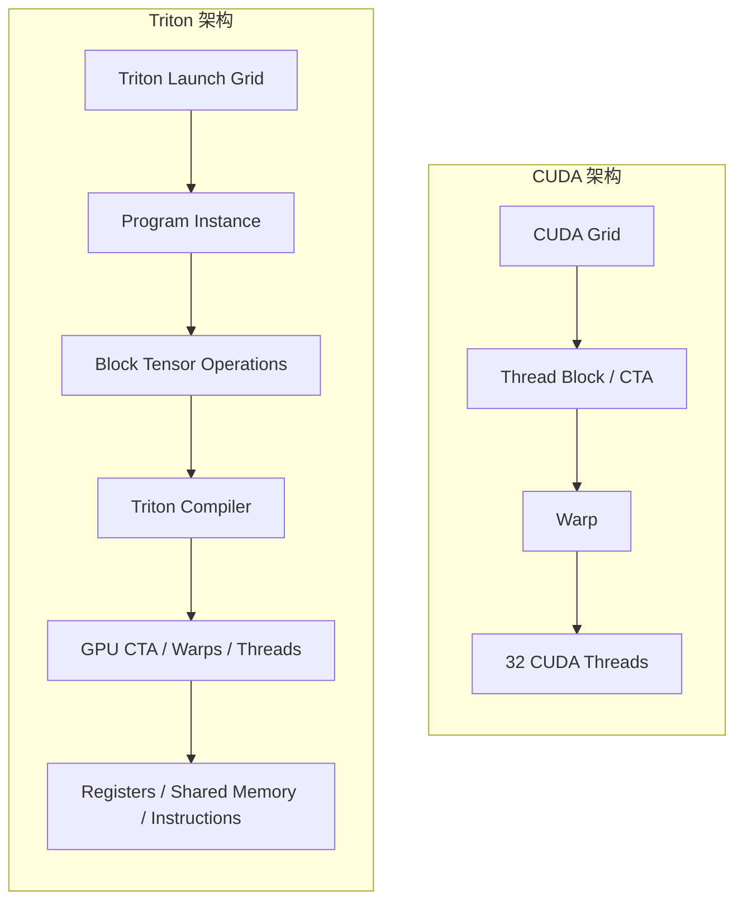
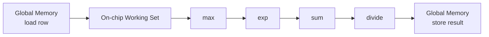
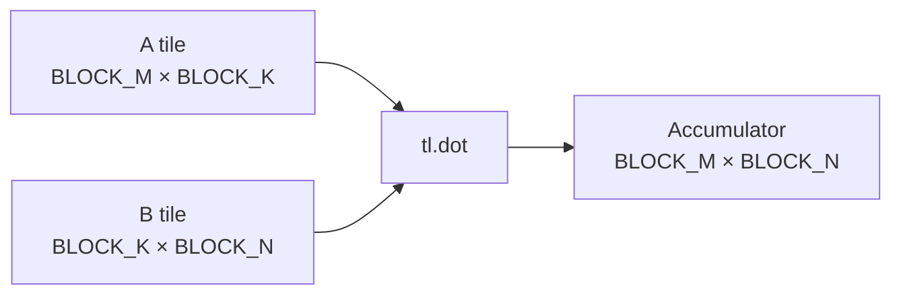
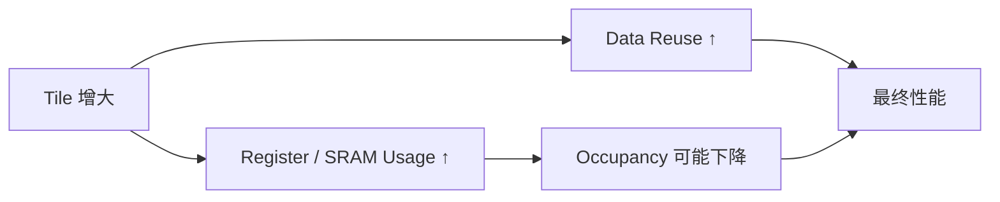
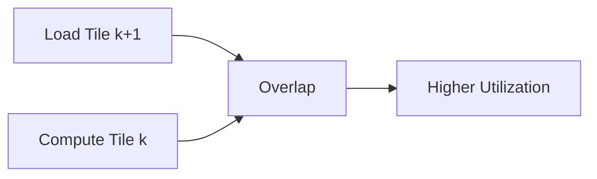
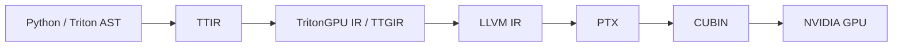
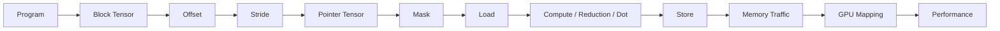

## 1. 为什么学习 Triton

Triton 是一种面向 GPU kernel 的编程语言和编译器。它的目标并不是隐藏 GPU，而是让程序员在比 CUDA 更高的抽象层次上描述一个 GPU kernel。

学习 Triton 时最容易产生的误解是：

> Triton 就是“用 Python 写 CUDA”。

这种理解并不准确。

CUDA 的核心编程对象通常是 **thread**：程序员显式写出每个 thread 如何根据 `threadIdx`、`blockIdx` 找到自己负责的数据。

Triton 的核心编程对象则更接近 **program instance + block tensor**：

- 一个 Triton kernel 会启动许多个 program instance；
- 每个 program instance 负责一块数据；
- program 内部通常一次构造一整个 offset tensor；
- 对这个 tensor 执行 `load`、计算、reduction、`store`；
- Triton compiler 再决定这些 tensor 操作如何映射到 GPU 的 threads、warps、registers、shared memory 和具体机器指令。

因此，学习 Triton 的第一目标不是记住 `tl.load()` 等 API，而是完成下面这个思维转换：



本文主要讨论经典的 `triton.language` 编程模型。Triton 的 compiler、Tensor Descriptor、TMA、persistent kernel、warp specialization 等部分仍在快速演进，因此必须始终区分：

| 层次              | 含义                                                 | 稳定程度         |
| --------------- | -------------------------------------------------- | ------------ |
| Triton 编程模型     | `program_id`、block tensor、`load/store`、reduction 等 | 相对稳定         |
| Triton compiler | tensor 如何分布到 threads、如何使用 registers/shared memory  | 可能随版本变化      |
| GPU 硬件          | warp、SM、global memory、shared memory、Tensor Core    | 由具体 GPU 架构决定 |

截至本文整理时，Triton 稳定版本已经进入 3.8 系列。阅读 `main` 分支文档时要注意，其中可能包含比当前稳定版更新的接口和实现。

---

## 2. 建议的学习路线

不要直接从 FlashAttention 或复杂 GEMM 开始。

更合理的路线是：

```mermaid
flowchart LR
    A["阶段 1<br/>Vector Add"]
    B["阶段 2<br/>program / block / offset / mask"]
    C["阶段 3<br/>2D Tensor / stride / broadcasting"]
    D["阶段 4<br/>Reduction / Softmax"]
    E["阶段 5<br/>Fusion 与 memory traffic"]
    F["阶段 6<br/>Tiled Matmul / tl.dot"]
    G["阶段 7<br/>autotune / num_warps / num_stages"]
    H["阶段 8<br/>LayerNorm / Attention"]
    I["阶段 9<br/>Persistent / TMA / 高级 Kernel"]
    J["阶段 10<br/>阅读真实项目 Triton Kernel"]

    A --> B
    B --> C
    C --> D
    D --> E
    E --> F
    F --> G
    G --> H
    H --> I
    I --> J
```



官方 Tutorials 可以按照下面的方式使用：

| 官方 Tutorial | 最适合学习的内容 |
|---|---|
| Vector Addition | program model、offset、mask、benchmark |
| Fused Softmax | reduction、fusion、on-chip working set |
| Matrix Multiplication | tiling、2D pointer arithmetic、`tl.dot`、autotune |
| Low-Memory Dropout | 随机数与 elementwise kernel |
| Layer Normalization | reduction、forward/backward、并行归约 |
| Fused Attention | 复杂 tiling、fusion、真实高性能 kernel |
| Group GEMM | 多 GEMM 调度 |
| Persistent Matmul | persistent scheduling |
| Block Scaled Matmul | 低精度与新硬件能力 |

前五个阶段应该真正理解之后，再进入 Attention 和 persistent kernel。

---

## 3. Triton 程序到底在执行什么

先从最简单的问题开始。假设有长度为 `10` 的数组：

$$
x = [x0, x1, x2, x3, x4, x5, x6, x7, x8, x9]
$$

现在令`BLOCK_SIZE = 4`可以让每个 Triton program 负责 4 个元素。

于是需要$\lceil10 / 4 \rceil = 3$个 program。对应关系是：

| program id | offsets | 实际有效元素 |
|---:|---|---|
| 0 | `[0, 1, 2, 3]` | `[0, 1, 2, 3]` |
| 1 | `[4, 5, 6, 7]` | `[4, 5, 6, 7]` |
| 2 | `[8, 9, 10, 11]` | `[8, 9]` |

注意这里最重要的一点：

> `offsets` 不是一个 scalar，而是一个 tensor。

也就是说 Triton program 并不是先找到“当前 thread 的 index”，而是一次构造`[8, 9, 10, 11]`这样一整块 index。

随后：

```python
mask = offsets < n_elements
```

得到：

```text
[True, True, False, False]
```

之后整个 tensor 一起参与 `tl.load()`。

这就是 Triton 最核心的 vectorized/block programming 思维。

---

## 4. Vector Add

先实现：

$$
z_i = x_i + y_i
$$

```python
import torch
import triton
import triton.language as tl


@triton.jit
def add_kernel(
    x_ptr,
    y_ptr,
    output_ptr,
    n_elements,
    BLOCK_SIZE: tl.constexpr,
):
    # 当前 program instance 的 ID，scalar
    pid = tl.program_id(axis=0)

    # 当前 program 负责的数据起点，scalar
    block_start = pid * BLOCK_SIZE

    # shape: [BLOCK_SIZE]
    offsets = block_start + tl.arange(0, BLOCK_SIZE)

    # shape: [BLOCK_SIZE]
    mask = offsets < n_elements

    # shape: [BLOCK_SIZE]
    x = tl.load(x_ptr + offsets, mask=mask)

    # shape: [BLOCK_SIZE]
    y = tl.load(y_ptr + offsets, mask=mask)

    # shape: [BLOCK_SIZE]
    output = x + y

    tl.store(
        output_ptr + offsets,
        output,
        mask=mask,
    )
```

这里第一次出现了几个 Triton 核心概念。

### 4.1 `@triton.jit`

`@triton.jit` 表示这个 Python 函数不是普通 Python 函数。

Triton compiler 会处理这个函数中的 Triton 操作，并生成 GPU kernel。

因此下面的代码：

```python
x = tl.load(...)
y = tl.load(...)
output = x + y
```

最终并不是在 Python interpreter 中逐元素执行。

### 4.2 `tl.program_id()`：我是哪一个 program

```python
pid = tl.program_id(axis=0)
```

假设 launch `grid = (3,)`那么会产生逻辑上的：

```text
program 0
program 1
program 2
```

不同 program 运行相同 kernel，但得到不同的 `pid`。

这本质上是一种 SPMD：

> Single Program, Multiple Data。

CUDA 也是 SPMD 编程模型，但二者选择的主要抽象粒度不同：

| CUDA | Triton |
|---|---|
| thread | program |
| thread index | tensor offsets |
| thread block | 通常与 program 的执行范围密切相关 |
| programmer 管理 thread cooperation | compiler 更多负责 block tensor 到 threads 的映射 |

### 4.3 `tl.arange()`：构造一个 index block

```python
offsets = tl.arange(0, BLOCK_SIZE)
```

假设 `BLOCK_SIZE = 8` 那么：

```text
offsets.shape = [8]

offsets = [0, 1, 2, 3, 4, 5, 6, 7]
```

假设 `pid = 2 BLOCK_SIZE = 8`那么 `block_start = 16`。于是：

```text
offsets = [16, 17, 18, 19, 20, 21, 22, 23]
```

这里已经体现了 Triton 和传统 CUDA 最大的思维区别。

CUDA 中经常写：

```cpp
int idx = blockIdx.x * blockDim.x + threadIdx.x;
```

得到的是当前 thread 的一个 scalar index。

而 Triton 中：

```python
offsets = pid * BLOCK_SIZE + tl.arange(0, BLOCK_SIZE)
```

得到的是整个 program 需要处理的一块 index tensor。

### 4.4 `tl.constexpr`

Kernel 参数：

```python
BLOCK_SIZE: tl.constexpr
```

表示 `BLOCK_SIZE` 是 compile-time meta-parameter。

例如 `BLOCK_SIZE = 256` 编译 kernel 时 Triton compiler 已经知道这个值。

因此它可以参与：

```python
tl.arange(0, BLOCK_SIZE)
```

以及其他决定 tensor shape、循环展开和编译策略的操作。

可以暂时把 Triton 参数分成两类：

| 类型 | 例子 | 何时确定 |
|---|---|---|
| runtime parameter | `n_elements` | kernel launch |
| compile-time parameter | `BLOCK_SIZE: tl.constexpr` | specialization / compilation |

很多 Triton 性能调优本质上是在调这些 compile-time meta-parameters。

### 4.5 为什么需要 mask

假设 `n_elements = 10 BLOCK_SIZE = 4` 对于 `pid = 2` 有：

```text
offsets = [8, 9, 10, 11]
```

但合法 index 只有 `0 ... 9` 。于是 `mask = offsets < n_elements` 得到 `[True, True, False, False]` 。

执行 `x = tl.load(x_ptr + offsets, mask=mask)` 逻辑上相当于：

```text
load x[8]
load x[9]
不要访问 x[10]
不要访问 x[11]
```

同理 `tl.store(output_ptr + offsets, output, mask=mask)` 只会保存前两个有效元素。

因此可以把 Triton 中最常见的 memory access 模式记成：

```python
offsets = ...
mask = ...
values = tl.load(ptr + offsets, mask=mask)
...
tl.store(ptr + offsets, values, mask=mask)
```

以后绝大部分 Triton kernel 都只是在把这里的一维 `offsets` 推广到二维甚至更复杂的 tensor。
### 4.6 Launch Grid

Kernel 本身只定义：

> 一个 program 做什么。

还需要在 host 端定义：

> 总共启动多少 program。

```python
def add(x: torch.Tensor, y: torch.Tensor):
    assert x.shape == y.shape

    output = torch.empty_like(x)

    n_elements = x.numel()
    BLOCK_SIZE = 256

    grid = (triton.cdiv(n_elements, BLOCK_SIZE),)

    add_kernel[grid](
        x,
        y,
        output,
        n_elements,
        BLOCK_SIZE=BLOCK_SIZE,
    )

    return output
```

其中 `triton.cdiv(a, b)` 是 ceiling division：

$$
\operatorname{cdiv}(a,b)
=
\left\lceil\frac{a}{b}\right\rceil
$$

例如 `n_elements = 1000 BLOCK_SIZE = 256` 则 `grid = (4,)`。

四个 program 分别负责：

```text
program 0 -> 0   ... 255
program 1 -> 256 ... 511
program 2 -> 512 ... 767
program 3 -> 768 ... 1023
```

最后一个 program 使用 mask 过滤 `1000 ... 1023`。

### 4.7 Triton Tensor 不等于 PyTorch Tensor

这是非常重要的概念。

PyTorch 中：

```python
x = torch.randn(1024, device="cuda")
```

这里的 tensor 对应 GPU global memory 中的一块实际存储。

Triton kernel 中：

```python
offsets = tl.arange(0, BLOCK_SIZE)
x = tl.load(x_ptr + offsets)
```

这里的 `offsets` 和 `x` 是 Triton IR 中的 block tensor。

例如 `offsets.shape = [128] x.shape = [128]` 它们描述的是 program 内的一块值。

这些值最终如何分配：

- 哪些元素由哪个 thread 负责；
- 使用多少 registers；
- 是否经过 shared memory；
- 如何进行 shuffle；
- 如何拆分到不同 warp；

主要由 Triton compiler 和目标 GPU 决定。

因此不要把 `x.shape == [128]` 错误理解成：

> GPU 上存在一个 thread，它有一个真正的长度 128 数组。

正确理解是：

> Triton IR 中存在一个 128-element block tensor，compiler 会为它选择硬件映射。
### 4.8 Triton program 如何映射到 CUDA GPU



在经典 NVIDIA GPU backend、普通单 CTA 配置中，可以建立一个非常有用但不能绝对化的心智模型： `一个 Triton program ≈ 一个合作执行该 program 的 CUDA CTA`。

而 `num_warps = 4` 表示这个 program 使用 4 个 warp，也就是 NVIDIA GPU 上通常有 `4 × 32 = 128 threads` 协同执行。

但是：

> block tensor 中的一个元素不等于一个固定 CUDA thread。

tensor element 到 thread/lane/register 的具体布局属于 compiler mapping。

特别是在：

- Tensor Core；
- layout conversion；
- multi-CTA；
- warp specialization；
- TMA；
- 新 GPU architecture；

存在时，简单的一一对应模型会失效。

因此学习Triton时需要明确分成三层。

你写Triton：

```python
x = tl.load(ptrs)
y = tl.sum(x)
```

compiler 决定：

```text
tensor elements
    ↓
threads / warps
    ↓
registers / shared memory
    ↓
instructions
```

GPU 最终执行：

```text
warp instructions
global memory transactions
shared-memory accesses
Tensor Core instructions
```

性能分析最终需要跨越这三层。
### 4.9 CUDA Warp 为什么仍然重要

虽然 Triton 没有要求你为每个 CUDA thread 手动计算 index，但 NVIDIA GPU 的执行硬件仍然以 warp 为重要执行单位。一个 warp 包含 32 个 threads。

<mark>因此Triton 隐藏 thread-level indexing 并不意味着warp 不重要。</mark>

相反，理解下面这些问题仍然需要 CUDA 知识：

- global memory coalescing；
- shared-memory bank conflict；
- branch divergence；
- register pressure；
- occupancy；
- Tensor Core；
- asynchronous memory pipeline。

Triton 降低的是表达这些程序的复杂度，而不是改变 GPU 硬件。
### 4.10 Memory Coalescing

考虑 `float32(每个元素 = 4 bytes)` 假设 GPU 上相邻 lanes 最终访问：

```text
x[0], x[1], x[2], ..., x[31]
```

那么这些地址连续，硬件可以把 warp 的访问合并成较少的 memory transactions。

这种模式称为：

> coalesced memory access。

如果访问变成：

```text
x[0], ... , x[1024], x[2048], x[3072]
```

那么地址高度分散，需要更多 memory transactions。

因此 Triton 中看到 pointer tensor 时，一定要问：

> 相邻逻辑元素最终访问的 global-memory 地址是否连续？

例如：

```python
offsets = pid * BLOCK_SIZE + tl.arange(0, BLOCK_SIZE)
x = tl.load(x_ptr + offsets)
```

是最典型的连续访问模式。

---

## 5. 理解二维 Tensor 和 Stride

现在考虑一个$M \times N$的矩阵X，我们希望：

$$
Y_{i,j}=X_{i,j}+B_j
$$

也就是给矩阵每一行加相同 bias。可以让一个 program 处理一整行。

Kernel：

```python
@triton.jit
def add_bias_kernel(
    x_ptr,
    bias_ptr,
    output_ptr,
    M,
    N,
    stride_xm,
    stride_xn,
    stride_ym,
    stride_yn,
    BLOCK_SIZE: tl.constexpr,
):
    # scalar
    row = tl.program_id(axis=0)

    # shape: [BLOCK_SIZE]
    cols = tl.arange(0, BLOCK_SIZE)

    # shape: [BLOCK_SIZE]
    mask = cols < N

    # shape: [BLOCK_SIZE]
    x_ptrs = (
        x_ptr
        + row * stride_xm
        + cols * stride_xn
    )

    # shape: [BLOCK_SIZE]
    y_ptrs = (
        output_ptr
        + row * stride_ym
        + cols * stride_yn
    )

    # shape: [BLOCK_SIZE]
    x = tl.load(x_ptrs, mask=mask)

    # shape: [BLOCK_SIZE]
    bias = tl.load(bias_ptr + cols, mask=mask)

    # shape: [BLOCK_SIZE]
    output = x + bias

    tl.store(y_ptrs, output, mask=mask)
```

### 5.1 Stride 到底是什么

假设有一个$3\times5$的contiguous matrix X 按照行优先存储，内存分布如下：

```text
x00 x01 x02 x03 x04 x10 x11 x12 x13 x14 x20 ...
```

于是 `stride_xm = 5 stride_xn = 1`，即$stride_{xm}$为N（列元素数量），$stride_{xn}$通常为1。

地址：

$$
\operatorname{addr}(X[i,j])
=
x\_ptr+i\times stride_{xm}+j\times stride_{xn}
$$

例如 `X[1, 3]` offset：$$1 × 5 + 3 × 1 = 8$$
因此 `X[1,3]` 对应第 8 个 element。

注意 <mark>stride 的单位通常是element，而不是 byte。</mark>

如果 `row = 1 cols = [0,1,2,3,4,5,6,7]` 则：

```python
x_ptrs = x_ptr + row * 5 + cols
```

得到 `x_ptr + [5,6,7,8,9,10,11,12]`。

如果 `N = 5` mask： `[True, True, True, True, True, False, False, False]`。

最终只读取：

```python
X[1,0:5]
```

### 5.2 为什么必须真正理解 Stride

真实 Triton kernel 中最常见的 bug 并不是算术错误，而是<mark>pointer arithmetic 错了</mark>。

尤其是：

- transpose；
- non-contiguous tensor；
- batch；
- attention；
- convolution；
- KV cache；
- irregular layouts。

看到 `ptr + i * stride_i + j * stride_j`时应该能够立即写出：

>这个 pointer tensor 对应原 tensor 的哪一块？

这是阅读 Triton kernel 最重要的能力之一。
### 5.3 Broadcasting

假设：

```python
rows = tl.arange(0, BLOCK_M) # shape:(BLOCK_M)
cols = tl.arange(0, BLOCK_N) # shape:(BLOCK_N)

rows[: None] # (BLOCK_M, 1)
cols[None, :] # (1, BLOCK_N)

# broadcast
offsets = rows[:, None] * N + cols[None, :] # (BLOCK_M, BLOCK_N)
```

例如：

```text
rows = [0,1] cols = [0,1,2] N = 3

rows[:, None] * 3 = [[0], [3]]

cols[None, :] = [[0,1,2]]
```

broadcast 后：

```text
offsets =

[[0,1,2],
 [3,4,5]]
```

这就是 Triton 二维 pointer arithmetic 的基础。
### 5.4 Mask 本质上也是 Tensor

对于二维 block：

```python
offs_m = ...
offs_n = ...
```

经常出现：

```python
mask = (
    (offs_m[:, None] < M)
    &
    (offs_n[None, :] < N)
)
```

如果：

```text
offs_m.shape = [BLOCK_M]
offs_n.shape = [BLOCK_N]
```

那么：

```text
mask.shape = [BLOCK_M, BLOCK_N]
```

因此 Triton 中：

```python
tl.load(ptrs, mask=mask)
```

可以一次描述整个二维 tile 中：

>哪些元素合法？哪些元素越界？

---

## 6. Reduction：从 Elementwise 到 Softmax

Vector Add 只有 `elementwise operation` ，每个 output 只依赖相同 index 的 input：

$$
z_i=x_i+y_i
$$

Softmax 不同。对于一行：
$$
y_i=
\frac{e^{x_i}}
{\sum_j e^{x_j}}
$$

每个输出元素都依赖整行。因此需要 reduction。

数值稳定版本Safe Softmax，其中$m=\max_j \{x_j\}$:

$$
y_i=
\frac{e^{x_i-m}}
{\sum_j e^{x_j-m}}
$$

Triton 提供： `tl.max() tl.sum()` 等 block reduction 操作。

### 6.1 一个最小 Softmax Kernel

这里先讨论容易理解的版本：一个 program 处理一整行。

```python
@triton.jit
def softmax_kernel(
    x_ptr,
    y_ptr,
    n_cols,
    stride_xm,
    stride_ym,
    BLOCK_SIZE: tl.constexpr,
):
    # 当前 program 处理哪一行
    row = tl.program_id(axis=0)

    # shape: [BLOCK_SIZE]
    cols = tl.arange(0, BLOCK_SIZE)

    # shape: [BLOCK_SIZE]
    mask = cols < n_cols

    # shape: [BLOCK_SIZE]
    x = tl.load(
        x_ptr + row * stride_xm + cols,
        mask=mask,
        other=-float("inf"),
    )

    # scalar
    row_max = tl.max(x, axis=0)

    # shape: [BLOCK_SIZE]
    numerator = tl.exp(x - row_max)

    # scalar
    denominator = tl.sum(numerator, axis=0)

    # shape: [BLOCK_SIZE]
    y = numerator / denominator

    tl.store(
        y_ptr + row * stride_ym + cols,
        y,
        mask=mask,
    )
```

Host：

```python
def softmax(x):
    M, N = x.shape

    y = torch.empty_like(x)

    BLOCK_SIZE = triton.next_power_of_2(N)

    softmax_kernel[(M,)](
        x,
        y,
        N,
        x.stride(0),
        y.stride(0),
        BLOCK_SIZE=BLOCK_SIZE,
        num_warps=4,
    )

    return y
```

### 6.2 用具体数字推演 Softmax

假设：`M = 2 N = 5 BLOCK_SIZE = 8` ，对于 `row = 0` 有：

```text
cols = [0,1,2,3,4,5,6,7]
```

mask：

```text
[1,1,1,1,1,0,0,0]
```

假设原数据 `[1,2,3,4,5]` 执行：

```python
tl.load(..., other=-inf)
```

得到：

```text
x = [1,2,3,4,5,-inf,-inf,-inf]
```

于是 `row_max = 5` 然后：

```text
x - row_max = [-4,-3,-2,-1,0,-inf,-inf,-inf]
```

经过 `tl.exp()` padding 部分仍然为 `0`。

因此不会影响：

```python
tl.sum()
```

这里体现了一种非常常见的技巧：

> mask 掉的元素应该使用 reduction 的 identity 或不会影响最终结果的值。

例如 max reduction 常见：

```python
other=-inf
```

而 sum reduction 常见：

```python
other=0
```
### 6.3 为什么 Triton Softmax 可以很快

考虑 PyTorch 中逻辑上拆开的：

```python
max_value = x.max(...)
numerator = torch.exp(x - max_value)
denominator = numerator.sum(...)
output = numerator / denominator
```

如果这些操作分别形成多个 GPU kernel，中间结果可能需要：


而融合 kernel 可以尝试：



中间值不需要反复写回 global memory。

因此 fusion 最重要的收益之一是：

> 减少 global-memory traffic。

这里不要简单理解成：

> Triton 自动把所有 tensor 放进 shared memory。

更准确地说：

> Triton compiler 会将 program 内的临时值映射到寄存器、shared memory 或其他合适的硬件资源；具体 placement 属于 compiler implementation。
### 6.4 Memory-Bound 与 Compute-Bound

分析 Triton 性能前必须先问：<mark> kernel 的瓶颈是什么？</mark>

Vector Add：

$$
z=x+y
$$

每个元素大约：

```text
load x
load y
1 add
store z
```

计算很少，memory traffic 很多。通常属于<mark>memory-bound。</mark>

Matrix Multiplication：

$$
C=A\times B
$$

一个 A/B element 可以被重复利用很多次进行 FMA（Fused Multiply-Add）。

经过良好 tiling 后通常可以实现高 arithmetic intensity，因此更可能受到 compute throughput 限制。可以用：

$$
\text{Arithmetic Intensity}
=
\frac{\text{FLOPs}}
{\text{Bytes transferred}}
$$

帮助判断。

优化方向因此完全不同。

Memory-bound kernel 优先考虑：

- global-memory traffic；
- memory coalescing；
- fusion；
- unnecessary load/store；
- cache reuse。

Compute-bound kernel 优先考虑：

- Tensor Core utilization；
- tile shape；
- instruction throughput；
- pipeline；
- occupancy；
- register pressure。

### 6.5 Kernel Fusion 为什么重要

假设：

```python
y = torch.sigmoid(x) * x
```

如果实现成多个 kernel：

```text
kernel 1:
global load x
compute sigmoid
global store temp

kernel 2:
global load temp
global load x
multiply
global store y
```

而 fused kernel 可以：

```text
global load x
sigmoid
multiply
global store y
```

少了：

```text
temp store
temp load
```

对于 memory-bound workload，这可能比优化几个 arithmetic instruction 更重要。

这也是 Triton 在 AI systems 中非常重要的原因之一：

> 自定义 fusion 通常比单独重新实现一个成熟 GEMM 更有实际价值。

## 7. Matmul：Triton Programming Model 的关键转折点

考虑：

$$
A\in\mathbb{R}^{M\times K}
$$

$$
B\in\mathbb{R}^{K\times N}
$$

$$
C=A\times B
$$

不要让一个 program 计算整个 `C`。

应该 tile：

>C = 多个 BLOCK_M × BLOCK_N tile

每个 Triton program：

>负责一个 C tile。

然后沿 K 方向循环：



不断累加：

$$
C_{\text{tile}}
=
\sum_k
A_{\text{tile},k}
B_{k,\text{tile}}
$$

### 7.1 一个教学版 Matmul Kernel

先写最容易理解的二维 grid 版本，不急着加入 grouped scheduling。

```python
@triton.jit
def matmul_kernel(
    a_ptr,
    b_ptr,
    c_ptr,
    M,
    N,
    K,
    stride_am,
    stride_ak,
    stride_bk,
    stride_bn,
    stride_cm,
    stride_cn,
    BLOCK_M: tl.constexpr,
    BLOCK_N: tl.constexpr,
    BLOCK_K: tl.constexpr,
):
    # 当前 program 负责 C 中哪一个 tile
    pid_m = tl.program_id(axis=0)
    pid_n = tl.program_id(axis=1)

    # shape: [BLOCK_M]
    offs_m = pid_m * BLOCK_M + tl.arange(0, BLOCK_M)

    # shape: [BLOCK_N]
    offs_n = pid_n * BLOCK_N + tl.arange(0, BLOCK_N)

    # shape: [BLOCK_K]
    offs_k = tl.arange(0, BLOCK_K)

    # shape: [BLOCK_M, BLOCK_N]
    accumulator = tl.zeros(
        (BLOCK_M, BLOCK_N),
        dtype=tl.float32,
    )

    for k_block in range(0, tl.cdiv(K, BLOCK_K)):
        # shape: [BLOCK_K]
        k_offsets = k_block * BLOCK_K + offs_k

        # shape: [BLOCK_M, BLOCK_K]
        a_ptrs = (
            a_ptr
            + offs_m[:, None] * stride_am
            + k_offsets[None, :] * stride_ak
        )

        # shape: [BLOCK_K, BLOCK_N]
        b_ptrs = (
            b_ptr
            + k_offsets[:, None] * stride_bk
            + offs_n[None, :] * stride_bn
        )

        # shape: [BLOCK_M, BLOCK_K]
        a_mask = (
            (offs_m[:, None] < M)
            &
            (k_offsets[None, :] < K)
        )

        # shape: [BLOCK_K, BLOCK_N]
        b_mask = (
            (k_offsets[:, None] < K)
            &
            (offs_n[None, :] < N)
        )

        # shape: [BLOCK_M, BLOCK_K]
        a = tl.load(
            a_ptrs,
            mask=a_mask,
            other=0.0,
        )

        # shape: [BLOCK_K, BLOCK_N]
        b = tl.load(
            b_ptrs,
            mask=b_mask,
            other=0.0,
        )

        # [BLOCK_M, BLOCK_K]
        #     @
        # [BLOCK_K, BLOCK_N]
        #     ->
        # [BLOCK_M, BLOCK_N]
        accumulator = tl.dot(
            a,
            b,
            accumulator,
        )

    # shape: [BLOCK_M, BLOCK_N]
    c_ptrs = (
        c_ptr
        + offs_m[:, None] * stride_cm
        + offs_n[None, :] * stride_cn
    )

    # shape: [BLOCK_M, BLOCK_N]
    c_mask = (
        (offs_m[:, None] < M)
        &
        (offs_n[None, :] < N)
    )

    tl.store(
        c_ptrs,
        accumulator,
        mask=c_mask,
    )
```

Host：

```python
def matmul(a, b):
    assert a.shape[1] == b.shape[0]

    M, K = a.shape
    _, N = b.shape

    c = torch.empty(
        (M, N),
        device=a.device,
        dtype=a.dtype,
    )

    BLOCK_M = 32
    BLOCK_N = 32
    BLOCK_K = 32

    grid = (
        triton.cdiv(M, BLOCK_M),
        triton.cdiv(N, BLOCK_N),
    )

    matmul_kernel[grid](
        a,
        b,
        c,
        M,
        N,
        K,
        a.stride(0),
        a.stride(1),
        b.stride(0),
        b.stride(1),
        c.stride(0),
        c.stride(1),
        BLOCK_M=BLOCK_M,
        BLOCK_N=BLOCK_N,
        BLOCK_K=BLOCK_K,
        num_warps=4,
    )

    return c
```

这不是最终追求极限性能的版本，而是用来理解 Triton matmul 的程序结构。

### 7.2 用具体 Shape 理解 Matmul

假设：

```text
M = 64
N = 96
K = 128

BLOCK_M = 32
BLOCK_N = 32
BLOCK_K = 32
```

grid：

```text
M 方向 = 64 / 32 = 2
N 方向 = 96 / 32 = 3
```

所以 `grid = [2,3]` 一共 `6 programs`

例如 `pid_m = 1` `pid_n = 2` 这个 program 负责 `C[32:64, 64:96]`。

因此：

```text
offs_m = [32 ... 63]
offs_n = [64 ... 95]
```

第一次 K iteration：

```text
k_offsets = [0 ... 31]
```

读取：

```text
A[32:64, 0:32]
B[0:32, 64:96]
```

第二次：

```text
A[32:64, 32:64]
B[32:64, 64:96]
```

第三次：

```text
A[32:64, 64:96]
B[64:96, 64:96]
```

第四次：

```text
A[32:64, 96:128]
B[96:128, 64:96]
```

不断执行：

```python
accumulator = tl.dot(a, b, accumulator)
```

最后得到 `C[32:64, 64:96]`。

这就是 Triton block programming 在 GEMM 中最典型的表现。

### 7.3 为什么 Matmul 要 Tiling

如果每算一个 `C[i,j]` 都重新从 global memory 读取完整 `A[i,:] B[:,j]` 则数据复用很差。

而 tile 方法让一块 `A tile` 参与多个 output element；一块 `B tile`同样参与多个 output element。

核心思想是：

> 花一次 memory traffic，把数据加载到更靠近计算单元的位置，然后尽量多算。

这是高性能 GEMM 的基础，也是 CUDA shared-memory tiling 背后的同一个根本思想。

不同点在于：

CUDA 通常需要程序员显式表达：

```text
shared-memory allocation
cooperative loading
__syncthreads()
thread-level MMA
```

Triton 允许程序员主要描述：

```text
load block
tl.dot
accumulate
```

而更多低层映射由 compiler 完成。
### 7.4 `tl.dot()` 与 Tensor Core

`tl.dot(a, b)` 表达的是 block matrix multiplication。

对于合适的：
- dtype；
- shape；
- GPU architecture；
- Triton compiler configuration；

compiler 可以将其映射到 GPU 的硬件 matrix-multiply instructions，例如 NVIDIA Tensor Core 对应的 MMA 系列指令。

但应区分：

**Triton 语义**

```python
tl.dot(a, b)
```

表示 block matrix product。

**Compiler**

compiler 判断应该如何 lower。

**GPU**

最终可能执行 Tensor Core MMA instructions。

因此不要形成：`tl.dot == 某条固定 PTX 指令` 这样的错误认识。

具体 lowering 依赖：
- Triton 版本；
- input dtype；
- GPU compute capability；
- tile shape；
- compiler implementation。

### 7.5 Tile 越大越好吗

不是。

更大的 tile 可以带来：
- 更多 data reuse；
- 更大的 arithmetic intensity；
- 更少 program scheduling overhead。

但是也会带来：
- 更多 registers；
- 更多 shared memory；
- 更大的 accumulator；
- 更低 occupancy；
- 更困难的 scheduling。

例如 accumulator `BLOCK_M × BLOCK_N = 128 × 256` 逻辑上就是32768个 accumulator values。

compiler 必须把这些值分布到参与 program 的 threads 和硬件存储中。

因此 tile size 是典型 trade-off：



<mark>没有一个 tile size 对所有 shape 和所有 GPU 都最佳。</mark>

---

## 8. `num_warps`

Triton launch 经常出现：

```python
num_warps=4
```

可以把它理解为：

> compiler 使用多少个 warp 协同执行一个 program。

在 NVIDIA GPU 上：

```text
4 warps = 128 threads
```

但不要因此尝试手动建立：

```text
某个 tensor element -> 某个 thread
```

的固定映射。

增加 `num_warps` 可能：
- 提高可用 parallelism；
- 更适合较大的 tile；

也可能：
- 增大 resource pressure；
- 降低每个 SM 同时驻留的 program 数量；
- 反而降低性能。

因此它是 performance meta-parameter，而不是“越大越快”的配置。

---

## 9. `num_stages`

Matmul 等 kernel 中还经常出现：

```python
num_stages=3
```

核心思想与 software pipelining 有关。

理想情况下，不希望 GPU：

```text
load A/B
等待
compute
load A/B
等待
compute
```

而希望形成类似：



也就是：

> 当前 tile 在计算时，未来 tile 的数据传输已经开始。

增加 pipeline stages 可以提高 latency hiding，但同样会增加：
- shared-memory usage；
- registers；
- resource pressure。

因此仍然存在 trade-off。

具体 lowering 会依赖 Triton 和目标 architecture，不应把 `num_stages` 简化成一个固定硬件机制。

---

## 10. Autotune

由于`BLOCK_M、BLOCK_N、BLOCK_K、num_warps、num_stages`都可能影响性能，很难手工为所有 shape 找到最佳配置。

Triton 提供：

```python
@triton.autotune
```

可以准备多个候选配置。

例如：

```python
@triton.autotune(
    configs=[
        triton.Config(
            {
                "BLOCK_M": 64,
                "BLOCK_N": 64,
                "BLOCK_K": 32,
            },
            num_warps=4,
            num_stages=3,
        ),
        triton.Config(
            {
                "BLOCK_M": 128,
                "BLOCK_N": 64,
                "BLOCK_K": 32,
            },
            num_warps=4,
            num_stages=4,
        ),
    ],
    key=["M", "N", "K"],
)
@triton.jit
def matmul_kernel(...):
    ...
```

当 `M / N / K`发生变化时，可以 benchmark 不同 configuration，从中选择表现更好的配置。

但要注意一个很重要的问题：

> autotune 会运行 kernel 多次。

如果 kernel 会修改输入或进行原地累加，需要考虑：

- `reset_to_zero`；
- `restore_value`；
- pre-hook；

否则 autotuning 本身可能改变程序状态。

---

## 11. Program Scheduling 也会影响 Cache

逻辑上假设有 $9\times9$个 output tiles。

最简单的执行顺序可能是：

```text
C00 C01 C02 ...
C10 C11 C12 ...
```

但相邻 output tile 是否可以复用 A/B 数据，会影响 L2 cache。

因此官方 Matmul Tutorial 使用 grouped program ordering，使附近的一组 program 更有机会共享相同输入 tile 的 cache footprint。

这里体现一个非常重要的性能原则：

> 两个数学上完全等价的 program 调度顺序，可能具有不同的 memory-system 行为。

所以分析 GPU kernel 不能只看：

>算了多少 FLOPs

还要看：

>这些 program 按什么顺序访问了哪些地址？

---

## 12. Triton Kernel 为什么会慢

可以从下面几个层次逐层检查。

### 算法层

先问：

>是不是做了没必要的工作？

例如：

- 重复计算；
- 多余 reduction；
- 本可 fusion 却拆成多个 kernel。

### Global Memory

检查：

>load/store 是否连续？
>
>有没有重复 global load？
>
>有没有不必要的中间 tensor materialization？
### Working Set

检查一个 program 处理的数据是否过大。

太大可能导致：
- register pressure；
- spilling；
- shared-memory pressure；
- occupancy 下降。
### Parallelism

program 太少：

>GPU 没有足够工作。

program 太小：

>每个 program overhead 较高，data reuse 又不足。
### Compute

Matmul 等 kernel 需要检查：

- tile 是否适合 Tensor Core；
- `tl.dot` 是否产生预期硬件路径；
- dtype 是否合适。

### Scheduling

检查：

- `num_warps`；
- `num_stages`；
- grouped ordering；
- persistent scheduling。

---

## 13. Occupancy 不是最终目标

CUDA 性能分析中经常看到 occupancy。

但：

> occupancy 越高并不等于 kernel 越快。

提高 occupancy 的意义主要是帮助：

```text
隐藏 memory / execution latency
```

但如果为了提高 occupancy：

```text
减小 tile
```

导致：

```text
data reuse 显著下降
```

最终性能可能更差。

因此正确目标不是：

```text
最大 occupancy
```

而是：

```text
在合理 resource usage 下最大化有效 throughput
```

---

## 14. Register Pressure

Triton block tensor 看起来很简洁，例如：

```python
accumulator = tl.zeros(
    (BLOCK_M, BLOCK_N),
    dtype=tl.float32,
)
```

但是这个逻辑 tensor 最终需要映射到硬件资源。

如果 program 的 live values 太多，可能：

```text
register usage ↑
```

严重时甚至发生：

```text
register spilling
```

spill 的值会落到更慢的 memory path，从而显著影响性能。

因此一个非常重要的经验是：

> Triton 源码短，不代表硬件资源使用少。

性能分析最终仍需要结合编译结果和 profiler。

---

## 15. PyTorch Baseline：先验证正确性

每写一个 kernel，顺序应该永远是：

```text
正确性
↓
benchmark
↓
profiling
↓
optimization
```

不要反过来。

例如 Vector Add：

```python
torch.manual_seed(0)

x = torch.randn(
    100_003,
    device="cuda",
)

y = torch.randn_like(x)

reference = x + y
actual = add(x, y)

torch.testing.assert_close(
    actual,
    reference,
)
```

测试 shape 不应该只包含整齐的：

```text
1024
2048
4096
```

还应包括：

```text
1
17
127
129
1003
```

这种不能被 block size 整除的 shape。

否则 mask bug 很容易被漏掉。

---

## 16. 数值正确性不等于 bitwise equality

Softmax、Matmul、LayerNorm 等 reduction-heavy kernel 中：

```text
operation ordering
```

可能与 PyTorch 不同。

floating-point arithmetic 不满足真正的结合律：

$$
(a+b)+c
\neq
a+(b+c)
$$

因此通常应该使用：

```python
torch.testing.assert_close(
    actual,
    reference,
    rtol=...,
    atol=...,
)
```

而不是要求：

```text
actual == reference
```

对不同：
- FP32；
- BF16；
- FP16；
- FP8；

容差也应该不同。

---

## 17. Benchmark 的正确姿势

Triton 提供：

```python
triton.testing.do_bench
```

例如：

```python
ms = triton.testing.do_bench(
    lambda: add(x, y)
)
```

Vector Add 可以估算 effective bandwidth。

如果使用 FP32：

```text
load x  = 4 bytes
load y  = 4 bytes
store z = 4 bytes
```

每元素约 `12 bytes` ，于是：

```python
bytes_moved = 3 * x.numel() * x.element_size()
```

带宽：

```python
gbps = bytes_moved / seconds / 1e9
```

这种指标比单纯：

```text
kernel latency = 0.02 ms
```

更有解释力。

因为它可以帮助判断：

> 已经接近 memory bandwidth 上限，还是仍有明显优化空间。

<mark>Benchmark 时不要只比较一个 Shape</mark>

Triton kernel 往往非常 shape-sensitive。

至少应该测试 `small medium large` 以及 `regular shape/irregular shape`

Matmul 更应该覆盖不同 `M N K` 比例，例如：

```text
square
tall-skinny
short-wide
```

一个 kernel 在$4096 \times 4096$很快并不能证明它普遍比 PyTorch 快。

PyTorch 背后的 cuBLAS、cuDNN、Inductor 等本身也会针对 shape 和硬件选择不同实现。

---

## 18. Debug Triton

Triton 提供多种调试方式。

**Compile-Time Debug**可以使用：

```python
tl.static_print(...)

tl.static_assert(...)
```

检查 compile-time information。

**Runtime Device Debug**可以使用：

```python
tl.device_print(...)

tl.device_assert(...)
```

检查 GPU runtime 行为。

**Interpreter**可以设置：

```bash
TRITON_INTERPRET=1 python example.py
```

让 Triton interpreter 在 CPU 上顺序模拟 program。

这非常适合检查：

```text
offsets
mask
pointer calculation
intermediate tensor
```

但 interpreter 并不等价于真实 GPU execution，而且存在不支持的操作，因此主要用于 correctness debugging，而不是性能分析。

**CUDA Memory Debugging** NVIDIA GPU 上还可以使用：

```bash
compute-sanitizer python example.py
```

帮助发现非法 memory access 等问题。

<mark>一个实用 Debug 方法：打印 Offset</mark>

当 kernel 结果错误时，不要首先怀疑：

```text
tl.exp
tl.dot
compiler
```

先检查：

```text
offset
mask
stride
```

例如有：

```python
offs_m = ...
offs_n = ...
ptrs = (
    x_ptr
    + offs_m[:, None] * stride_m
    + offs_n[None, :] * stride_n
)
```

应该人工选 `pid = 0 pid = 1` 并用具体 `M N stride` 计算 pointer。

能够人工推演 pointer arithmetic，是 Triton debugging 最重要的基本功之一。

---

## 19. 阅读 Triton Kernel 的固定顺序

真实项目 kernel 往往一上来就有：

```text
20+ parameters
autotune
constexpr
复杂 pointer arithmetic
multiple loops
atomic
```

不要从第一行顺序往下硬读。

推荐按照以下顺序。

### 第一步：先写 Shape

先找到：

```text
input shapes
output shapes
```

例如：

```text
Q: [B, H, N, D]
K: [B, H, N, D]
V: [B, H, N, D]
O: [B, H, N, D]
```

### 第二步：看 Grid

找到：

```python
kernel[grid](...)
```

确定：

>program_id 每个维度代表什么？

### 第三步：确定一个 Program 负责什么

例如：

```text
一个 row
一个 tile
一个 attention block
一个 expert
```

这一点不清楚时，不要继续往下读。

### 第四步：标注每个 Offset 的 Shape

例如：

```python
offs_m  # [BLOCK_M]
offs_n  # [BLOCK_N]

q_ptrs  # [BLOCK_M, BLOCK_D]
k_ptrs  # [BLOCK_N, BLOCK_D]
```

这是阅读复杂 Triton kernel 最有效的技巧之一。

### 第五步：恢复 Pointer 对应的逻辑 Tensor

看到：

```python
ptr + ...
```

翻译成：

```text
X[b, h, row, col]
```

### 第六步：找 Mask

确认：

>哪些边界条件在这里处理？

### 第七步：找 Reduction / Dot / Atomic

这些通常定义了 kernel 最核心的数学行为。

### 第八步：最后才看 Performance Tricks

例如：

```text
GROUP_SIZE
num_warps
num_stages
persistent scheduling
compiler hints
```

先弄清楚：

>算的是什么

再研究：

>为什么这样更快

---

## 20. Triton Compiler Pipeline

如果之后开始研究 Triton compiler，一个非常有用的高级心智模型是：



这里属于 compiler implementation，而不是 Triton kernel language 的用户级语义。

可以粗略理解：

**TTIR**：更接近 Triton 程序本身的高级 tensor semantics。

**TritonGPU IR / TTGIR**：加入更多 GPU layout、distribution 和 hardware mapping 信息。

**LLVM IR**：进一步 lower 到 LLVM 能处理的 IR。

**PTX**：NVIDIA GPU 的 virtual ISA。

**CUBIN**：最终 GPU binary。

当以后遇到：

>为什么这个 Triton 写法生成了这种 PTX？

真正要研究的就是这条 lowering pipeline。

但是入门阶段不需要先学 compiler internals。

---

## 21. Triton 与 CUDA

下面这个表比简单说“Triton 等于 CUDA”更准确。

| 概念 | CUDA | Triton |
|---|---|---|
| Kernel | `__global__` function | `@triton.jit` |
| Grid | CUDA grid | Triton launch grid |
| 工作单元 | CUDA thread | Triton program + block tensor |
| Block ID | `blockIdx` | `tl.program_id()` |
| Thread ID | `threadIdx` | 通常不直接暴露为主要编程抽象 |
| Vector index | thread scalar index | `tl.arange()` tensor |
| Global load | pointer dereference | `tl.load()` |
| Global store | pointer store | `tl.store()` |
| Boundary | `if (idx < N)` | tensor `mask` |
| Reduction | warp/block primitives | `tl.sum()`、`tl.max()` |
| Matrix MMA | CUDA/Tensor Core primitives | `tl.dot()` |
| Shared-memory tiling | 通常手工管理 | 很大一部分由 compiler 管理 |
| Performance tuning | block shape 等 | block shape、`num_warps`、`num_stages` 等 |

真正需要掌握的思想不是：

> 把每条 CUDA 代码翻译成 Triton。

而是：

> 把 CUDA 中的 thread-centric algorithm 重新表达成 block-centric algorithm。

---
## 22. 每写一个 Kernel 都回答这十个问题

以后无论写什么 Triton kernel，都建议先回答：

1. 输入和输出的 logical shape 是什么？
2. launch grid 是什么？
3. 一个 program 负责哪一块 output？
4. 每个重要 tensor 的 shape 是什么？
5. offsets 如何计算？
6. pointer 如何根据 stride 计算？
7. 哪些位置需要 mask？
8. 这个 kernel 是 memory-bound 还是 compute-bound？
9. 哪些数据可以 reuse 或 fusion？
10. 应该用什么 PyTorch baseline 验证正确性和性能？

只要这十个问题能回答清楚，大部分 Triton kernel 就不会完全看不懂。

---

## 23. 总结

学完 Triton 入门阶段之后，脑中应该形成下面这条链：

```mermaid
flowchart LR
    A["问题 Shape"]
    B["划分 Tiles"]
    C["定义 Launch Grid"]
    D["一个 Program 负责一个 Tile"]
    E["tl.arange 构造 Block Offsets"]
    F["Stride 构造 Pointer Tensor"]
    G["Mask 处理边界"]
    H["tl.load 加载 Block"]
    I["Elementwise / Reduction / tl.dot"]
    J["tl.store"]
    K["分析 Memory Access"]
    L["调整 Tile / num_warps / num_stages"]
    M["Benchmark + Profile"]

    A --> B
    B --> C
    C --> D
    D --> E
    E --> F
    F --> G
    G --> H
    H --> I
    I --> J
    J --> K
    K --> L
    L --> M
```



这条链比记住几十个 Triton API 更重要。

Triton 最核心的思想可以压缩成一句话：

> 不再手工告诉 GPU 每一个 thread 做什么，而是描述每个 program 要处理的数据 block，让 compiler 将 block-level tensor operations 映射到底层 GPU execution。

真正需要掌握的主线是：



其中最容易被低估、但实际最重要的三个能力是：

- 能够根据具体数字推演 `offset + stride + mask`；
- 能够判断一个 program 到底负责哪一块数据；
- 能够把 Triton 编程模型、compiler 行为和 GPU hardware 行为区分开。

掌握这些以后，再阅读 Softmax、LayerNorm、Matmul、Attention 时，它们就不再是一堆陌生的 Triton API，而是相同 block-programming 思想在不同算子上的组合。
